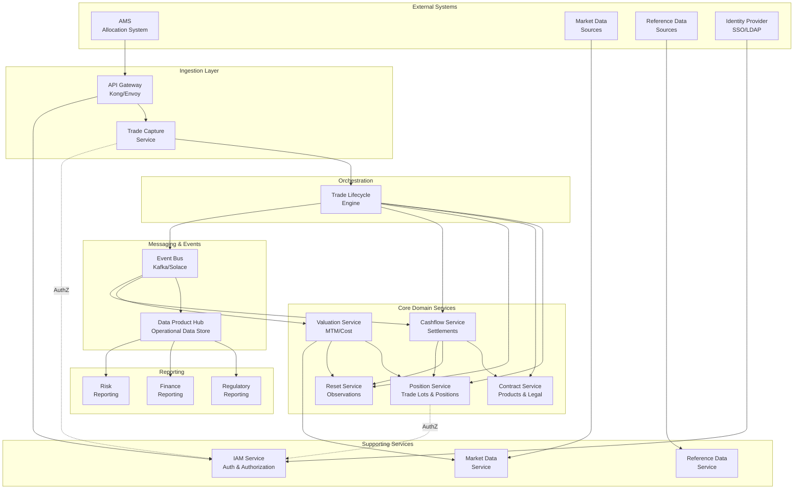
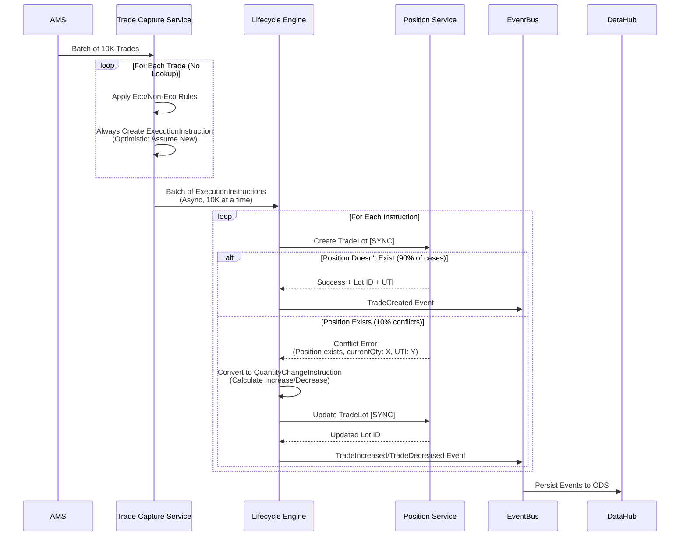
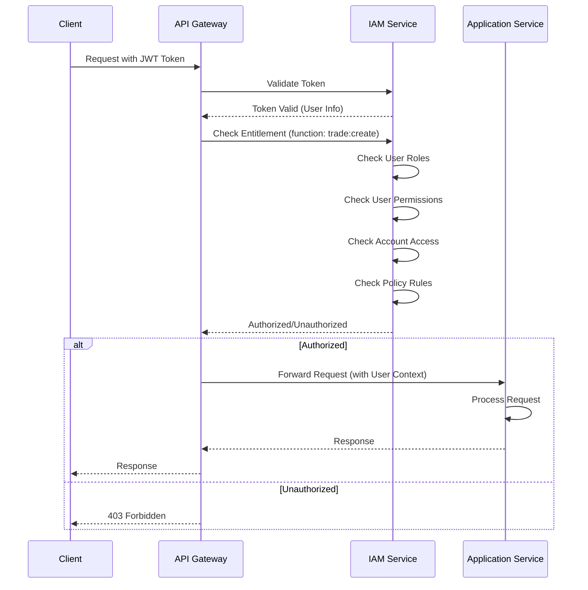
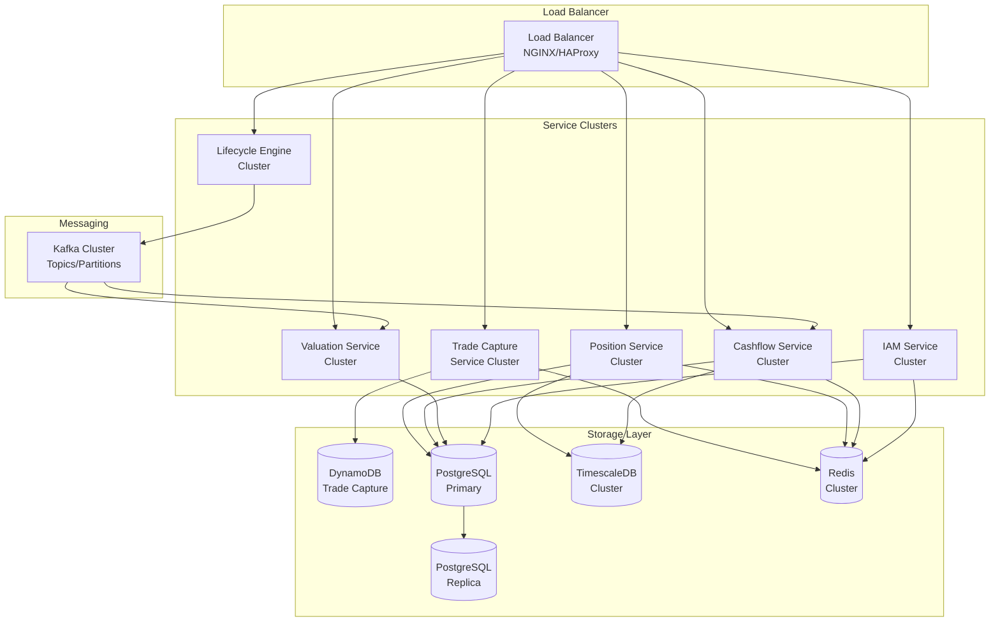

# Equity Swap Service Architecture - Blueprint

## Document Purpose

This architectural blueprint provides both executive-level overview and technical detail for the Equity Swap Lifecycle Management System. It serves as a comprehensive reference for stakeholders, architects, and developers, integrating information from the consolidated service guide and detailed technical documents.

---

## Table of Contents

### Part 1: Executive Summary
- [1.1 System Overview](#11-system-overview)
- [1.2 Key Architectural Decisions](#12-key-architectural-decisions)
- [1.3 System Architecture Diagram](#13-system-architecture-diagram)
- [1.4 Technology Stack Summary](#14-technology-stack-summary)
- [1.5 Performance Characteristics](#15-performance-characteristics)
- [1.6 Key Principles](#16-key-principles)

### Part 2: Architecture Overview
- [2.1 Service Catalog](#21-service-catalog)
- [2.2 System Architecture Diagram](#22-system-architecture-diagram)
- [2.3 Integration Points](#23-integration-points)
- [2.4 Cross-Cutting Concerns](#24-cross-cutting-concerns)

### Part 3: Core Services Architecture
- [3.1 Trade Capture Service](#31-trade-capture-service)
- [3.2 Position Service](#32-position-service)
- [3.3 Contract Service](#33-contract-service)
- [3.4 Lifecycle Engine](#34-lifecycle-engine)
- [3.5 Cashflow Service](#35-cashflow-service)
- [3.6 Reset Service](#36-reset-service)
- [3.7 Valuation Service](#37-valuation-service)
- [3.8 Basket / Custom Index Service (Dynamic Basket with CVT)](#38-basket--custom-index-service-dynamic-basket-with-cvt)

### Part 4: Supporting Services
- [4.1 Market Data Service](#41-market-data-service)
- [4.2 Reference Data Service](#42-reference-data-service)
- [4.3 IAM Service](#43-iam-service)

### Part 5: Messaging & Event Architecture
- [5.1 Event-Driven Architecture](#51-event-driven-architecture)
- [5.2 Messaging Layer](#52-messaging-layer)

### Part 6: Data Architecture
- [6.1 Storage Models](#61-storage-models)
- [6.2 Settlement Date Tracking](#62-settlement-date-tracking)
- [6.3 Data Product Hub](#63-data-product-hub-operational-data-store)

### Part 7: Processing Patterns
- [7.1 Optimistic New Trade Pattern](#71-optimistic-new-trade-pattern)
- [7.2 Scalability Patterns for High-Volume Trades](#72-scalability-patterns-for-high-volume-trades)
- [7.3 Roll Trade Handling](#73-roll-trade-handling)
- [7.4 Composite Instructions](#74-composite-instructions)

### Part 8: Security & Compliance
- [8.1 Authentication & Authorization](#81-authentication--authorization)
- [8.2 Event Security](#82-event-security)
- [8.3 Compliance & Audit Trail](#83-compliance--audit-trail)

### Part 9: Deployment & Operations
- [9.1 Deployment Architecture](#91-deployment-architecture)
- [9.2 Monitoring & Observability](#92-monitoring--observability)
- [9.3 Performance Characteristics](#93-performance-characteristics)

### Part 10: Appendices
- [A. Detailed Documents Reference](#a-detailed-documents-reference)
- [B. Glossary](#b-glossary)
- [C. Architecture Decision Records](#c-architecture-decision-records)

---

# Part 1: Executive Summary

## 1.1 System Overview

The Equity Swap Lifecycle Management System is a microservices-based platform designed to process and manage equity swap trades throughout their lifecycle, from trade capture through settlement, valuation, and reporting. The system is built on CDM (Common Domain Model) principles and is architected to handle high-volume processing (2M+ trades per day) with strong consistency, transactional integrity, and comprehensive audit capabilities.

### Business Context

Equity swaps are financial derivatives where two parties exchange cashflows - one based on equity performance and one based on interest rates. The system must:

- Capture new trades from Allocation Management Systems (AMS)
- Track positions and quantities over time
- Calculate cashflows (equity performance and interest payments)
- Handle lifecycle events (increases, decreases, terminations, resets, settlements)
- Provide regulatory reporting capabilities
- Support real-time valuations and risk analytics

### Key Capabilities

1. **High-Volume Trade Processing**: Optimistic processing pattern handles 2M+ trades/day
2. **CDM Compliance**: Full alignment with Common Domain Model standards
3. **Event-Driven Architecture**: Real-time event streaming for downstream systems
4. **Comprehensive Authorization**: Role-based and attribute-based access control
5. **Accurate Calculations**: Settlement date tracking ensures precise interest accrual
6. **Operational Data Store**: Unified data view for reporting and analytics

---

## 1.2 Key Architectural Decisions

| Decision | Rationale | Impact |
|----------|-----------|--------|
| **Microservices Architecture** | Domain-driven design with clear service boundaries enables independent scaling and deployment | High modularity, service isolation |
| **Optimistic New Trade Pattern** | Eliminates position lookup overhead for 2M+ trades, handles conflicts gracefully | 2M trades processed in ~20-25 minutes |
| **CDM Compliance** | Industry standard ensures interoperability and regulatory alignment | Standardized data model, future-proof |
| **Event-Driven with ODS** | Real-time events + unified reporting data store | Fast reporting, 15-minute SLA for regulatory reports |
| **Hybrid Settlement Date Tracking** | Stores settlement dates in Position Service, uses CDM fields as fallback | Accurate interest calculations for T+2/T+3 settlement |
| **Saga Pattern for Transactions** | Ensures consistency across distributed services without 2PC overhead | Reliable transaction integrity |
| **PostgreSQL + TimescaleDB** | ACID transactions + time-series optimization + mature ecosystem | Strong consistency, efficient analytics |

---

## 1.3 System Architecture Diagram



---

## 1.4 Technology Stack Summary

### Core Technologies
- **Application Framework**: Java/Spring Boot (microservices)
- **Databases**: 
  - PostgreSQL (Position, Contract, IAM services)
  - TimescaleDB (time-series data for positions, resets)
  - DynamoDB/Cassandra (Trade Capture for high write throughput)
- **Caching**: Redis (authorization decisions, position lookups, reference data)
- **Messaging**: Kafka/Solace (event streaming)
- **API Gateway**: Kong/Envoy (routing, authentication, rate limiting)

### Supporting Technologies
- **Time-Series**: TimescaleDB hypertables
- **Search**: PostgreSQL full-text search, JSONB queries
- **Monitoring**: Prometheus, Grafana, ELK stack
- **Security**: JWT tokens, OAuth 2.0, SAML 2.0

---

## 1.5 Performance Characteristics

| Metric | Target | Notes |
|--------|--------|-------|
| **Trade Processing Throughput** | 2M+ trades/day | Optimistic pattern enables instant processing in Trade Capture |
| **End-to-End Latency** | < 25 minutes | 2M trades processed with conflict resolution in ~20-25 minutes |
| **API Response Time** | < 50ms P99 | With caching for position lookups and reference data |
| **Batch Query Performance** | < 50ms P99 | 1000+ position keys in single query |
| **Regulatory Reporting SLA** | 15 minutes | Fast path from Operational Data Store |
| **Cache Hit Rate** | 80%+ | High cache efficiency for position and reference data lookups |

---

## 1.6 Key Principles

1. **CDM Compliance**: All trade state changes follow CDM primitive instructions
2. **Domain-Driven Design**: Clear service boundaries aligned to business domains
3. **Event-Driven**: Asynchronous event streaming for decoupled services
4. **Immutability**: Trade state changes create new states, never modify existing ones
5. **Transaction Integrity**: Saga pattern ensures consistency across services
6. **Security by Design**: Authorization at API gateway and service levels
7. **Scalability**: Horizontal scaling, partitioning, and caching strategies
8. **Observability**: Comprehensive metrics, logging, and tracing

---

# Part 2: Architecture Overview

## 2.1 Service Catalog

### Core Domain Services

**Trade Capture Service**
- **Domain**: Trade Ingestion
- **Purpose**: Receives allocated trades from AMS, translates to CDM instructions
- **Key Pattern**: Optimistic new trade pattern (always creates ExecutionInstruction)
- **Storage**: DynamoDB/Cassandra or PostgreSQL with partitioning

**Position Service**
- **Domain**: Trade & Position Management
- **Purpose**: Source of truth for trade lots and aggregated positions
- **Key Features**: UTI lifecycle, settlement date tracking, time-series quantities
- **Storage**: PostgreSQL with TimescaleDB, Redis cache

**Contract Service**
- **Domain**: Product & Legal
- **Purpose**: Manages product definitions, economic terms, legal agreements
- **Key Features**: JSONB storage for flexible product structures
- **Storage**: PostgreSQL with JSONB, Redis cache

**Cashflow Service**
- **Domain**: Settlement
- **Purpose**: Calculates and manages cashflows (equity leg + interest leg)
- **Key Features**: Settlement date-based interest accrual, net cashflow calculation
- **Storage**: PostgreSQL with time-series support

**Reset Service**
- **Domain**: Market Observations
- **Purpose**: Records market data observations (prices, rates) for calculations
- **Key Features**: Reset history tracking, links to payouts
- **Storage**: PostgreSQL with TimescaleDB

**Valuation Service**
- **Domain**: Analytics
- **Purpose**: Calculates MTM and cost basis valuations
- **Key Features**: Daily valuations, P&L calculations
- **Dependencies**: Reads from Position, Reset, Market Data services

**Basket / Custom Index Service (Dynamic Basket with CVT)**
- **Domain**: Basket & Custom Index
- **Purpose**: Manages client-specified, dynamically rebalanced custom baskets with Cash Value Ticker (CVT)
- **Key Features**: Basket versioning, rebalance instructions (product mechanics, not lifecycle), CVT as residual constituent, CQRS event flow
- **Storage**: MS SQL (basket_definition, basket_constituent, basket_instruction); ODS consumes basket events
- **Reference**: See [detailed-documents/dynamic_basket_equity_swap_cvt_e2e.md](detailed-documents/dynamic_basket_equity_swap_cvt_e2e.md)

**Trade Lifecycle Engine**
- **Domain**: Orchestration
- **Purpose**: Stateless processor of CDM primitive instructions
- **Key Features**: Saga pattern for transaction integrity, conflict resolution
- **Storage**: Stateless (no persistence)

### Supporting Services

**Market Data Service**
- **Purpose**: Ingests and provides market data (equity prices, FX rates, indices)
- **Key Features**: File and API connectors, data quality checks, time-series storage
- **Reference**: See [detailed-documents/market_reference_data_architecture.md](detailed-documents/market_reference_data_architecture.md)

**Reference Data Service**
- **Purpose**: Manages reference data (securities, accounts, books, parties)
- **Key Features**: Full/incremental sync, relationship management
- **Reference**: See [detailed-documents/market_reference_data_architecture.md](detailed-documents/market_reference_data_architecture.md)

**IAM Service**
- **Purpose**: Centralized authentication and authorization
- **Key Features**: RBAC, ABAC, function-level entitlements, JWT tokens
- **Reference**: See [detailed-documents/user_entitlements_architecture.md](detailed-documents/user_entitlements_architecture.md)

---

## 2.2 System Architecture Diagram

See section 1.3 for the high-level system architecture diagram showing all services, data flows, and integration points.

---

## 2.3 Integration Points

### Service-to-Service Communication

**Synchronous Communication**
- Trade Capture → Lifecycle Engine: CDM primitive instructions
- Lifecycle Engine → Domain Services: Writes (Position, Contract, Reset, Cashflow)
- Valuation Service → Position/Reset/Market Data: Reads for calculations
- API Gateway → IAM Service: Authorization checks

**Asynchronous Communication**
- Lifecycle Engine → Event Bus: Business events
- Event Bus → Downstream Services: Event consumers (Valuation, Cashflow, ODS)
- Position Service → Event Bus: Position update events (cache invalidation)

### External Integration Points

**Data Ingestion**
- AMS → Trade Capture Service: Allocated trades
- Market Data Sources → Market Data Service: Prices, rates, indices
- Reference Data Sources → Reference Data Service: Securities, accounts, books

**Security**
- Identity Provider → IAM Service: Authentication (LDAP, SAML, OAuth 2.0)
- API Gateway → IAM Service: Authorization checks

### Messaging Layer Integration

The messaging layer (Kafka/Solace) integrates entitlements for secure event routing:

- **Event Enrichment**: User context and entitlement metadata added to events
- **Producer Authorization**: Authorization checks before publishing events
- **Consumer Authorization**: Authorization checks when consuming events
- **Message Filtering**: Events filtered based on user entitlements
- **Topic-Based Routing**: Events routed to topics based on entitlements

**Reference**: See [detailed-documents/messaging_entitlements_integration.md](detailed-documents/messaging_entitlements_integration.md) for detailed implementation.

---

## 2.4 Cross-Cutting Concerns

### Security & Authorization

**Authentication**
- Multiple authentication methods: LDAP, SAML 2.0, OAuth 2.0
- JWT tokens with short-lived access tokens and refresh tokens
- API key authentication for service-to-service calls

**Authorization**
- **Role-Based Access Control (RBAC)**: Predefined roles (TRADE_CAPTURE_USER, POSITION_ADMIN, etc.)
- **Attribute-Based Access Control (ABAC)**: Account-level, book-level, security-level access
- **Function-Level Entitlements**: Granular permissions per service function (trade:create, position:read, etc.)
- **Authorization at Multiple Layers**: API Gateway, service level, messaging layer

**Reference**: See [detailed-documents/user_entitlements_architecture.md](detailed-documents/user_entitlements_architecture.md) for complete IAM architecture.

### Market Data Management

**Data Ingestion**
- File-based connectors (CSV, XML, JSON) with file watchers
- API-based connectors (REST, WebSocket) for real-time data
- Batch and incremental sync capabilities

**Data Quality**
- Validation rules (completeness, accuracy, consistency, timeliness)
- Quality monitoring and alerting
- Dead letter queue for failed records

**Reliability**
- Retry mechanisms with exponential backoff
- Circuit breakers for fault tolerance
- Backup connectors for fallback data sources

**Reference**: See [detailed-documents/market_reference_data_architecture.md](detailed-documents/market_reference_data_architecture.md) for full architecture.

### Data Consistency & Integrity

**Transaction Management**
- Saga pattern for distributed transactions
- Idempotency keys to prevent duplicate processing
- Optimistic locking for concurrent updates

**Audit Trail**
- Immutable trade state history
- Comprehensive event logging
- Audit logs for authorization decisions

---

# Part 3: Core Services Architecture

## 3.1 Trade Capture Service

### Overview

The Trade Capture Service is the entry point for all trade data from external Allocation Management Systems (AMS). It translates raw allocated trades into CDM primitive instructions using an optimistic processing pattern optimized for high-volume scenarios.

### Key Responsibilities

1. **Receive Allocated Trades**: Accept trades from AMS systems
2. **Apply Business Rules**: Eco/Non-Eco rules for trade classification
3. **Create CDM Instructions**: Translate to `ExecutionInstruction` (optimistic approach)
4. **Batch Processing**: Send instructions to Lifecycle Engine in batches (async)

### Optimistic New Trade Pattern

**Pattern Overview**: The service always creates `ExecutionInstruction` assuming all trades are new, eliminating position lookup overhead.

**Benefits**:
- Zero lookup overhead in Trade Capture (processes 2M trades instantly)
- Simple architecture (no caching, no batch queries needed)
- Handles conflicts gracefully (Lifecycle Engine retries as QuantityChangeInstruction)
- High throughput (no external dependencies in critical path)

**Performance**:
- Trade Capture: 2M trades processed instantly (no external calls)
- Overall: 2M trades processed in ~20-25 minutes (with conflict resolution)

### Storage Models

**Recommended**: DynamoDB (AWS) or Cassandra (On-Prem)
- High write throughput (40,000+ writes/second per partition)
- Low latency (< 5ms P99)
- Built-in partitioning and auto-scaling

**Alternative**: PostgreSQL with Partitioning
- Strong consistency (ACID transactions)
- SQL queries for complex use cases
- JSONB support for flexible schema

For detailed storage schema and configuration, see Part 6: Data Architecture.

---

## 3.2 Position Service

### Overview

The Position Service is the **source of truth** for all trades at the lot level, then aggregated at the position level. It manages trade lots, positions, UTI lifecycle, and quantity schedules with settlement date tracking for accurate interest accrual.

### Key Responsibilities

1. **Trade Lot Management**: Create/update trade lots (CDM `TradeLot` entities)
2. **Position Aggregation**: Aggregate lots into positions by `{Account + Book + Security + Direction}`
3. **UTI Lifecycle**: Track UTI status, merge history, regulatory reporting
4. **Quantity Schedules**: Time-series quantity tracking with `NonNegativeQuantitySchedule`
5. **Settlement Date Tracking**: Track settlement dates for accurate interest accrual

### Data Model

**Trade Lots**
- `TradeLot` records with `priceQuantity` (quantity, price at execution)
- Trade identifiers (UTI, internal IDs)
- Trade dates and settlement dates
- Counterparties and parties
- Links to `Contract.productId`

**Positions**
- Net quantity by `{Account + Book + Security + Direction}`
- Position direction (LONG/SHORT)
- `NonNegativeQuantitySchedule` (quantity changes over time)
- Position state (Open, Closed, Settled)

**UTI Lifecycle**
- Current active UTI per position
- UTI history (created, merged, closed)
- Merged UTIs tracking

### Settlement Date & Quantity Tracking

**Problem**: `NonNegativeQuantitySchedule` only tracks effective date (trade date), but interest accrual should start from settlement date (T+2, T+3).

**Solution**: Hybrid approach
1. Store settlement date in TradeLot (Position Service)
2. Use `PriceQuantity.effectiveDate` as settlement date for quantity changes (fallback)
3. Use settlement date for interest accrual calculations (not trade date)
4. Track settled quantity separately from effective quantity

**Key Principles**:
- Settlement date determines when interest accrual starts
- Settled quantity is what was actually settled (may differ from effective quantity)
- Trade date is when trade was executed (for position tracking)
- CDM-compliant (extends CDM, doesn't modify it)

**Reference**: See [detailed-documents/settlement_date_quantity_tracking_solution.md](detailed-documents/settlement_date_quantity_tracking_solution.md) for full implementation details, including schema design, code examples, and T+2 settlement scenario.

### Storage

**Recommended**: PostgreSQL with Partitioning + TimescaleDB + Redis Cache
- ACID transactions for UTI assignment and position updates
- TimescaleDB for time-series quantity schedules
- Redis cache for batch position lookups (TTL: 10 minutes)

**Performance**:
- Batch Query (1000 keys): < 50ms P99
- Point Lookup: < 5ms P99
- Time-Series Query: < 20ms P99 (with TimescaleDB)
- Cache Hit: < 1ms

For detailed schema design, see Part 6: Data Architecture.

---

## 3.3 Contract Service

### Overview

The Contract Service manages product definitions, economic terms, and legal agreements. It provides the product template that trades reference, but does not store trade-specific data (that's in Position Service).

### Key Responsibilities

1. **Product Definitions**: Manage `NonTransferableProduct` definitions
2. **Economic Terms**: Structure for `PerformancePayout`, `InterestRatePayout`, calculation schedules
3. **Legal Agreements**: Master agreements (ISDA), confirmations, credit support annexes
4. **Collateral Terms**: Collateral provisions, margin requirements, eligible collateral types

### Data Model

**Products**
- Product definitions with economic terms structure
- Calculation schedules (payment dates, reset dates)
- Business day conventions and day count fractions

**Legal Agreements**
- Master agreements (ISDA)
- Confirmations
- Credit support annexes

**CDM Entities**: `Product`, `EconomicTerms`, `LegalAgreement`, `Collateral`

### Storage

**Recommended**: PostgreSQL with JSONB + Redis Cache
- JSONB for complex nested product structures
- Strong consistency for product definitions
- GIN indexes for efficient JSONB queries
- Redis cache (TTL: 24 hours, 95%+ hit rate)

**Performance**:
- Point Lookup: < 5ms P99 (with index)
- JSONB Query: < 20ms P99 (with GIN index)
- Cache Hit: < 1ms

For detailed schema design, see Part 6: Data Architecture.

---

## 3.4 Lifecycle Engine

### Overview

The Trade Lifecycle Engine is a **stateless** service that implements CDM's primitive instruction processing logic. It orchestrates the execution of `Create_*` functions as defined in CDM, coordinating writes to domain services and maintaining immutability principles.

### Key Responsibilities

1. **Process Primitive Instructions**: Implements CDM's `Create_TradeState` and all `Create_*` functions
2. **Coordinate Domain Services**: Writes to Position, Contract, Reset, Cashflow services
3. **Handle Conflicts**: Auto-resolves optimistic conflicts (ExecutionInstruction → QuantityChangeInstruction)
4. **Emit Events**: Publishes BusinessEvent to Event Bus
5. **Maintain Immutability**: Never modifies existing state, always creates new instances

### Supported Instructions

**Core Primitives (Required)**:
1. **ExecutionInstruction** - Create new trade
2. **QuantityChangeInstruction** - Modify quantity (increase/decrease/terminate)
3. **ResetInstruction** - Record market observations
4. **TransferInstruction** - Record cash settlements
5. **TermsChangeInstruction** - Modify product terms
6. **PartyChangeInstruction** - Change counterparty (novation/assignment)
7. **ContractFormationInstruction** - Link legal agreements

**Optional Primitives**:
8. **StockSplitInstruction** - Handle corporate actions
9. **ExerciseInstruction** - Exercise embedded options

### Execution Order

CDM defines a specific execution order for composite instructions:
1. execution
2. quantityChange
3. termsChange
4. partyChange
5. contractFormation
6. transfer
7. reset
8. indexTransition
9. observation
10. valuation
11. stockSplit
12. exercise (always last)

### Transaction Integrity: Saga Pattern

For composite instructions, the Lifecycle Engine uses a **Saga Pattern** with compensation:
- Execute steps sequentially (each step is a transaction)
- Track execution state (which steps completed)
- Compensate on failure (undo completed steps)
- Idempotent operations (safe to retry)

Each primitive has a corresponding compensation action that undoes its effects.

**Reference**: See consolidated guide section 2.4 for detailed saga coordinator implementation.

---

## 3.5 Cashflow Service

### Overview

The Cashflow Service manages all cashflows - future (accrued) and realized (settled). It calculates equity leg and interest leg cashflows for equity swaps, then nets them to determine the final cashflow amount.

### Key Responsibilities

1. **Equity Leg Calculation**: Calculate equity performance (price return + dividends)
2. **Interest Leg Calculation**: Calculate interest payments (fixed or floating rate)
3. **Cashflow Netting**: Net equity and interest legs based on payer/receiver roles
4. **Settlement Date Integration**: Use settlement date (not trade date) for interest accrual start

### Equity Swap Cashflow Calculation

**Equity Leg**:
- Price Return Only: `Price Rate Of Return × Equity Notional Amount`
- Total Return: `(Price Rate Of Return + Dividend Rate Of Return) × Equity Notional Amount`

**Interest Leg**:
- Fixed: `Notional × Fixed Rate × Year Fraction`
- Floating: `Notional × Floating Rate × Year Fraction`

**Net Cashflow**: `Equity Performance - Interest Amount`

### Interest Calculation with Settlement Date

For interest calculations, the Cashflow Service must use **settlement date** (not trade date) for accrual start:

```java
// Get settled quantity info from Position Service
SettledQuantityInfo settled = getSettledQuantityInfo(lotId, periodStart);

// Calculate year fraction from SETTLEMENT DATE
BigDecimal yearFraction = calculateYearFraction(
    settled.getSettlementDate(),  // Start from settlement date
    periodEnd,
    dayCountFraction
);

// Use settled quantity
BigDecimal interest = settled.getQuantity()
    .multiply(interestRate)
    .multiply(yearFraction);
```

**Key Points**:
- Interest accrual starts from settlement date, not trade date
- Use settled quantity (actual settled amount), not effective quantity
- Hybrid approach: Settlement date from TradeLot, with fallback to `PriceQuantity.effectiveDate`

**Reference**: See [detailed-documents/settlement_date_quantity_tracking_solution.md](detailed-documents/settlement_date_quantity_tracking_solution.md) for full implementation details.

### Service Architecture

**Layer 1: Underlier Abstraction**
- Generic interface for single, index, or basket underliers
- `UnderlierResolver` and `PriceResolutionStrategy`

**Layer 2: Price Resolution Strategy**
- SingleNamePriceStrategy, IndexPriceStrategy, BasketPriceStrategy

**Layer 3: Cashflow Calculation Service**
- EquityLegCashflowService, InterestLegCashflowService, EquitySwapCashflowService

---

## 3.6 Reset Service

### Overview

The Reset Service manages reset history - observations of market data over time. It stores raw observations (prices, rates) which are used for cashflow calculations and performance tracking.

### Key Responsibilities

1. **Record Reset Observations**: Store observed prices/rates at reset dates
2. **Reset History Tracking**: Maintain historical reset data linked to payouts
3. **Observation Metadata**: Track data source, quality flags, observation vs reset dates

### Data Model

**Reset History**
- Reset date and reset value (observed price/rate)
- Observation identifier (what was observed)
- Links to payout (equity leg or interest leg)
- Links to trade lots (via position reference)

**CDM Entities**: `Reset`, `ResetHistory`, `Observation`

### Relationship with Valuation Service

- **Reset Service**: Stores **raw observations** (prices, rates) - "what was the market data"
- **Valuation Service**: Stores **calculated valuations** (MTM, P&L) - "what is the position worth"

**Distinct purposes**: Resets feed into valuations, but resets are also used for cashflow calculations and performance tracking.

---

## 3.7 Valuation Service

### Overview

The Valuation Service calculates and stores daily valuations (MTM/Cost basis). It reads from other services' data to perform calculations but doesn't store trade state (unless contractually required to be pinned).

### Key Responsibilities

1. **Calculate MTM Valuations**: Using market prices from Market Data Service
2. **Calculate Cost Basis Valuations**: Using trade lots from Position Service
3. **Store Valuation Snapshots**: Daily valuations with P&L calculations
4. **Provide As-of-Date Valuations**: Time-travel queries for historical valuations

### Data Model

**Daily Valuations**
- Valuation date and valuation method (MTM or Cost)
- Valuation amount and currency
- Links to market data used

**Valuation History**
- Time series of valuations
- P&L calculations
- Attribution analysis

**CDM Entities**: `Valuation`, `ValuationInstruction` (if pinned to trade)

### Dependencies

- Reads from: Position Service (trade lots), Market Data Gateway (prices), Reset Service (reset history for performance calculations)

---

## 3.8 Basket / Custom Index Service (Dynamic Basket with CVT)

### Overview

The **Basket / Custom Index Service** manages client-specified, dynamically rebalanced custom baskets with a **Cash Value Ticker (CVT)** as the residual constituent. It owns basket definition, versioning, and rebalance instructions. **Rebalancing is product mechanics, not trade lifecycle**: no TradeState mutation, no lifecycle events.

**Reference**: See [detailed-documents/dynamic_basket_equity_swap_cvt_e2e.md](detailed-documents/dynamic_basket_equity_swap_cvt_e2e.md) for the full implementation-ready E2E specification (CDM, CQRS, ODS, Risk, Reg Reporting).

### Canonical Invariants

These invariants must hold system-wide:

1. **One legal trade, one UTI** – Rebalances do not create new trades.
2. **Basket rebalancing is product mechanics, not trade lifecycle** – Rebalance produces no TradeState mutation.
3. **Trade economics are immutable unless legally amended** – Notional, payoff, financing, reset change only via lifecycle primitives (e.g. TermsChange).
4. **Basket composition is versioned, point-in-time state** – Each rebalance creates a new basket version; history is auditable.
5. **CVT is a residual basket constituent, never a traded underlier** – CVT = notional − Σ(real underlyer MV).
6. **Index MTM = Σ constituent MTM + CVT** (within tolerance) – Enforced at valuation and control checks.

### Key Responsibilities

1. **Basket Definition & Versioning**: Store and version basket definitions (`basket_id`, `basket_version`), constituents (including CVT via `is_cash`), and rebalance rules (e.g. NOTIONAL_PRESERVING).
2. **Rebalance Instruction Processing**: Accept rebalance instructions (client reweight, corporate action normalization, hedge drift); validate; create new basket version; emit basket events (BasketRebalanceRequested → Validated → BasketVersionCreated); **do not** emit lifecycle events or mutate TradeState.
3. **Audit & Replay**: Persist `basket_instruction` for audit and selective replay of basket projections.

### Physical Data Model (MS SQL – snake_case)

| Table | Purpose |
|-------|---------|
| `trade` | Existing; `product_type` e.g. EQUITY_INDEX_TRS |
| `basket_definition` | `basket_id`, `basket_version`, `trade_id`, `effective_from`, `rebalance_rule`, `client_specified_flag`, `status` (ACTIVE/SUPERSEDED) |
| `basket_constituent` | `basket_id`, `basket_version`, `instrument_id`, `ticker`, `weight`, `notional_amount`, `is_cash` (true for CVT) |
| `basket_instruction` | `instruction_id`, `basket_id`, `instruction_type` (REBALANCE), `requested_effective_date`, `instruction_payload_json`, `requested_by` (CLIENT/SYSTEM) |

**Where**: Basket / Custom Index Service owns these tables; ODS projections consume basket events. Align with SQL Server storage (partitioning, temporal if needed).

### CDM Mapping

- **Trade** → TradeState; product_type → EquityIndexPayout; financing_terms → InterestRatePayout.
- **Basket** (extension): Product → Underlier → **CustomBasket** (`basketId`, `basketVersion`, `components[]`, `rebalanceRule`). **components[]**: AssetPayout (Equity), **CashProduct** (CVT). CVT: quantity = cash amount, price = 1; accrual via InterestRatePayout or custom funding leg.
- **Rebalance**: Captured as **Instruction** (non-lifecycle). **No TradeState mutation**.

### Dynamic Rebalance – Event Flow (CQRS)

**Trigger sources**: Client reweight instruction; corporate action normalization; hedge execution drift.

**Event sequence** (no lifecycle events):

1. BasketRebalanceRequested → 2. BasketRebalanceValidated → 3. BasketVersionCreated → 4. Projections Updated (ODS, risk).

**Lifecycle events are not emitted** for rebalance. TradeState is unchanged.

### Valuation & CVT Mechanics

- **Basket valuation**: `equity_value = Σ(weight × notional × price)` over non-cash constituents; `cvt_value = notional − equity_value`; **Index MTM = equity_value + cvt_value**.
- **Rebalance**: Zero P&L; apply weight changes; recompute notionals; CVT = notional − Σ(non-cash notionals); assert MTM preserved within tolerance.

**Numeric walkthrough**: Notional $100mm; v1: 90% equities / 10% CVT → v2: 100% equities / 0% CVT. MTM before = MTM after; only future P&L distribution changes.

### P&L Attribution

| Component | P&L Type |
|-----------|----------|
| Equity constituents | Market P&L |
| CVT | Funding / carry |
| Rebalance | Zero |
| Reset | Realization |

### Risk, Margin & Regulatory Reporting

- **Market risk**: Look-through to constituents; aggregate to basket; **CVT delta = 0**.
- **Credit & funding**: CVT = unsecured funding; limits: max CVT %, max negative CVT.
- **Margin**: Initial margin on basket volatility; variation margin on basket MTM; CVT implicitly included; CSA references trade MTM only.
- **Regulatory reporting**: **Reported**: Product = Equity Swap, Underlier = Custom Basket, Client Specified = TRUE, Notional, Price, UTI = single. **Not reported**: Constituents, CVT, basket versions, rebalance events. **Reportable modifications**: Only if notional, payoff, financing, or reset conventions change.

### Selective Replay (ODS)

- **Basket versions** are replayable independently (e.g. projection fixes).
- **TradeState is never replayed** for rebalance correction.
- **Projections** (ODS, risk) recompute deterministically from basket events + lifecycle events.

See **6.3 Data Product Hub**: separate basket event stream feeds ODS; lifecycle events remain primary for trade/position state.

### Production Controls

| Control | Purpose |
|--------|---------|
| Σ weights = 1.0 | Basket composition consistency |
| Σ notionals = trade notional | Notional-neutral invariant |
| CVT within limits | Max CVT %, max negative CVT (if disallowed) |
| Index MTM reconciliation | Index MTM = Σ constituent MTM + CVT (within tolerance) |
| Auditability | Every CVT movement maps to basket instruction or lifecycle event |
| Pricing source | Explicit rule for CVT return (overnight / spread / zero) |
| Settlement discipline | CVT movements reconcile with cash ledger |

**Alerts** raised on breach.

---

# Part 4: Supporting Services

## 4.1 Market Data Service

### Overview

The Market Data Service ingests and provides market data (equity prices, FX rates, indices, dividends) from various golden sources. It handles both file-based and API-based ingestion with data quality checks and reliability mechanisms.

### Key Responsibilities

1. **Data Ingestion**: File-based (CSV, XML, JSON) and API-based (REST, WebSocket) connectors
2. **Data Quality**: Validation rules, quality monitoring, alerting
3. **Data Processing**: Transform, enrich, and store market data
4. **Time-Series Storage**: Optimized storage using TimescaleDB for time-series queries
5. **Caching**: Redis cache for latest prices and frequently accessed data

### Architecture Components

**Data Ingestion Layer**
- File watchers, parsers, validators for file-based sources
- Real-time and batch API connectors
- Support for multiple data formats and encodings

**Data Quality & Validation Layer**
- Data quality engine with validation rules
- Quality monitoring and metrics tracking
- Alerting for quality issues

**Reliability & Resilience Layer**
- Retry mechanisms with exponential backoff
- Circuit breakers for fault tolerance
- Dead letter queue for failed records
- Backup connectors for fallback data sources

**Storage & API Layer**
- TimescaleDB for time-series optimization
- Redis cache for performance
- REST/gRPC APIs for data access

### Integration Points

- **Data Sources**: Equity pricing systems, FX rate systems, index providers, dividend data files
- **Consuming Services**: Cashflow Service (for price lookups), Valuation Service (for MTM calculations), Reset Service (for market observations)

**Reference**: See [detailed-documents/market_reference_data_architecture.md](detailed-documents/market_reference_data_architecture.md) for complete architecture including:
- Detailed component design
- Data quality rules and validation
- Reliability patterns
- Storage schema design
- Deployment architecture
- Monitoring and observability

---

## 4.2 Reference Data Service

### Overview

The Reference Data Service manages reference data (securities, accounts, books, parties) from master data systems. It provides a unified view of reference data with relationship management and change tracking.

### Key Responsibilities

1. **Data Ingestion**: Full sync and incremental sync from master systems
2. **Relationship Management**: Track relationships (accounts → books, securities → issuers)
3. **Change Tracking**: Detect and manage data changes (new, updated, deleted)
4. **Data Enrichment**: Add metadata, calculate derived fields
5. **Caching**: Redis cache for frequently accessed reference data

### Architecture Components

**Data Ingestion Layer**
- File-based and API-based connectors for reference data sources
- File watchers, parsers, validators
- Batch and incremental sync capabilities

**Data Processing Layer**
- Reference data processor (handles full/incremental sync)
- Relationship validator
- Data enricher

**Storage & API Layer**
- PostgreSQL with normalized schema and foreign key relationships
- Redis cache for performance
- REST/gRPC APIs for data access

### Integration Points

- **Data Sources**: Security master systems, account master systems, book master systems, party master systems
- **Consuming Services**: Trade Capture Service (for trade validation), Position Service (for position aggregation), Contract Service (for product definitions)

**Reference**: See [detailed-documents/market_reference_data_architecture.md](detailed-documents/market_reference_data_architecture.md) for complete architecture including:
- Detailed component design
- Data model and schema
- Sync strategies
- Storage design
- API specifications
- Deployment architecture

---

## 4.3 IAM Service

### Overview

The IAM (Identity & Access Management) Service provides centralized authentication and authorization for the entire system. It supports multiple authentication methods, role-based and attribute-based access control, and function-level entitlements.

### Key Responsibilities

1. **Authentication**: Multiple methods (LDAP, SAML 2.0, OAuth 2.0, API keys)
2. **Token Management**: JWT token issuance, validation, refresh, revocation
3. **Authorization**: RBAC, ABAC, function-level entitlements
4. **Session Management**: User sessions, MFA support
5. **User Management**: User CRUD, role assignments, permission management

### Architecture Components

**Authentication Layer**
- Authentication Service (multiple methods support)
- Token Service (JWT tokens)
- Session Management

**Authorization Layer**
- Authorization Service (permission checks)
- Role-Based Access Control (RBAC)
- Attribute-Based Access Control (ABAC)
- Policy Engine (policy rules evaluation)

**User Data Layer**
- User data store (PostgreSQL)
- Role & permission store (PostgreSQL)
- Entitlement store (PostgreSQL)

### Access Control Models

**Role-Based Access Control (RBAC)**
- Predefined roles: TRADE_CAPTURE_USER, POSITION_ADMIN, CASHFLOW_VIEWER, etc.
- Role hierarchy with inherited permissions
- User-role assignments

**Attribute-Based Access Control (ABAC)**
- Account-level access (user can only access specific accounts)
- Book-level access (user can only access specific books)
- Security-level access (user can only access specific securities)

**Function-Level Entitlements**
- Granular permissions per service function (trade:create, position:read, etc.)
- Entitlements checked at API gateway and service levels

### Integration Points

- **Identity Providers**: Active Directory (LDAP), SSO providers (SAML), Identity providers (OAuth 2.0)
- **Application Services**: All services check entitlements via IAM Service
- **API Gateway**: Validates tokens and checks entitlements before routing requests

**Reference**: See [detailed-documents/user_entitlements_architecture.md](detailed-documents/user_entitlements_architecture.md) for complete architecture including:
- Detailed component design
- Data model (users, roles, permissions, entitlements)
- Authorization flow diagrams
- API specifications
- Caching strategy
- Security considerations
- Deployment architecture

---

# Part 5: Messaging & Event Architecture

## 5.1 Event-Driven Architecture

### Overview

The system uses an event-driven architecture where the Lifecycle Engine publishes business events to an Event Bus, which are then consumed by downstream services for real-time processing and data synchronization.

### Event Bus

**Messaging Infrastructure**: Kafka or Solace PubSub+
- **Kafka**: Distributed streaming platform with topics and partitions
- **Solace**: Enterprise message broker with topics and queues

### Business Events

The Lifecycle Engine generates `BusinessEvent` objects containing:
- Event ID, type, timestamp
- User context (userId, roles, permissions)
- Entitlement metadata (required function, authorization status)
- Instruction data (PrimitiveInstruction)
- Trade state (before and after states)

**Event Types**:
- `NEW_TRADE`, `TRADE_INCREASED`, `TRADE_DECREASED`
- `POSITION_UPDATED`, `CASHFLOW_CALCULATED`
- `RESET`, `SETTLEMENT`, `NOVATION`
- And more...

### Event Consumers

**Downstream Services**:
- Valuation Service (for real-time valuations)
- Cashflow Service (for cashflow recalculation)
- Reset Service (for reset processing)
- Data Product Hub (for ODS persistence)

**Reporting Systems**:
- Regulatory Reporting (fast path from ODS)
- Finance Reporting
- Risk Reporting
- Client Reporting

---

## 5.2 Messaging Layer

### Event Enrichment

Events are enriched with user context and entitlement metadata before publishing:
- User context extracted from request (userId, roles, accountIds, bookIds)
- Required function determined based on event type
- Entitlement metadata added (required function, authorization status)

### Producer-Side Authorization

Before publishing events, authorization checks are performed:
- Check if user has permission for required function
- Check if user has data access (account, book)
- Route to appropriate topic based on entitlements

### Consumer-Side Authorization

When consuming events, authorization checks are performed:
- Check if user has permission to consume event type
- Check data access (account, book)
- Filter events based on entitlements

### Message Filtering

Events can be filtered based on user entitlements:
- Filter by function permission
- Filter by account access
- Filter by book access

### Topic-Based Authorization

Topics can be organized by entitlements:
- Account-specific topics: `equity-swaps-events-account-{accountId}`
- Book-specific topics: `equity-swaps-events-book-{bookId}`
- Role-specific topics: `equity-swaps-events-role-{role}`
- Priority topics for admins: `equity-swaps-events-priority`

### Dynamic Topic Subscription

Consumers subscribe to topics based on their entitlements:
- Base public topic (all users)
- Account-specific topics (for user's accessible accounts)
- Book-specific topics (for user's accessible books)
- Role-specific topics (for user's roles)

### Event Routing

Smart event router routes events to appropriate topics/queues based on entitlements:
- Find authorized users for event
- Route to user-specific topics
- Route to role-based topics
- Route to account-based topics

### Message-Level Security

**Encryption**: Sensitive data can be encrypted in events
**Signing**: Events can be signed for integrity verification
**Dead Letter Queue**: Unauthorized events sent to DLQ for investigation

**Reference**: See [detailed-documents/messaging_entitlements_integration.md](detailed-documents/messaging_entitlements_integration.md) for detailed implementation including:
- Event structure with user context
- Producer and consumer authorization patterns
- Kafka and Solace integration patterns
- Message filtering and routing
- Performance optimizations (caching, batch checks)
- Monitoring and auditing

---

# Part 6: Data Architecture

## 6.1 Storage Models

### Trade Capture Service Storage

**Recommended: DynamoDB (AWS) or Cassandra (On-Prem)**

**Why DynamoDB/Cassandra?**
- High write throughput (40,000+ writes/second per partition)
- Low latency (< 5ms P99)
- Built-in partitioning and auto-scaling
- Idempotency support with conditional writes

**Schema Design**:
- Partition Key: `accountId` (for partitioning)
- Sort Key: `tradeId` (for uniqueness)
- GSI: `idempotencyKey` (for idempotency checks)

**Performance**:
- Write: 40,000+ write units per partition (can burst higher)
- Read: < 5ms P99 (point lookup), < 10ms P99 (GSI query)
- Scalability: Auto-scales partitions

**Alternative: PostgreSQL with Partitioning**
- Strong consistency (ACID transactions)
- SQL queries for complex use cases
- JSONB support for flexible schema
- Trade-off: Lower write throughput, requires manual scaling

### Position Service Storage

**Recommended: PostgreSQL with Partitioning + TimescaleDB + Redis Cache**

**Why PostgreSQL?**
- ACID transactions (required for UTI assignment, position updates)
- Strict sequencing (partition-level ordering ensures correct processing)
- Complex queries (batch queries, aggregations, time-series queries)
- JSONB support for flexible CDM structures
- Mature ecosystem

**Schema Design**:

**Table: `trade_lots` (Partitioned)**
- Partitioned by `partition_key` (`{accountId}_{bookId}_{securityId}`)
- Date Fields: `trade_date`, `settlement_date`
- Quantity Fields: `quantity`, `settled_quantity`
- Indexes on `partition_key`, `trade_timestamp`, `trade_id`, `position_id`, `uti`, `settlement_date`

**Table: `positions` (Partitioned)**
- Partitioned by `partition_key` (`{accountId}_{bookId}_{securityId}_{direction}`)
- Unique constraint on `partition_key`
- Optimistic locking with `version` column
- Indexes on `uti`, `account_id`, `security_id`

**Table: `uti_lifecycle`**
- Tracks UTI status, merge history, regulatory reporting status
- Indexes on `status`, `position_key`, `merged_into`

**Table: `quantity_schedule` (Time-Series)**
- Uses TimescaleDB extension for time-series optimization
- Hypertable partitioned by `effective_date`
- Index on `position_id`, `effective_date`

**Batch Query API**:
- Optimized stored procedure for batch queries (1000+ keys)
- Parallel execution with `MAXDOP`

**Redis Cache**:
- Cache key: `position:{accountId}:{bookId}:{securityId}:{direction}`
- TTL: 10 minutes
- Event-driven cache invalidation

**Performance**:
- Batch Query (1000 keys): < 50ms P99
- Point Lookup: < 5ms P99
- Time-Series Query: < 20ms P99 (with TimescaleDB)
- Cache Hit: < 1ms

### Contract Service Storage

**Recommended: PostgreSQL with JSONB + Redis Cache**

**Why PostgreSQL + JSONB?**
- Complex nested structures (handles CDM's complex product structures)
- Strong consistency (required for product definitions)
- Flexible schema (products can have varying structures)
- Query support (JSONB queries, indexing, full-text search)
- Mature ecosystem

**Schema Design**:

**Table: `products`**
- `product_id` (Primary Key)
- `product_type`, `product_definition` (JSONB), `economic_terms` (JSONB)
- `legal_agreement` (JSONB), `collateral_terms` (JSONB)
- GIN indexes on JSONB columns for efficient queries

**Table: `product_versions` (Temporal Table)**
- Versioning support for immutable products
- Temporal table for history tracking

**Table: `legal_agreements`**
- `agreement_id` (Primary Key)
- `agreement_type`, `agreement_data` (JSONB), `parties` (JSONB array)
- Indexes on `agreement_type`, `effective_date`, `parties_json`

**Redis Cache**:
- Cache key: `product:{productId}`
- TTL: 24 hours (products rarely change)
- Cache hit rate: 95%+

**Performance**:
- Point Lookup: < 5ms P99 (with index)
- JSONB Query: < 20ms P99 (with GIN index)
- Cache Hit: < 1ms

### SQL Server 2022 Storage Models

**Recommended Storage Option for Enterprise Deployments**: SQL Server 2022 provides enterprise-grade, high-performance storage solutions that leverage advanced features for optimal performance, scalability, and reliability. It is an excellent choice when you need a single, unified database platform with enterprise features like Always On Availability Groups, comprehensive security, and advanced analytics capabilities.

**Key Advantages of SQL Server 2022**:
- ✅ **Unified Platform**: Single database technology across all services (simplifies operations)
- ✅ **Enterprise Features**: Always On AG, Transparent Data Encryption, advanced security
- ✅ **In-Memory OLTP**: Ultra-high performance for Trade Capture (50K-100K writes/second)
- ✅ **Temporal Tables**: Built-in time-series support with point-in-time queries
- ✅ **Columnstore Indexes**: 10x compression + batch mode for analytics (excellent for ODS)
- ✅ **JSON Support**: Native JSON with indexed computed columns for flexible schemas
- ✅ **Query Store**: Built-in performance monitoring and plan regression detection
- ✅ **Intelligent Query Processing**: Automatic query optimization improvements
- ✅ **Ledger Tables**: Immutable audit trail with cryptographic verification (SQL Server 2022)
- ✅ **Comprehensive Tooling**: SQL Server Management Studio, Azure Data Studio, rich monitoring

#### Trade Capture Service: SQL Server In-Memory OLTP

**Why In-Memory OLTP for Trade Capture?**
- **Ultra-High Write Throughput**: 50,000+ writes/second per instance (can scale to 100K+ with proper configuration)
- **Sub-Millisecond Latency**: < 1ms P99 (all data in memory)
- **Lock-Free Concurrency**: Optimistic concurrency control eliminates lock contention
- **Partitioned Memory-Optimized Tables**: SQL Server 2022 supports partitioning for memory-optimized tables
- **Natively Compiled Stored Procedures**: Near-native performance for critical paths

**Optimal Configuration**:

```sql
-- Memory-optimized table with durability
CREATE TABLE trade_capture_queue (
    trade_id VARCHAR(255) NOT NULL,
    account_id VARCHAR(255) NOT NULL,
    trade_data NVARCHAR(MAX) NOT NULL,
    idempotency_key VARCHAR(255) NOT NULL,
    processing_status VARCHAR(50) NOT NULL,
    created_at DATETIME2 NOT NULL DEFAULT GETUTCDATE(),
    
    INDEX idx_account_trade NONCLUSTERED (account_id, trade_id),
    INDEX idx_idempotency NONCLUSTERED HASH (idempotency_key) WITH (BUCKET_COUNT = 100000),
    INDEX idx_status NONCLUSTERED (processing_status, created_at)
) WITH (
    MEMORY_OPTIMIZED = ON,
    DURABILITY = SCHEMA_AND_DATA
);

-- Partition function for memory-optimized table (SQL Server 2022)
CREATE PARTITION FUNCTION pf_account_hash (INT) AS RANGE LEFT FOR VALUES (0, 1, 2, 3);

-- Natively compiled stored procedure for high-performance inserts
CREATE PROCEDURE sp_insert_trade_capture
    @trade_id VARCHAR(255),
    @account_id VARCHAR(255),
    @trade_data NVARCHAR(MAX),
    @idempotency_key VARCHAR(255)
WITH NATIVE_COMPILATION, SCHEMABINDING, EXECUTE AS OWNER
AS BEGIN ATOMIC WITH (
    TRANSACTION ISOLATION LEVEL = SNAPSHOT,
    LANGUAGE = N'English'
)
BEGIN
    INSERT INTO dbo.trade_capture_queue (trade_id, account_id, trade_data, idempotency_key, processing_status)
    VALUES (@trade_id, @account_id, @trade_data, @idempotency_key, 'PENDING');
END;
```

**Performance Characteristics**:
- Write Throughput: 50,000-100,000 writes/second (with proper memory allocation)
- Latency: < 1ms P99 (point inserts), < 2ms P99 (batch inserts)
- Memory Requirements: Plan for 2-4x table size in memory (depends on indexes)

**Best Practices**:
- Allocate sufficient memory for In-Memory OLTP (checkpoint file pairs)
- Use hash indexes for exact lookups (idempotency keys)
- Use nonclustered indexes for range queries
- Natively compiled procedures for high-frequency operations
- Monitor memory usage and adjust memory-optimized tables accordingly

---

#### Position Service: SQL Server Partitioned + Temporal Tables + Columnstore

**Optimal Configuration Strategy**:

**1. Partitioned Tables for Scalability**
```sql
-- Partition function by account hash
CREATE PARTITION FUNCTION pf_account_hash (INT) AS RANGE LEFT FOR VALUES (0, 1, 2, 3, 4);

-- Partition scheme
CREATE PARTITION SCHEME ps_account_hash AS PARTITION pf_account_hash
ALL TO ([PRIMARY]);

-- Trade lots table with partitioning
CREATE TABLE trade_lots (
    lot_id VARCHAR(255) NOT NULL,
    trade_id VARCHAR(255) NOT NULL,
    partition_key VARCHAR(255) NOT NULL,
    account_id VARCHAR(255) NOT NULL,
    quantity DECIMAL(20, 8) NOT NULL,
    settled_quantity DECIMAL(20, 8) NOT NULL,
    trade_date DATE NOT NULL,
    settlement_date DATE NOT NULL,
    price_quantity NVARCHAR(MAX) NOT NULL, -- JSON
    direction VARCHAR(10) NOT NULL,
    uti VARCHAR(255),
    position_id VARCHAR(255),
    created_at DATETIME2 NOT NULL DEFAULT GETUTCDATE(),
    
    CONSTRAINT PK_trade_lots PRIMARY KEY CLUSTERED (lot_id, account_id)
        ON ps_account_hash(CAST(HASHBYTES('SHA2_256', account_id) AS INT) % 5)
) ON ps_account_hash(CAST(HASHBYTES('SHA2_256', account_id) AS INT) % 5);

-- Indexes on partition key and settlement date
CREATE NONCLUSTERED INDEX idx_partition_timestamp ON trade_lots (partition_key, created_at)
    ON ps_account_hash(CAST(HASHBYTES('SHA2_256', account_id) AS INT) % 5);

CREATE NONCLUSTERED INDEX idx_settlement_date ON trade_lots (settlement_date, lot_id)
    ON ps_account_hash(CAST(HASHBYTES('SHA2_256', account_id) AS INT) % 5);
```

**2. Temporal Tables for Time-Series Data**
```sql
-- Quantity schedule as temporal table
CREATE TABLE quantity_schedule (
    schedule_id BIGINT IDENTITY(1,1) NOT NULL,
    position_id VARCHAR(255) NOT NULL,
    effective_date DATE NOT NULL,
    quantity DECIMAL(20, 8) NOT NULL,
    valid_from DATETIME2 GENERATED ALWAYS AS ROW START NOT NULL,
    valid_to DATETIME2 GENERATED ALWAYS AS ROW END NOT NULL,
    
    CONSTRAINT PK_quantity_schedule PRIMARY KEY CLUSTERED (schedule_id, effective_date),
    PERIOD FOR SYSTEM_TIME (valid_from, valid_to)
) WITH (
    SYSTEM_VERSIONING = ON (
        HISTORY_TABLE = dbo.quantity_schedule_history
    )
);

-- Query historical quantity at specific point in time
SELECT quantity 
FROM quantity_schedule
FOR SYSTEM_TIME AS OF '2024-01-15 10:00:00'
WHERE position_id = @position_id
    AND effective_date <= '2024-01-15';
```

**3. Columnstore Indexes for Analytics**
```sql
-- Clustered columnstore index for analytics queries
CREATE CLUSTERED COLUMNSTORE INDEX CCI_trade_lots_analytics 
ON trade_lots (lot_id, trade_id, account_id, quantity, trade_date, settlement_date, direction);

-- Benefits:
-- - 10x compression (reduces storage and I/O)
-- - Batch mode processing (processes millions of rows efficiently)
-- - Ideal for aggregation queries (SUM, AVG, COUNT)
-- - Efficient for reporting and analytics workloads
```

**4. Batch Query Optimization**
```sql
-- Optimized stored procedure for batch position queries
CREATE PROCEDURE sp_batch_query_positions
    @partition_keys NVARCHAR(MAX) -- JSON array of partition keys
AS
BEGIN
    SET NOCOUNT ON;
    
    -- Parse JSON array using OPENJSON (SQL Server 2016+)
    SELECT 
        t.lot_id,
        t.partition_key,
        t.quantity,
        t.settlement_date,
        t.trade_date,
        p.position_id,
        p.net_quantity
    FROM OPENJSON(@partition_keys) WITH (partition_key VARCHAR(255) '$') AS j
    INNER JOIN trade_lots t ON t.partition_key = j.partition_key
    LEFT JOIN positions p ON p.partition_key = t.partition_key
    OPTION (MAXDOP 8); -- Parallel execution
END;
```

**Performance Characteristics**:
- Batch Query (1000 keys): < 50ms P99 (with parallel execution)
- Point Lookup: < 5ms P99 (with proper indexing)
- Time-Series Query: < 20ms P99 (with temporal tables)
- Analytics Queries: 10-100x faster with columnstore indexes
- Partition Elimination: Queries only scan relevant partitions

**Best Practices**:
- Partition by account hash for even distribution
- Use temporal tables for audit trail and point-in-time queries
- Clustered columnstore indexes for analytics workloads
- Nonclustered columnstore indexes for specific analytics queries
- Always On Availability Groups for read scaling and HA
- Query Store enabled for performance monitoring and plan forcing

---

#### Contract Service: SQL Server JSON + Columnstore + Always On

**Optimal Configuration**:

**1. JSON Storage with Indexed Computed Columns**
```sql
CREATE TABLE products (
    product_id VARCHAR(255) PRIMARY KEY,
    product_type VARCHAR(100) NOT NULL,
    product_definition NVARCHAR(MAX) NOT NULL, -- JSON
    economic_terms NVARCHAR(MAX) NOT NULL, -- JSON
    legal_agreement NVARCHAR(MAX), -- JSON
    collateral_terms NVARCHAR(MAX), -- JSON
    
    -- Computed columns for JSON properties (indexed)
    payout_type AS JSON_VALUE(product_definition, '$.payout[0].performancePayout') PERSISTED,
    underlier_isin AS JSON_VALUE(economic_terms, '$.performancePayout.underlier.security.identifier[0]') PERSISTED,
    
    created_at DATETIME2 NOT NULL DEFAULT GETUTCDATE(),
    updated_at DATETIME2 NOT NULL DEFAULT GETUTCDATE()
);

-- Indexes on computed columns for fast JSON queries
CREATE NONCLUSTERED INDEX idx_payout_type ON products (payout_type)
WHERE payout_type IS NOT NULL;

CREATE NONCLUSTERED INDEX idx_underlier_isin ON products (underlier_isin)
WHERE underlier_isin IS NOT NULL;

-- JSON indexes using full-text index for complex queries
CREATE FULLTEXT INDEX ON products (product_definition, economic_terms)
KEY INDEX PK_products;

-- Query examples using JSON functions
SELECT product_id, product_definition
FROM products
WHERE JSON_VALUE(product_definition, '$.payout[0].performancePayout') IS NOT NULL;

SELECT product_id, economic_terms
FROM products
WHERE JSON_VALUE(economic_terms, '$.performancePayout.underlier.security.identifier[0]') = 'ISIN:US0378331005';
```

**2. Temporal Tables for Product Versioning**
```sql
-- Product versions with temporal table
CREATE TABLE product_versions (
    version_id BIGINT IDENTITY(1,1) NOT NULL,
    product_id VARCHAR(255) NOT NULL,
    version_number INT NOT NULL,
    product_definition NVARCHAR(MAX) NOT NULL,
    valid_from DATETIME2 GENERATED ALWAYS AS ROW START NOT NULL,
    valid_to DATETIME2 GENERATED ALWAYS AS ROW END NOT NULL,
    
    CONSTRAINT PK_product_versions PRIMARY KEY (version_id),
    PERIOD FOR SYSTEM_TIME (valid_from, valid_to)
) WITH (
    SYSTEM_VERSIONING = ON (HISTORY_TABLE = dbo.product_versions_history)
);
```

**3. Columnstore Indexes for Analytics**
```sql
-- Nonclustered columnstore index for analytics
CREATE NONCLUSTERED COLUMNSTORE INDEX NCCI_products_analytics 
ON products (product_id, product_type, payout_type, underlier_isin);
```

**Performance Characteristics**:
- Point Lookup: < 5ms P99 (with primary key)
- JSON Query: < 20ms P99 (with indexed computed columns)
- Full-Text Search: < 50ms P99 (for complex JSON queries)
- Analytics Queries: 10-50x faster with columnstore indexes

**Best Practices**:
- Use computed columns with indexes for frequently queried JSON properties
- Full-text indexes for complex JSON searches
- Temporal tables for immutable product versioning
- Columnstore indexes for analytics and reporting
- Always On Availability Groups for read replicas (scale reads)

---

#### Additional SQL Server 2022 Features to Leverage

**1. Query Store Enhancements**
- **Query Store for Performance Monitoring**: Automatic plan regression detection
- **Plan Forcing**: Force optimal execution plans
- **Wait Statistics**: Track query wait statistics for bottleneck identification

**2. Intelligent Query Processing (IQP)**
- **Parameter-Sensitive Plan Optimization**: Multiple plans for different parameter values
- **Memory Grant Feedback**: Adjust memory grants based on actual usage
- **Adaptive Joins**: Choose join algorithm at runtime

**3. Ledger Tables (SQL Server 2022)**
- **Immutable Audit Trail**: Use ledger tables for critical audit data
- **Cryptographic Verification**: Verify data integrity
- **Regulatory Compliance**: Built-in tamper detection

```sql
-- Example: Ledger table for trade audit
CREATE TABLE trade_audit_ledger (
    audit_id BIGINT IDENTITY(1,1) NOT NULL,
    trade_id VARCHAR(255) NOT NULL,
    action_type VARCHAR(50) NOT NULL,
    action_data NVARCHAR(MAX) NOT NULL,
    performed_by VARCHAR(255) NOT NULL,
    performed_at DATETIME2 NOT NULL DEFAULT GETUTCDATE()
) WITH (
    LEDGER = ON (
        LEDGER_VIEW = trade_audit_ledger_view (
            TRANSACTION_ID_COLUMN_NAME = ledger_transaction_id,
            SEQUENCE_NUMBER_COLUMN_NAME = ledger_sequence_number,
            OPERATION_TYPE_COLUMN_NAME = ledger_operation_type,
            OPERATION_TYPE_DESC_COLUMN_NAME = ledger_operation_type_desc
        )
    )
);
```

**4. Always On Availability Groups**
- **High Availability**: Automatic failover (< 30 seconds RTO)
- **Read Scaling**: Up to 8 read replicas for scale-out reads
- **Secondary Replicas**: Offload backup and reporting workloads

**5. Data Compression**
- **Row Compression**: Reduce storage by 20-40%
- **Page Compression**: Reduce storage by 50-70%
- **Columnstore Compression**: 10x compression for analytics data

**6. In-Memory Columnstore Enhancements**
- **Clustered Columnstore Indexes**: Primary table storage format
- **Batch Mode Processing**: Process millions of rows in batches
- **Real-Time Operational Analytics**: Combine OLTP and analytics workloads

---

#### SQL Server 2022 Deployment Recommendations

**Infrastructure**:
- **Memory**: 256GB+ for In-Memory OLTP workloads
- **Storage**: NVMe SSDs for data files, separate drives for logs
- **CPU**: 16+ cores for parallel query execution
- **Network**: 10Gbps+ for Always On replication

**Configuration**:
- **TempDB**: Multiple data files (1 per CPU core, up to 8)
- **Max Memory**: Reserve 25% for OS, allocate rest to SQL Server
- **Max Degree of Parallelism (MAXDOP)**: Set based on NUMA configuration
- **Cost Threshold for Parallelism**: Default 50 (adjust based on workload)

**Monitoring**:
- **Query Store**: Enabled for all databases
- **Extended Events**: Track performance bottlenecks
- **DMVs**: Monitor In-Memory OLTP, temporal tables, columnstore indexes
- **Always On Dashboard**: Monitor AG health and replication lag

---

## 6.2 Settlement Date Tracking

### Problem Statement

For cashflow and interest calculations, we need to know:
1. The exact settled quantity (what quantity was actually settled)
2. The settlement date (when interest accrual starts)

However, `NonNegativeQuantitySchedule` only tracks:
- Effective date (trade date) - when quantity becomes effective
- Quantity value - the quantity amount

**The Gap**: 
- Trade Date: 2024-01-15 (quantity becomes effective)
- Settlement Date: 2024-01-17 (when interest accrual should start)
- Problem: `NonNegativeQuantitySchedule.datedValue.date = 2024-01-15` (trade date)
- Need: Settlement date (2024-01-17) to know when interest accrual starts

### CDM's Current Approach

CDM uses calculation periods for interest accrual, which are based on the effective date from the product definition. CDM's assumption is that for most products, **effective date ≈ settlement date** (or the difference is negligible).

**For Equity Swaps**: This assumption may not hold if there's a significant gap between trade date and settlement date (T+2, T+3).

### Recommended Solution: Hybrid Approach

**Approach**: Store settlement date in TradeLot (Position Service) and use `PriceQuantity.effectiveDate` as fallback.

**Implementation Strategy**:

1. **Store settlement date in TradeLot** (Position Service)
   - Add `settlement_date` column to `trade_lots` table
   - Add `settled_quantity` column to track actual settled quantity
   - Use settlement date for interest accrual start

2. **Use `PriceQuantity.effectiveDate`** as settlement date for quantity changes
   - When creating quantity changes, set `PriceQuantity.effectiveDate` = settlement date
   - Provides fallback when settlement date is not explicitly stored

3. **Use settlement date for interest accrual calculations** (not trade date)
   - Interest accrual starts from settlement date, not trade date
   - Year fraction calculation uses settlement date as start date

4. **Track settled quantity separately** from effective quantity
   - Settled quantity may differ from effective quantity (partial settlements)
   - Use settled quantity for interest calculations

### Enhanced Schema Design

The Position Service `trade_lots` table includes:
- `settlement_date DATE NOT NULL` - Settlement date (when interest accrual starts)
- `settled_quantity DECIMAL(20, 8) NOT NULL` - Quantity that was actually settled
- Index on `settlement_date` for interest accrual queries

### Key Principles

1. Settlement date determines when interest accrual starts
2. Settled quantity is what was actually settled (may differ from effective quantity)
3. Trade date is when trade was executed (for position tracking)
4. Effective date in quantity schedule can represent settlement date for quantity changes
5. CDM-compliant (extends CDM, doesn't modify it)

**Reference**: See [detailed-documents/settlement_date_quantity_tracking_solution.md](detailed-documents/settlement_date_quantity_tracking_solution.md) for:
- Full implementation details
- Code examples for settlement tracking service
- Usage examples for new trades and quantity changes
- T+2 settlement scenario example
- Complete schema design

---

## 6.3 Data Product Hub (Operational Data Store)

### Overview

The Data Product Hub serves as an Operational Data Store (ODS) that provides a unified view of all trade and position data for reporting and analytics purposes.

### Purpose

1. **Unified Reporting View**: Single source for regulatory, finance, risk, and client reporting
2. **Fast Query Performance**: Optimized for read-heavy reporting workloads
3. **15-Minute SLA**: Fast path for regulatory reporting requirements
4. **Historical Data**: Time-series data for analytics and historical reporting

### Data Flow

- Lifecycle Engine publishes business events to Event Bus
- Events are consumed and persisted to ODS
- Reporting systems query ODS directly (not individual services)
- ODS maintains denormalized, query-optimized schema

### Storage

**Recommended**: PostgreSQL with partitioning + TimescaleDB
- Partitioned tables for efficient querying
- TimescaleDB hypertables for time-series data
- Columnstore indexes for analytics queries (if using SQL Server)

---

# Part 7: Processing Patterns

## 7.1 Optimistic New Trade Pattern

### Overview

The Optimistic New Trade Pattern is designed for high-volume trade processing (2M+ trades) where most trades are new. Instead of querying Position Service to determine if a trade is new or an amend, we optimistically assume all trades are new and let the Lifecycle Engine handle conflicts.

### Architecture Flow



### Implementation

**Trade Capture Service**:
- Always creates `ExecutionInstruction` (no position lookup)
- Processes 2M trades instantly (no external calls)
- Batch sends to Lifecycle Engine (async, 10K trades per batch)

**Lifecycle Engine**:
- Attempts to create trade lot in Position Service
- Detects conflicts automatically
- Converts to `QuantityChangeInstruction` if conflict detected
- Uses idempotency keys to prevent duplicates

### Performance

- **Trade Capture**: 2M trades processed instantly (no external calls)
- **Engine**: 2M attempts, ~10% conflicts (200K retries) = ~18-20 minutes total
- **Overall**: 2M trades processed in ~20-25 minutes (with 10 parallel workers)

### Benefits

- Zero lookup overhead in Trade Capture Service
- Simple architecture (no caching, no batch queries)
- Handles conflicts gracefully (automatic retry)
- High throughput (no external dependencies in critical path)

---

## 7.2 Scalability Patterns for High-Volume Trades

### Pattern 1: Batch Lookup with Caching

**Architecture**: Trade Capture Service batches position lookups and caches results.

**Implementation**:
1. Batch Grouping: Group incoming trades by `{Account + Book + Security + Direction}`
2. Caching Strategy: In-Memory Cache (Redis/Memcached) with 5-10 minute TTL
3. Batch Query API: Position Service exposes `batchQueryPositions(keys: string[])`
4. Cache Invalidation: Event-driven (Position Service emits `PositionUpdated` event)

**Performance**:
- Before: 2M synchronous calls = ~2.7 hours
- After: 2M trades → ~2000 unique positions → 2 batch calls = ~100ms
- With Cache: 80% cache hit rate → 1.6M from cache (0ms) + 0.4M batch queries = ~40ms

**Benefits**:
- Reduces Position Service load by 99.9%
- Cache hit rate high (most trades are new, cache miss = new trade)
- Batch queries efficient (Position Service optimized for batch reads)

### Pattern 2: Partitioned Processing with Local Cache

**Architecture**: Partition trades by account/security, each partition has local cache.

**Implementation**:
1. Partitioning Strategy: Partition by `Account` (hash-based)
2. Local Cache per Partition: In-memory cache (Guava Cache, Caffeine)
3. Batch Lookups: Within partition, batch queries to Position Service

**Performance**:
- Per Partition: 666K trades → ~66K unique positions → 66 batch queries = ~3 seconds
- Total: 3 partitions × 3 seconds = ~9 seconds (parallel)
- With Cache: 80% hit rate → ~2 seconds per partition = ~6 seconds total

**Benefits**:
- Parallel processing (3 partitions = 3x speedup)
- Local cache per partition (smaller, faster)
- Scales horizontally (add more partitions)

### Recommended Solution: Hybrid Approach

For 2M hedge trades, use **Pattern 1 (Batch Lookup + Caching) with Pattern 2 (Partitioning)**:

**Architecture**:
- Partition by `Account` hash (3-5 partitions)
- Each partition batches position queries (1000 keys per batch)
- Redis cache per partition (shared cache also works)
- Event-driven cache invalidation

**Expected Performance**:
- 2M trades processed in < 1 minute (with 3 parallel partitions)
- Position Service load: ~2000 batch queries (instead of 2M individual queries)
- Cache hit rate: 80%+ (new trades = cache miss = new position)

---

## 7.3 Roll Trade Handling

### Overview

A roll trade is a business event where an existing trade is closed and a new trade is entered into with the same characteristics, except with an extended termination date and (possibly) a different price.

### CDM Implementation

Roll trades use a **SplitInstruction** with two breakdowns:

**Breakdown 1: Termination**
- Type: `QuantityChangeInstruction`
- Direction: `Replace`
- Action: Set all quantities to zero
- Purpose: Close the existing trade

**Breakdown 2: New Rolled Trade**
- Type: Composite `PrimitiveInstruction` containing:
  - `QuantityChangeInstruction`: Set new price/quantity
  - `TermsChangeInstruction`: Update dates
    - `effectiveDate`: effectiveRollDate (new effective date)
    - `terminationDate`: terminationDate (new termination date)

### Roll Trade Characteristics

**What Changes**:
1. Effective Date: Updated to the roll date (typically the old termination date)
2. Termination Date: Extended to the new termination date
3. Price/Quantity: May change based on market conditions (optional)
4. Trade State: Original trade closed, new trade opened

**What Stays the Same**:
1. Product Structure: Same payout structure
2. Collateral: Same collateral provisions
3. Parties: Same counterparties and roles
4. Other Economic Terms: All other terms remain unchanged

### Use Cases

1. Repo Roll at Maturity: Repo matures and is rolled into a new repo with extended term
2. Futures Contract Roll: Rolling from front month to back month futures contract
3. Forward Contract Extension: Extending a forward contract beyond original termination date

---

## 7.4 Composite Instructions

### Overview

Composite instructions combine multiple primitive instructions (e.g., `Reset + Transfer`, `QuantityChange + TermsChange`) to perform complex operations in a single atomic transaction. The Lifecycle Engine uses Saga pattern to ensure transaction integrity across all primitives.

### Composite Instruction Structure

A `PrimitiveInstruction` can contain multiple primitive instruction types:

**Supported Primitives**:
- execution, quantityChange, termsChange, partyChange
- contractFormation, transfer, reset
- indexTransition, observation, valuation
- stockSplit, exercise (always last)

**Key Principle**: When a `split` instruction exists, it is **exclusive** and cannot be combined with other primitives in the same `PrimitiveInstruction`. Instead, the primitive instructions must be specified as **breakdowns** in the split instruction.

### Common Composite Patterns

**1. Reset + Transfer** (Required)
- Purpose: Complete period-end settlement (reset + cash transfer)
- Execution: Reset first (capture observation), Transfer second (settle cashflow)
- Use Cases: Quarterly settlement, monthly settlement, period-end cashflow settlement

**2. QuantityChange + TermsChange** (Optional)
- Purpose: Modify quantity and terms simultaneously
- Use Cases: Increase trade with amended payment frequency, decrease trade with amended reset schedule

**3. PartyChange + ContractFormation** (Required)
- Purpose: Novation with new legal agreement
- Use Cases: Novation (change counterparty + new ISDA), assignment (change party role + new confirmation)

**4. Execution + ContractFormation** (Required)
- Purpose: New trade with legal agreement
- Use Cases: New trade with ISDA master agreement, new trade with confirmation

**5. Split Instruction with Breakdowns**
- Purpose: Split a trade into multiple branches
- Use Cases: Allocation (split to multiple sub-accounts), partial novation, clearing (CCP)
- Key Constraint: Split is exclusive - no other primitives can be in the same instruction

### Important Constraints

1. **Split Exclusivity**: Split instruction cannot be combined with other primitives
2. **Breakdown Independence**: Each breakdown creates separate trade state
3. **Quantity Conservation**: Sum of quantities in all breakdowns must equal original quantity
4. **Reset and Transfer Relationship**: Separate primitives - not all resets generate transfers, not all transfers require resets
5. **Interim States**: CDM creates interim states for each primitive, but implementors typically don't persist them - only final state is persisted

---

# Part 8: Security & Compliance

## 8.1 Authentication & Authorization

### Overview

The system implements comprehensive security with centralized IAM (Identity & Access Management) Service that provides authentication and authorization across all services.

### Authentication

**Multiple Authentication Methods**:
- **LDAP/Active Directory**: Corporate directory integration
- **SAML 2.0**: Single Sign-On (SSO) support
- **OAuth 2.0**: Third-party identity providers (Okta, Azure AD)
- **API Keys**: Service-to-service authentication

**Token Management**:
- JWT tokens with short-lived access tokens (15 minutes) and longer refresh tokens (7 days)
- Token validation and refresh mechanisms
- Token revocation support
- HttpOnly cookies for web applications, secure storage for mobile

### Authorization Models

**Role-Based Access Control (RBAC)**
- Predefined roles with hierarchical permissions
- Roles: TRADE_CAPTURE_USER, POSITION_ADMIN, CASHFLOW_VIEWER, SYSTEM_ADMIN, etc.
- User-role assignments with optional expiration

**Attribute-Based Access Control (ABAC)**
- Account-level access: Users can only access specific accounts
- Book-level access: Users can only access specific books
- Security-level access: Users can only access specific securities
- Region/Business Unit access: Geographic and organizational restrictions

**Function-Level Entitlements**
- Granular permissions per service function (trade:create, position:read, cashflow:calculate, etc.)
- Entitlements checked at API Gateway and service levels
- Direct entitlements can bypass roles for specific use cases

### Authorization Flow



### Caching Strategy

Authorization decisions are cached for performance:
- Redis cache with TTL: 5 minutes
- Cache key: `auth:entitlement:{userId}:{functionName}`
- Cache invalidation on role/permission changes
- Batch authorization checks for multiple events

### Security Considerations

1. **Token Security**: Strong signing algorithms (RS256), proper expiration, secure storage
2. **Password Security**: Bcrypt/Argon2 hashing, password policies, MFA support
3. **Authorization Security**: Principle of least privilege, regular audits, separation of duties
4. **Audit Logging**: Authentication events, authorization decisions, user management events

**Reference**: See [detailed-documents/user_entitlements_architecture.md](detailed-documents/user_entitlements_architecture.md) for complete IAM architecture including:
- Detailed component design
- Data model (users, roles, permissions, entitlements)
- API specifications
- Integration patterns
- Deployment architecture

---

## 8.2 Event Security

### Overview

The messaging layer integrates entitlements for secure event routing, ensuring only authorized users can produce and consume events, and that events are routed appropriately based on entitlements.

### Event-Level Security

**Event Enrichment**:
- User context and entitlement metadata added to events before publishing
- Required function determined based on event type
- Authorization status tracked in event metadata

**Producer-Side Authorization**:
- Authorization checks before publishing events
- Data access checks (account, book) before publishing
- Topic routing based on user entitlements

**Consumer-Side Authorization**:
- Authorization checks when consuming events
- Message filtering based on user entitlements
- Filtered events not processed by unauthorized consumers

**Topic-Based Authorization**:
- Events routed to topics based on entitlements
- Account-specific, book-specific, role-specific topics
- Dynamic topic subscription based on user entitlements

### Message-Level Security

**Encryption**:
- Sensitive data can be encrypted in events
- User-specific encryption keys
- Account IDs, book IDs encrypted for sensitive events

**Signing**:
- Events can be signed for integrity verification
- Signature verification before processing
- Prevents event tampering

**Dead Letter Queue**:
- Unauthorized events sent to DLQ for investigation
- Security team alerts for unauthorized access attempts
- Audit trail for security incidents

**Reference**: See [detailed-documents/messaging_entitlements_integration.md](detailed-documents/messaging_entitlements_integration.md) for detailed implementation including:
- Event structure with user context
- Producer and consumer authorization patterns
- Kafka and Solace integration patterns
- Message filtering and routing
- Performance optimizations
- Monitoring and auditing

---

## 8.3 Compliance & Audit Trail

### Audit Logging

**Authentication Events**:
- Login, logout, failed login attempts
- Token refresh, token revocation
- MFA enrollment and usage

**Authorization Events**:
- Permission checks (success/failure)
- Access denials with reason
- Role assignments and revocations

**User Management Events**:
- User creation, updates, deletion
- Role assignments, permission grants
- Account/book access grants

**Trade Lifecycle Events**:
- All trade state changes (immutable history)
- Instruction processing (success/failure)
- Compensation actions (saga rollbacks)

### Data Retention

- Trade state history: Immutable, permanent retention
- Audit logs: Regulatory retention requirements (7+ years)
- Event history: Time-based retention with archival

### Regulatory Compliance

- **15-Minute SLA**: Fast path for regulatory reporting from ODS
- **UTI Tracking**: Complete UTI lifecycle for regulatory reporting
- **Data Lineage**: Full audit trail from trade capture to reporting
- **Immutable Records**: Trade state changes create new states, never modify

---

# Part 9: Deployment & Operations

## 9.1 Deployment Architecture

### Service Deployment



### High Availability

**Service Clusters**:
- Multiple instances per service (3+ instances)
- Load balancing across instances
- Health checks and automatic failover
- Rolling deployments for zero-downtime updates

**Database High Availability**:
- PostgreSQL: Primary-replica configuration with automatic failover
- TimescaleDB: Cluster with replication
- DynamoDB: Multi-AZ deployment (AWS)
- Redis: Cluster mode with replication

**Messaging High Availability**:
- Kafka: Multi-broker cluster with replication
- Topic replication factor: 3
- Partition distribution across brokers

### Scaling Strategy

**Horizontal Scaling**:
- Add service instances based on load
- Auto-scaling based on CPU, memory, request rate
- Partition-based scaling (Position Service)

**Vertical Scaling**:
- Database instance size adjustments
- Cache cluster size adjustments
- Broker instance sizing (Kafka)

**Partitioning**:
- Position Service: Partitioned by account (hash-based)
- Trade Capture Service: Partitioned by account (DynamoDB/Cassandra)
- Time-series data: Partitioned by time (TimescaleDB)

---

## 9.2 Monitoring & Observability

### Metrics

**Application Metrics**:
- Request rate, latency (P50, P95, P99), error rate
- Throughput: Trades processed per second
- Service health: Uptime, availability

**Business Metrics**:
- Trade processing volume (trades/day)
- Conflict rate (ExecutionInstruction → QuantityChangeInstruction)
- Cache hit rates
- Event processing lag

**Infrastructure Metrics**:
- CPU, memory, disk usage
- Database connection pool usage
- Cache memory usage
- Network throughput

### Logging

**Structured Logging**:
- JSON format with correlation IDs
- Log levels: DEBUG, INFO, WARN, ERROR
- Centralized log aggregation (ELK, Splunk)

**Log Categories**:
- Application logs (service operations)
- Security logs (authentication, authorization)
- Audit logs (trade lifecycle events)
- Performance logs (slow queries, timeouts)

### Tracing

**Distributed Tracing**:
- Request tracing across services
- Trace correlation IDs
- Performance bottleneck identification
- Error propagation tracking

**Trace Points**:
- API Gateway → Service calls
- Service → Service calls
- Service → Database calls
- Service → Cache calls
- Service → Event Bus publishes

### Alerting

**Alert Types**:
- Critical: Service down, database unavailable, high error rate
- Warning: High latency, low cache hit rate, approaching capacity
- Info: Deployment completed, configuration changes

**Alert Channels**:
- PagerDuty for critical alerts
- Slack/Teams for warnings
- Email for info alerts
- Dashboard notifications

---

## 9.3 Performance Characteristics

### Throughput

| Component | Throughput | Notes |
|-----------|------------|-------|
| Trade Capture Service | 2M+ trades/day | Optimistic pattern, no external calls |
| Lifecycle Engine | 2M+ instructions/day | With conflict resolution (~20-25 min for 2M trades) |
| Position Service | 1000+ batch queries/second | Batch queries of 1000 keys |
| Event Bus | 10K+ events/second | Kafka/Solace throughput |

### Latency

| Operation | Target Latency | Notes |
|-----------|----------------|-------|
| Trade Capture (optimistic) | < 1ms | No external calls |
| Position Batch Query (1000 keys) | < 50ms P99 | With indexing |
| Position Point Lookup | < 5ms P99 | With cache |
| Authorization Check | < 5ms P99 | With cache (TTL: 5 min) |
| Event Publishing | < 10ms P99 | Async, fire-and-forget |
| API Response Time | < 50ms P99 | End-to-end with caching |

### Scalability

**Horizontal Scaling**:
- Services scale independently
- Add instances based on load
- Database read replicas for read scaling

**Data Partitioning**:
- Position Service: Partition by account
- Trade Capture: Partition by account (DynamoDB)
- Time-series: Partition by time (TimescaleDB)

**Caching**:
- Redis cache for authorization decisions (TTL: 5 min)
- Redis cache for position lookups (TTL: 10 min)
- Redis cache for reference data (TTL: 24 hours)
- Cache hit rates: 80%+ for positions, 95%+ for reference data

---

# Part 10: Appendices

## A. Detailed Documents Reference

This blueprint references the following detailed technical documents:

1. **Market & Reference Data Architecture**
   - Location: [detailed-documents/market_reference_data_architecture.md](detailed-documents/market_reference_data_architecture.md)
   - Content: Complete architecture for Market Data and Reference Data services, including connectors, data quality, reliability patterns, storage design, and deployment

2. **User Entitlements Architecture**
   - Location: [detailed-documents/user_entitlements_architecture.md](detailed-documents/user_entitlements_architecture.md)
   - Content: Complete IAM architecture including authentication, authorization (RBAC/ABAC), data model, API specifications, and integration patterns

3. **Messaging Entitlements Integration**
   - Location: [detailed-documents/messaging_entitlements_integration.md](detailed-documents/messaging_entitlements_integration.md)
   - Content: Detailed implementation of entitlements integration at messaging layer, including event enrichment, authorization patterns, Kafka/Solace integration, and security

4. **Settlement Date Quantity Tracking Solution**
   - Location: [detailed-documents/settlement_date_quantity_tracking_solution.md](detailed-documents/settlement_date_quantity_tracking_solution.md)
   - Content: Complete solution for tracking settlement dates vs trade dates, including problem statement, hybrid approach implementation, schema design, and code examples

5. **Dynamic Basket Equity Swap with CVT – End-to-End Technical Integration**
   - Location: [detailed-documents/dynamic_basket_equity_swap_cvt_e2e.md](detailed-documents/dynamic_basket_equity_swap_cvt_e2e.md)
   - Content: Implementation-ready E2E spec for client-specified, dynamically rebalanced custom basket equity swaps with Cash Value Ticker (CVT): canonical invariants, physical data model (MS SQL), CDM mapping (CustomBasket, CashProduct), rebalance-as-product-mechanics (no lifecycle), event flow (CQRS), valuation/P&L, risk, reg reporting, ODS selective replay, and controls

### Consolidated Guide

**Equity Swap Service Architecture - Consolidated Guide**
- Location: [consolidated_equity_swap_service_guide.md](consolidated_equity_swap_service_guide.md)
- Content: Comprehensive technical guide covering all aspects of the equity swap service architecture

---

## B. Glossary

### CDM Terms

**CDM (Common Domain Model)**: Industry standard data model for financial instruments and trade lifecycle management.

**Primitive Instruction**: CDM instruction type that performs a single atomic operation (ExecutionInstruction, QuantityChangeInstruction, ResetInstruction, etc.).

**Composite Instruction**: Combination of multiple primitive instructions executed in CDM-defined order.

**Trade State**: Immutable representation of a trade at a point in time, containing all trade attributes, identifiers, and history.

**TradeLot**: CDM entity representing a trade at the lot level, containing price/quantity information and trade identifiers.

**Position**: Aggregated view of trade lots by `{Account + Book + Security + Direction}`, containing net quantity and position state.

**NonNegativeQuantitySchedule**: CDM structure for tracking quantity changes over time with effective dates.

**PriceQuantity**: CDM structure containing quantity schedule and optional effective date, used for quantity changes.

**CustomBasket**: CDM extension for custom basket underlier; holds `basketId`, `basketVersion`, `components[]` (AssetPayout for equity, CashProduct for CVT), and `rebalanceRule`. Basket lives inside the product, not lifecycle.

**CashProduct (CVT)**: Synthetic underlier representing unallocated notional (cash placeholder) in a dynamic basket. Modeled as CashProduct in CustomBasket; quantity = cash amount, price = 1; return = overnight accrual, financing spread, or zero (term-sheet dependent). CVT = notional − Σ(real underlyer MV).

### Architecture Terms

**Optimistic New Trade Pattern**: Processing pattern where Trade Capture Service always creates ExecutionInstruction, and Lifecycle Engine handles conflicts by converting to QuantityChangeInstruction.

**Saga Pattern**: Distributed transaction pattern that coordinates multiple service operations with compensation actions for rollback.

**Settlement Date**: Date when quantity is actually settled (T+2, T+3 for equity swaps), used for interest accrual start.

**Trade Date**: Date when trade was executed, used for position tracking and trade identification.

**Settled Quantity**: Quantity that was actually settled, which may differ from effective quantity in cases of partial settlement.

**UTI (Unique Trade Identifier)**: Regulatory identifier for trades, tracked through lifecycle (created, merged, closed).

**Operational Data Store (ODS)**: Unified data store providing denormalized view for reporting and analytics.

**Basket Rebalance (Product Mechanics)**: Client- or system-driven change to basket weights/constituents. Captured as non-lifecycle Instruction; produces BasketVersionCreated and projection updates only. **No TradeState mutation**; rebalances do not create new trades or change UTI.

**CVT (Cash Value Ticker)**: Residual basket constituent representing unallocated notional; behaves as cash (overnight accrual or zero). Delta = 0, Vega = 0, Gamma = 0; only financing P&L when accrual applies.

### Service Terms

**Lifecycle Engine**: Stateless service that processes CDM primitive instructions and coordinates writes to domain services.

**Event Bus**: Messaging infrastructure (Kafka/Solace) for asynchronous event streaming.

**Business Event**: Event published by Lifecycle Engine containing trade state changes and metadata.

**Data Product Hub**: Operational Data Store providing unified reporting view.

**Basket / Custom Index Service**: Service that owns basket definitions, versioning, and rebalance instructions for dynamic custom baskets with CVT. Processes rebalance as product mechanics (no lifecycle); emits basket events (BasketRebalanceRequested → Validated → BasketVersionCreated) for ODS and risk projections.

---

## C. Architecture Decision Records

### ADR-001: Microservices Architecture

**Decision**: Use microservices architecture with domain-driven design boundaries.

**Context**: Need for independent scaling, deployment, and technology choices per domain.

**Options Considered**:
1. Monolithic architecture
2. Microservices architecture
3. Service-oriented architecture (SOA)

**Decision**: Microservices architecture with clear domain boundaries.

**Consequences**:
- ✅ Independent scaling and deployment
- ✅ Technology flexibility per service
- ✅ Clear service responsibilities
- ⚠️ Increased operational complexity
- ⚠️ Distributed transaction challenges (addressed with Saga pattern)

---

### ADR-002: Optimistic New Trade Pattern

**Decision**: Use optimistic new trade pattern for high-volume trade processing (2M+ trades/day).

**Context**: Need to process 2M+ trades per day with minimal latency.

**Options Considered**:
1. Position lookup before creating instruction (synchronous)
2. Batch position lookup with caching
3. Optimistic pattern (always ExecutionInstruction, handle conflicts)

**Decision**: Optimistic new trade pattern.

**Consequences**:
- ✅ Zero lookup overhead in Trade Capture (processes 2M trades instantly)
- ✅ Simple architecture (no caching needed)
- ✅ High throughput (no external dependencies)
- ⚠️ ~10% conflict rate requires retry (acceptable trade-off)

---

### ADR-003: Hybrid Settlement Date Tracking

**Decision**: Use hybrid approach for settlement date tracking (store in TradeLot + use PriceQuantity.effectiveDate as fallback).

**Context**: CDM's NonNegativeQuantitySchedule only tracks effective date (trade date), but interest accrual should start from settlement date (T+2, T+3).

**Options Considered**:
1. Store settlement date only in TradeLot
2. Use PriceQuantity.effectiveDate only
3. Hybrid approach (TradeLot + PriceQuantity.effectiveDate fallback)

**Decision**: Hybrid approach.

**Consequences**:
- ✅ Accurate interest calculations (settlement date-based accrual)
- ✅ CDM-compliant (extends CDM, doesn't modify)
- ✅ Fallback mechanism for legacy data
- ⚠️ Additional schema columns (settlement_date, settled_quantity)

---

### ADR-004: PostgreSQL with TimescaleDB for Position Service

**Decision**: Use PostgreSQL with TimescaleDB extension for Position Service storage.

**Context**: Need ACID transactions, time-series optimization, and mature ecosystem.

**Options Considered**:
1. PostgreSQL only
2. PostgreSQL + TimescaleDB
3. Specialized time-series database (InfluxDB, etc.)

**Decision**: PostgreSQL + TimescaleDB.

**Consequences**:
- ✅ ACID transactions for UTI assignment
- ✅ Time-series optimization for quantity schedules
- ✅ Mature ecosystem and proven at scale
- ✅ Single database technology (simpler operations)
- ⚠️ Requires TimescaleDB extension installation

---

### ADR-005: Saga Pattern for Transaction Integrity

**Decision**: Use Saga pattern with compensation for distributed transaction integrity.

**Context**: Composite instructions require coordination across multiple services (Position, Contract, Reset, Cashflow).

**Options Considered**:
1. Two-phase commit (2PC)
2. Saga pattern with compensation
3. Eventual consistency only

**Decision**: Saga pattern with compensation.

**Consequences**:
- ✅ No distributed locking (better performance)
- ✅ Compensation actions for rollback
- ✅ Idempotent operations (safe to retry)
- ⚠️ More complex failure handling
- ⚠️ Need to track saga state for recovery

---

### ADR-006: Event-Driven Architecture with ODS

**Decision**: Use event-driven architecture with Operational Data Store for reporting.

**Context**: Need real-time event streaming for downstream services and fast reporting (15-minute SLA).

**Options Considered**:
1. Synchronous API calls for reporting
2. Event-driven with direct service queries
3. Event-driven with ODS (Operational Data Store)

**Decision**: Event-driven with ODS.

**Consequences**:
- ✅ Real-time event streaming for downstream services
- ✅ Fast reporting from ODS (15-minute SLA)
- ✅ Decoupled services (event-driven)
- ⚠️ Eventual consistency in ODS (acceptable for reporting)
- ⚠️ Additional infrastructure (Event Bus, ODS)

---

## Summary

This architectural blueprint provides a comprehensive overview of the Equity Swap Service Architecture, designed to handle high-volume trade processing (2M+ trades/day) while maintaining CDM compliance and ensuring transaction integrity across multiple domain services.

**Key Highlights**:
- **Microservices Architecture**: Domain-driven design with clear service boundaries
- **Optimistic Processing**: High-throughput pattern for 2M+ trades/day
- **CDM Compliance**: Full alignment with Common Domain Model standards
- **Event-Driven**: Real-time event streaming with unified reporting data store
- **Security**: Comprehensive authorization at multiple layers (API Gateway, service, messaging)
- **Settlement Date Tracking**: Accurate interest accrual for T+2/T+3 settlement scenarios
- **Transaction Integrity**: Saga pattern ensures consistency across distributed services

**For Detailed Information**:
- See Part 1: Executive Summary for high-level overview
- See Parts 2-9: Technical Architecture for detailed design
- See Part 10: Appendices for references to detailed documents
- See detailed-documents/ folder for implementation details

The architecture is production-ready and designed for scalability, reliability, and maintainability.


