# Equity Swap Service - C4 Architecture Diagrams

This document provides C4 (Context, Container, Component) diagrams for the Equity Swap Lifecycle Management System, derived from the [architectural_blueprint.md](architectural_blueprint.md).

---

## C4 Level 1: System Context Diagram

Shows the Equity Swap Lifecycle Management System and its relationships with users and external systems.

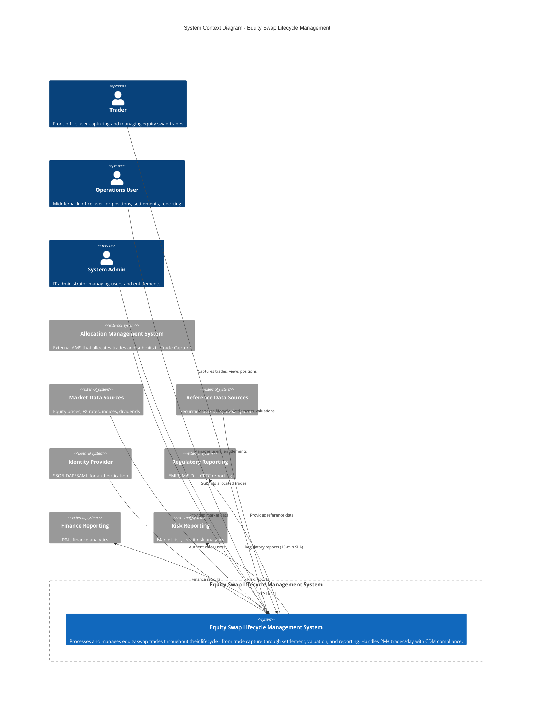

---

## C4 Level 2: Container Diagram

Shows the high-level technical building blocks (containers) inside the Equity Swap Lifecycle Management System.

```mermaid
C4Container
    title Container Diagram - Equity Swap Lifecycle Management System

    Person(trader, "Trader", "Captures and manages trades")

    System_Boundary(equity_swap_system, "Equity Swap Lifecycle Management System") {

        Container_Boundary(ingestion, "Ingestion Layer") {
            Container(gateway, "API Gateway", "Kong/Envoy", "Routing, auth, rate limiting")
            Container(tc, "Trade Capture Service", "Java/Spring Boot", "Receives allocated trades from AMS, translates to CDM instructions (optimistic pattern)")
        }

        Container_Boundary(orchestration, "Orchestration") {
            Container(engine, "Trade Lifecycle Engine", "Java/Spring Boot", "Stateless CDM primitive processor, Saga pattern for transaction integrity")
        }

        Container_Boundary(core_services, "Core Domain Services") {
            Container(pos, "Position Service", "Java/Spring Boot", "Source of truth for trade lots, positions, UTI lifecycle, settlement date tracking")
            Container(contract, "Contract Service", "Java/Spring Boot", "Product definitions, economic terms, legal agreements")
            Container(cf, "Cashflow Service", "Java/Spring Boot", "Equity leg + interest leg calculations, settlement date-based accrual")
            Container(reset, "Reset Service", "Java/Spring Boot", "Market observations, reset history for calculations")
            Container(val, "Valuation Service", "Java/Spring Boot", "MTM and cost basis valuations")
            Container(basket, "Basket / Custom Index Service", "Java/Spring Boot", "Dynamic baskets with CVT, rebalance instructions")
        }

        Container_Boundary(supporting, "Supporting Services") {
            Container(md_svc, "Market Data Service", "Java/Spring Boot", "Ingests prices, rates, indices; data quality")
            Container(ref_svc, "Reference Data Service", "Java/Spring Boot", "Securities, accounts, books, parties")
            Container(iam, "IAM Service", "Java/Spring Boot", "Authentication, RBAC, ABAC, entitlements")
        }

        Container_Boundary(messaging, "Messaging & Data") {
            ContainerQueue(event_bus, "Event Bus", "Kafka/Solace", "Business event streaming")
            ContainerDb(ods, "Data Product Hub (ODS)", "PostgreSQL/TimescaleDB", "Operational data store for reporting")
        }

        Container_Boundary(storage, "Storage") {
            ContainerDb(tc_db, "Trade Capture DB", "DynamoDB/Cassandra/PostgreSQL", "High-throughput trade queue")
            ContainerDb(pos_db, "Position DB", "PostgreSQL + TimescaleDB", "Trade lots, positions, UTI")
            ContainerDb(contract_db, "Contract DB", "PostgreSQL", "Products, legal agreements")
            ContainerDb(basket_db, "Basket DB", "MS SQL", "Basket definitions, constituents")
            ContainerDb(iam_db, "IAM DB", "PostgreSQL", "Users, roles, entitlements")
            Container(cache, "Cache", "Redis", "Authorization, position lookups, reference data")
        }
    }

    System_Ext(ams, "AMS", "Allocation Management System")
    System_Ext(idp, "Identity Provider", "SSO/LDAP")

    Rel(trader, gateway, "HTTPS")
    Rel(gateway, iam, "AuthZ check")
    Rel(gateway, tc, "Routes trades")
    Rel(ams, gateway, "Submits trades")
    Rel(idp, iam, "Authentication")

    Rel(tc, engine, "CDM instructions")
    Rel(tc, tc_db, "Reads/writes")
    Rel(tc, cache, "Cache")

    Rel(engine, pos, "Writes position state")
    Rel(engine, contract, "Writes product refs")
    Rel(engine, reset, "Writes observations")
    Rel(engine, cf, "Writes cashflows")
    Rel(engine, event_bus, "Publishes events")
    Rel(engine, basket, "Basket instructions")

    Rel(event_bus, ods, "Feeds ODS")
    Rel(event_bus, val, "Triggers valuation")
    Rel(event_bus, cf, "Triggers recalc")

    Rel(val, pos, "Reads positions")
    Rel(val, reset, "Reads resets")
    Rel(val, md_svc, "Reads prices")
    Rel(cf, contract, "Reads terms")
    Rel(cf, reset, "Reads observations")
    Rel(cf, pos, "Reads positions")

    Rel(pos, pos_db, "Reads/writes")
    Rel(pos, cache, "Cache")
    Rel(contract, contract_db, "Reads/writes")
    Rel(contract, cache, "Cache")
    Rel(basket, basket_db, "Reads/writes")
    Rel(iam, iam_db, "Reads/writes")
    Rel(iam, cache, "Auth cache")
    Rel(md_svc, ref_src, "Ingests")
    Rel(ref_svc, ref_src, "Syncs")
```

---

## C4 Level 3: Component Diagrams

### Trade Capture Service - Components

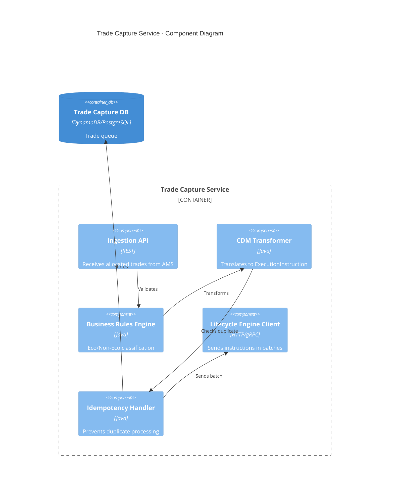

### Trade Lifecycle Engine - Components

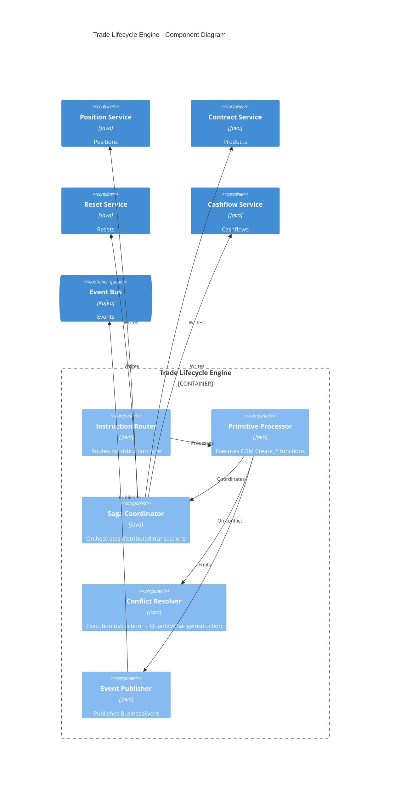

### Position Service - Components

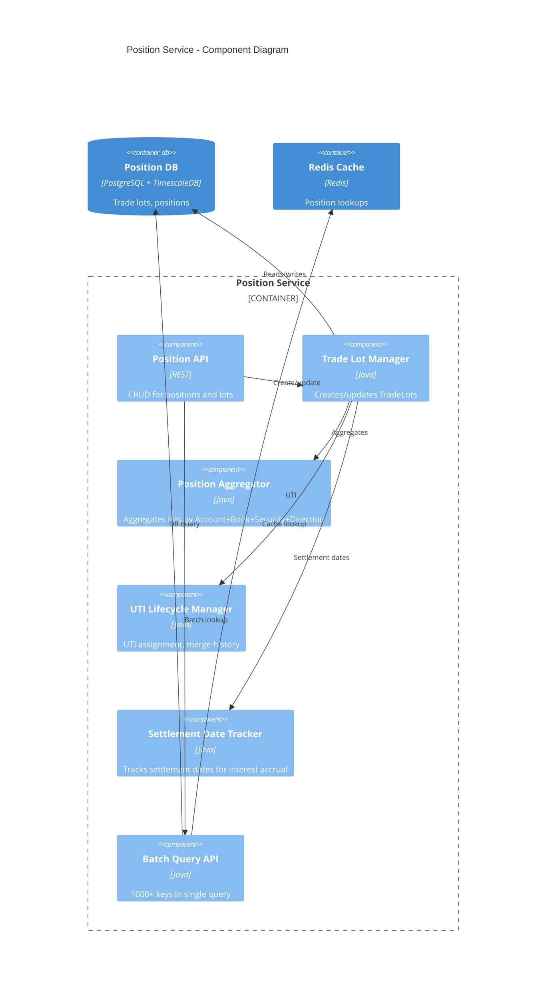

### Cashflow Service - Components

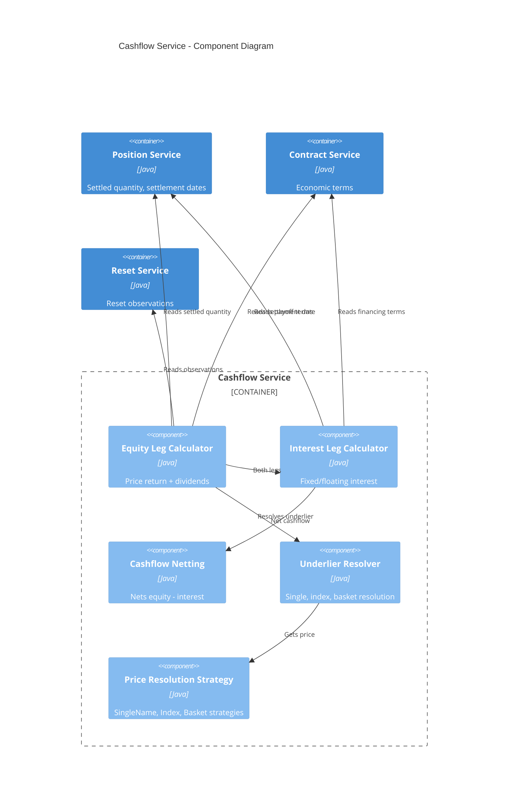

---

## C4 Level 4: Deployment Diagram (Optional)

High-level deployment view of the system.

```mermaid
C4Deployment
    title Deployment Diagram - Equity Swap System

    Deployment_Node(lb, "Load Balancer", "NGINX/HAProxy", "Routes traffic")

    Deployment_Node(app_cluster, "Application Cluster", "Kubernetes/ECS") {
        Deployment_Node(tc_node, "Trade Capture", "Docker") {
            Container(tc, "Trade Capture Service", "Java", "")
        }
        Deployment_Node(engine_node, "Lifecycle Engine", "Docker") {
            Container(engine, "Lifecycle Engine", "Java", "")
        }
        Deployment_Node(pos_node, "Position Service", "Docker") {
            Container(pos, "Position Service", "Java", "")
        }
        Deployment_Node(domain_nodes, "Other Domain Services", "Docker", "Contract, Cashflow, Reset, Valuation")
    }

    Deployment_Node(db_cluster, "Database Cluster") {
        Deployment_Node(dynamo, "Trade Capture DB", "DynamoDB/Cassandra") {
            ContainerDb(tc_db, "Trade Queue", "", "")
        }
        Deployment_Node(pg_primary, "PostgreSQL Primary", "PostgreSQL") {
            ContainerDb(pos_db, "Position DB", "", "")
            ContainerDb(contract_db, "Contract DB", "", "")
        }
        Deployment_Node(tsdb, "TimescaleDB", "TimescaleDB") {
            ContainerDb(tsdb_store, "Time-Series", "", "")
        }
        Deployment_Node(redis, "Redis Cluster", "Redis") {
            Container(cache, "Cache", "Redis", "")
        }
    }

    Deployment_Node(msg_cluster, "Messaging Cluster") {
        Deployment_Node(kafka, "Kafka", "Kafka") {
            ContainerQueue(event_bus, "Event Bus", "", "")
        }
    }

    Rel(lb, app_cluster, "HTTPS")
    Rel(tc_node, dynamo, "Reads/writes")
    Rel(pos_node, pg_primary, "Reads/writes")
    Rel(pos_node, tsdb, "Time-series")
    Rel(app_cluster, redis, "Cache")
    Rel(engine_node, kafka, "Publishes")
```

---

## Sequence Diagrams – Service Boundaries

Sequence diagrams showing synchronous and asynchronous interactions between services with clear boundaries (using Mermaid `box` to group participants by layer).

### 1. New Trade Capture Flow (Optimistic Pattern)

AMS → API Gateway (auth) → Trade Capture → Lifecycle Engine → Domain services.

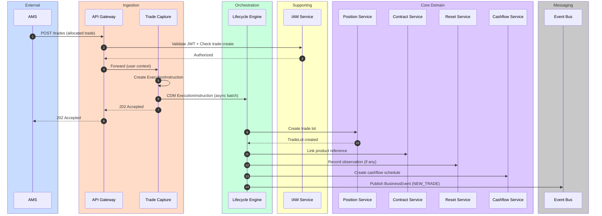

### 2. Conflict Resolution (Optimistic Pattern)

When Position Service detects existing position, Engine retries as QuantityChangeInstruction.

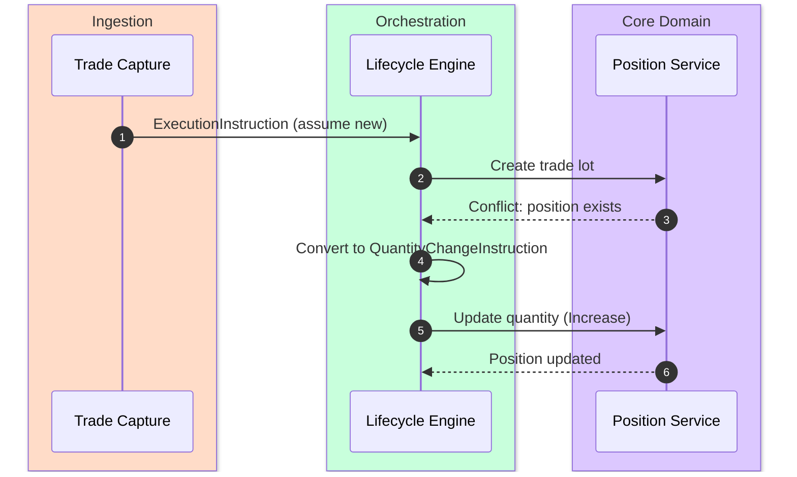

### 3. Reset + Transfer (Period-End Settlement)

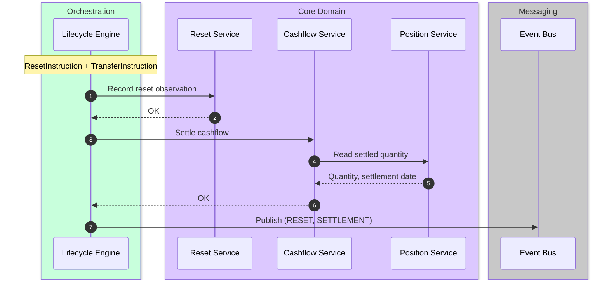

### 4. Event-Driven Valuation Flow

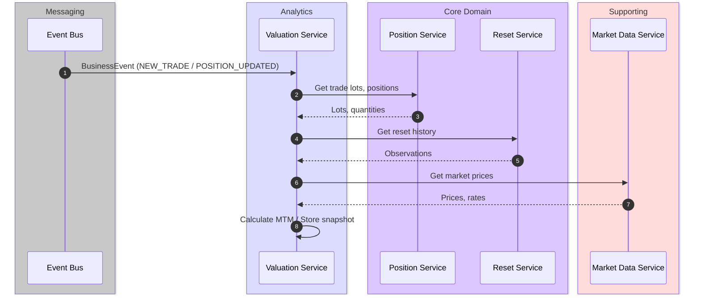

### 5. Cashflow Calculation (Read Across Services)

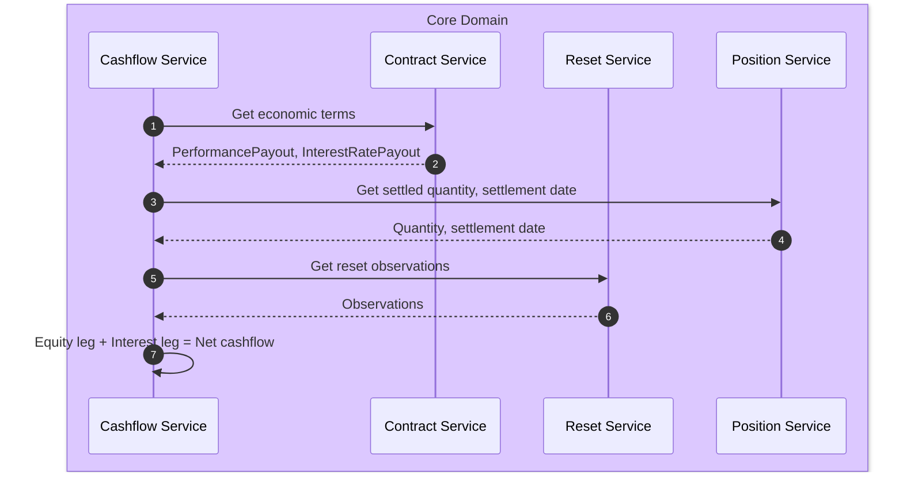

### 6. Authorization Flow

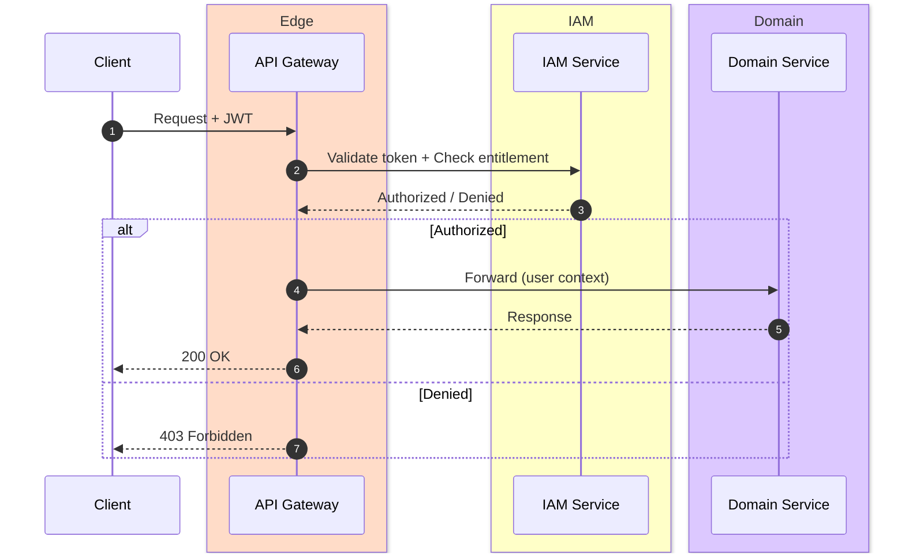

---

## Diagram Summary

| Level | Diagram | Purpose |
|-------|---------|---------|
| **1** | System Context | Shows the system boundary and external actors (users, AMS, market data, reporting) |
| **2** | Container | Shows major services (Trade Capture, Lifecycle Engine, Position, Contract, Cashflow, etc.) and their interactions |
| **3** | Component | Shows internal components of key services (Trade Capture, Lifecycle Engine, Position, Cashflow) |
| **4** | Deployment | Shows deployment topology (load balancer, app cluster, databases, messaging) |
| **—** | **Sequence** | Shows end-to-end flows with clear service boundaries (New Trade, Conflict Resolution, Reset+Transfer, Valuation, Cashflow, Authorization) |

---

## References

- [architectural_blueprint.md](architectural_blueprint.md) - Full architectural specification
- [Mermaid C4 Syntax](https://mermaid.js.org/syntax/c4.html) - C4 diagram rendering
- [C4 Model](https://c4model.com/) - C4 architecture documentation
