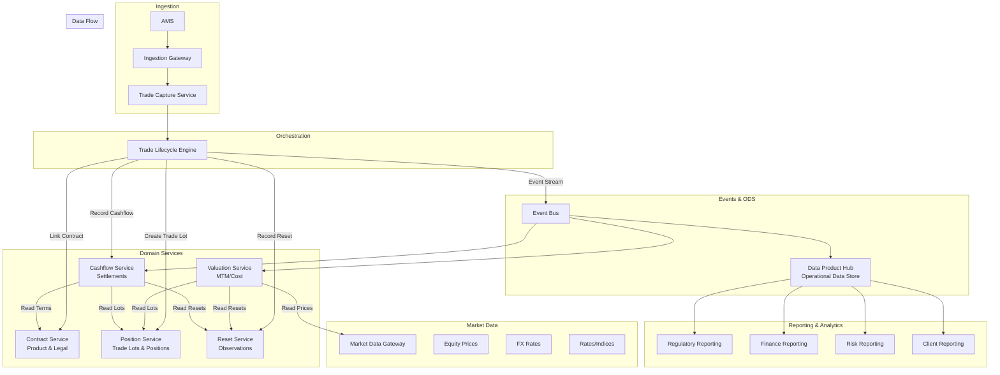
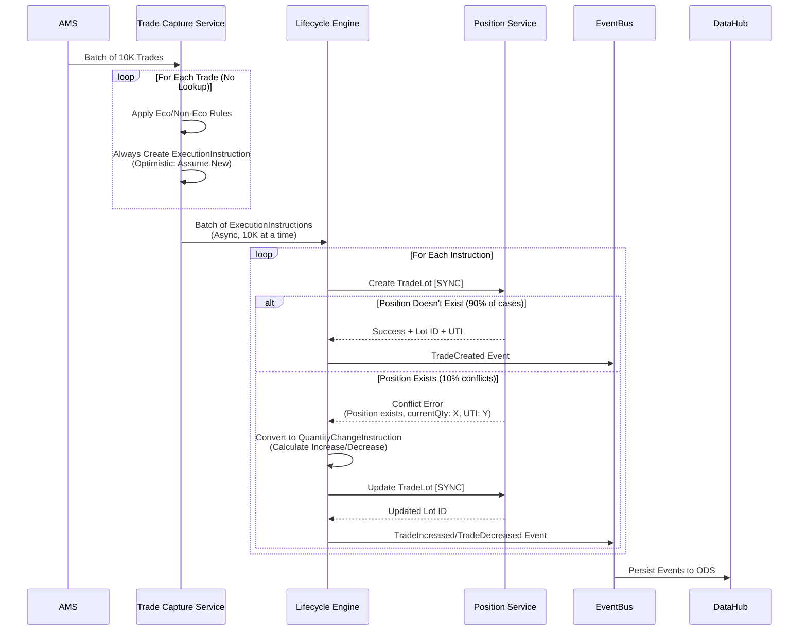

# Equity Swap Service Architecture - Consolidated Guide

## Table of Contents

1. [Architecture Overview](#1-architecture-overview)
   - [Service Boundaries & Responsibilities](#11-service-boundaries--responsibilities)
   - [Service Interaction Architecture](#12-service-interaction-architecture)
   - [Architecture Refinement: Eliminating Matching Service](#13-architecture-refinement-eliminating-matching-service)

2. [Lifecycle Engine](#2-lifecycle-engine)
   - [Implementation Overview](#21-implementation-overview)
   - [Supported Instructions](#22-supported-instructions)
   - [Primitive Instruction Processing](#23-primitive-instruction-processing)
   - [Composite Instructions & Transaction Integrity](#24-composite-instructions--transaction-integrity)

3. [Processing Patterns](#3-processing-patterns)
   - [Optimistic New Trade Pattern](#31-optimistic-new-trade-pattern)
   - [Scalability Patterns for High-Volume Trades](#32-scalability-patterns-for-high-volume-trades)
   - [Roll Trade Handling](#33-roll-trade-handling)

4. [Storage Models](#4-storage-models)
   - [Trade Capture Service Storage](#41-trade-capture-service-storage)
   - [Position Service Storage](#42-position-service-storage)
     - [Settlement Date & Quantity Tracking](#settlement-date--quantity-tracking)
   - [Contract Service Storage](#43-contract-service-storage)
   - [SQL Server 2022 Storage Models](#44-sql-server-2022-storage-models)

5. [Cashflow Service](#5-cashflow-service)
   - [Equity Swap Cashflow Service Design](#51-equity-swap-cashflow-service-design)

6. [Composite Instructions](#6-composite-instructions)
   - [Composite Instruction Structure](#61-composite-instruction-structure)
   - [Common Composite Patterns](#62-common-composite-patterns)

---

# 1. Architecture Overview

## 1.1 Service Boundaries & Responsibilities

### Contract Service (Product & Legal Domain)
**Purpose**: Manages product definitions, economic terms, and legal agreements.

**Data Stored**:
- Product definitions (`NonTransferableProduct`)
  - Economic terms structure (PerformancePayout, InterestRatePayout)
  - Calculation schedules (payment dates, reset dates)
  - Business day conventions
  - Day count fractions
- Legal agreements
  - Master agreements (ISDA)
  - Confirmations
  - Credit support annexes
- Collateral terms
  - Collateral provisions
  - Margin requirements
  - Eligible collateral types

**CDM Entities**: `Product`, `EconomicTerms`, `LegalAgreement`, `Collateral`

**Key Operations**:
- Create/Update product definitions
- Link trades to master agreements
- Manage collateral terms

---

### Position Service (Trade & Lot Domain)
**Purpose**: Source of truth for all trades at lot level, then aggregated at position level.

**Data Stored**:
- **Trade Lots** (source of truth):
  - `TradeLot` records with `priceQuantity` (quantity, price at execution)
  - Trade identifiers (UTI, internal IDs)
  - Trade dates and timestamps
  - Counterparties and parties
  - Links to `Contract.productId` (references Contract Service)
- **Aggregated Positions**:
  - Net quantity by `{Account + Book + Security + Direction}`
  - Position direction (LONG/SHORT)
  - `NonNegativeQuantitySchedule` (quantity changes over time)
  - Position state (Open, Closed, Settled)
- **UTI Lifecycle**:
  - Current active UTI per position
  - UTI history (created, merged, closed)
  - Merged UTIs tracking

**CDM Entities**: `TradeLot`, `Position`, `PositionIdentifier`, `PriceQuantity`, `NonNegativeQuantitySchedule`

**Key Operations**:
- Create/Update trade lots (from Lifecycle Engine)
- Aggregate positions from lots
- Manage UTI lifecycle
- Query net positions for reporting

**Note**: This is the **source of truth** for trade-level data (lots, quantities, parties, identifiers). Contract Service only provides the product template.

---

### Cashflow Service (Settlement Domain)
**Purpose**: Manages all cashflows - future (accrued) and realized (settled).

**Data Stored**:
- **Accrued Cashflows** (future):
  - Expected equity performance payments
  - Expected interest payments
  - Calculation period details
  - Accrual dates
- **Realized Cashflows** (settled):
  - Actual cash transfers (from `TransferInstruction`)
  - Settlement dates
  - Payer/receiver information
  - Links to resets that generated them
- **Cashflow Schedule**:
  - All future payment dates
  - Payment amounts (estimated/calculated)
  - Settlement status

**CDM Entities**: `Transfer`, `TransferState`, `CashTransfer`

**Key Operations**:
- Calculate future cashflows from contracts + resets
- Record realized cashflows (from Lifecycle Engine events)
- Update accruals as market data changes
- Provide cashflow projections

**Dependencies**:
- Reads from: Contract Service (economic terms), Reset Service (observations), Position Service (notionals)

---

### Reset Service (Observation Domain)
**Purpose**: Manages reset history - observations of market data over time.

**Data Stored**:
- **Reset History**:
  - Reset date
  - Reset value (observed price/rate)
  - Observation identifier (what was observed)
  - Links to payout (equity leg or interest leg)
  - Links to trade lots (via position reference)
- **Observation Metadata**:
  - Observation date vs reset date
  - Data source
  - Quality flags

**CDM Entities**: `Reset`, `ResetHistory`, `Observation`

**Key Operations**:
- Record reset observations (from Lifecycle Engine)
- Query reset history for calculations
- Provide latest reset values

**Overlap with Valuation Service?**
- **Reset Service**: Stores **raw observations** (prices, rates) - "what was the market data"
- **Valuation Service**: Stores **calculated valuations** (MTM, P&L) - "what is the position worth"
- **Distinct purposes**: Resets feed into valuations, but resets are also used for cashflow calculations and performance tracking

**Recommendation**: Keep them separate. Reset Service is the "market data journal" while Valuation Service is the "analytics engine".

---

### Valuation Service (Analytics Domain)
**Purpose**: Calculates and stores daily valuations (MTM/Cost basis).

**Data Stored**:
- **Daily Valuations**:
  - Valuation date
  - Valuation method (MTM or Cost)
  - Valuation amount
  - Currency
  - Links to market data used
- **Valuation History**:
  - Time series of valuations
  - P&L calculations
  - Attribution analysis

**CDM Entities**: `Valuation`, `ValuationInstruction` (if pinned to trade)

**Key Operations**:
- Calculate MTM valuations (using market prices)
- Calculate Cost basis valuations (using trade lots)
- Store valuation snapshots
- Provide "as-of" date valuations

**Dependencies**:
- Reads from: Position Service (trade lots), Market Data Gateway (prices), Reset Service (reset history for performance calculations)

**Note**: Valuation is **calculated** from other services' data, not stored as part of trade state (unless contractually required to be pinned).

---

### Trade Lifecycle Engine (Orchestration Domain)
**Purpose**: Stateless processor of CDM primitive instructions.

**Responsibilities**:
- Implements `Create_TradeState`, `Create_Reset`, `Create_QuantityChange`, etc.
- Coordinates writes to multiple services
- Generates `BusinessEvent` objects
- Maintains transaction boundaries (distributed transaction or saga pattern)

**Key Operations**:
- Process `ExecutionInstruction` → Create trade lot (Position Service) + Link contract (Contract Service)
- Process `ResetInstruction` → Record reset (Reset Service) + Update cashflows (Cashflow Service)
- Process `QuantityChangeInstruction` → Update trade lot (Position Service) + Recalculate cashflows (Cashflow Service)
- Process `TransferInstruction` → Record realized cashflow (Cashflow Service)

**CDM Entities**: `PrimitiveInstruction`, `BusinessEvent`

**Note**: This service is **stateless** and **pure logic**. It coordinates writes but doesn't store data.

---

## 1.2 Service Interaction Architecture



---

## 1.3 Architecture Refinement: Eliminating Matching Service

### The Problem with Separate Matching Service

**Current Architecture Issues**:
1. **Matching Service is not a domain** - It's a decision-making step, not a bounded context
2. **Unnecessary indirection** - Adds a hop between Trade Capture and Lifecycle Engine
3. **Tight coupling** - Matching Service must know about Position Service AND Lifecycle Engine
4. **Not CDM-aligned** - CDM doesn't have a "matching" concept; it has `ExecutionInstruction` vs `QuantityChangeInstruction`

### What Matching Actually Does:
- **Query**: Check if position exists (read from Position Service)
- **Decide**: New trade → `ExecutionInstruction`, Existing → `QuantityChangeInstruction`
- **Route**: Call Lifecycle Engine with appropriate instruction

This is **orchestration logic**, not a separate domain service.

---

### Refined Architecture: Optimistic New Trade Pattern (Recommended for High Volume: 2M+ Trades)

#### Updated Service Responsibilities

**Trade Capture Service (Optimistic Pattern)**
**Purpose**: Translate raw allocated trades into CDM instructions using optimistic approach.

**Responsibilities**:
1. Receive raw allocated trade from AMS
2. Apply Eco/Non-Eco rules
3. **Always Create ExecutionInstruction** (optimistic: assume new trade)
   - **No position lookup** (zero overhead)
   - Assume all trades are new trades
   - Create `ExecutionInstruction` for every trade
4. Call **Lifecycle Engine** with `ExecutionInstruction` (async batch processing)

**Key Insight**: Trade Capture Service is the **"Intent Translator"** - it translates business intent (allocated trade) into CDM instructions. For high-volume scenarios (2M+ trades), we use optimistic pattern to eliminate lookup overhead.

**Benefits**:
- ✅ **Zero lookup overhead** in Trade Capture Service (processes 2M trades instantly)
- ✅ **Simple architecture** (no caching, no batch queries needed)
- ✅ **Handles conflicts gracefully** (Lifecycle Engine retries as QuantityChangeInstruction)
- ✅ **High throughput** (no external dependencies in critical path)

---

**Lifecycle Engine (With Conflict Resolution)**
**Purpose**: Process CDM primitive instructions (stateless, pure logic) with optimistic conflict handling.

**Responsibilities**:
1. Receive `ExecutionInstruction` from Trade Capture Service
2. Attempt to create trade lot in Position Service
3. **Handle Conflicts**:
   - **If position exists** → Detects conflict, automatically converts to `QuantityChangeInstruction`
   - **If position doesn't exist** → Creates new trade lot successfully
4. Process instruction (Execute, QuantityChange, Reset, etc.)
5. Coordinate writes to domain services (Position, Contract, Reset, Cashflow)
6. Emit events to Event Bus

**Conflict Resolution Logic**:
- Position Service returns conflict error if position already exists
- Engine automatically retries with `QuantityChangeInstruction` (Increase/Decrease)
- Uses idempotency keys to prevent duplicate processing
- Handles ~10% conflict rate gracefully (acceptable for 2M trades)

---

### Updated Architecture Diagram

```mermaid
graph TB
    subgraph "Ingestion & Intent"
        AMS[AMS] --> Capture[Trade Capture Service<br/>Optimistic: Always ExecutionInstruction]
        Note over Capture: No Position Lookup<br/>Zero Overhead
    end

    subgraph "Processing"
        Capture -->|ExecutionInstruction<br/>(Async Batch)| Engine[Lifecycle Engine<br/>+ Conflict Resolution]
    end

    subgraph "Domain Services"
        Engine -->|Create/Update| Position[Position Service]
        Engine -->|Link| Contract[Contract Service]
        Engine -->|Record| Reset[Reset Service]
        Engine -->|Record| Cashflow[Cashflow Service]
        
        Note over Engine,Position: Conflict Detection:<br/>Position exists?<br/>Auto-retry as QuantityChange
    end

    subgraph "Events & ODS"
        Engine --> EventBus[Event Bus]
        EventBus --> DataHub[Data Product Hub]
        EventBus --> Cashflow
        EventBus --> Valuation[Valuation Service]
    end

    subgraph "Reporting"
        DataHub --> RegRep[Regulatory Reporting]
        DataHub --> Finance[Finance Reporting]
    end
```

**Key Changes**: 
- **Trade Capture Service**: No position lookup (optimistic approach)
- **Lifecycle Engine**: Handles conflicts automatically (retries as QuantityChangeInstruction)
- **No Matching Service**: Eliminated entirely
- **No Caching**: Not needed with optimistic pattern

---

# 2. Lifecycle Engine

## 2.1 Implementation Overview

The **Lifecycle Engine** is a stateless service that implements CDM's primitive instruction processing logic. It orchestrates the execution of `Create_*` functions as defined in CDM, coordinating writes to domain services and maintaining immutability principles.

### Service Responsibilities

1. **Process Primitive Instructions**: Implements CDM's `Create_TradeState` and all `Create_*` functions
2. **Coordinate Domain Services**: Writes to Position, Contract, Reset, Cashflow services
3. **Handle Conflicts**: Auto-resolves optimistic conflicts (ExecutionInstruction → QuantityChangeInstruction)
4. **Emit Events**: Publishes BusinessEvent to Event Bus
5. **Maintain Immutability**: Never modifies existing state, always creates new instances

### Service Boundaries

- **Input**: `PrimitiveInstruction` (ExecutionInstruction, QuantityChangeInstruction, ResetInstruction, etc.)
- **Output**: `BusinessEvent` with `after` TradeState
- **Dependencies**: Position Service, Contract Service, Reset Service, Cashflow Service, Market Data Gateway
- **Stateless**: No internal state storage, pure function processing

---

## 2.2 Supported Instructions

### Core Primitives (Must Support)

#### 1. ExecutionInstruction ✅ **REQUIRED**
- **Purpose**: Create a new trade from scratch
- **CDM Function**: `Create_Execution`
- **Use Cases**: New trade execution, Trade allocation, Trade novation (new trade leg)
- **Service Writes**: Position Service (Create TradeLot), Contract Service (Link Contract)
- **Business Events**: `NEW_TRADE`, `TRADE_ALLOCATION`, `NOVATION`

#### 2. QuantityChangeInstruction ✅ **REQUIRED**
- **Purpose**: Modify the quantity (and/or price) of an existing trade
- **CDM Function**: `Create_QuantityChange`
- **Use Cases**: Increase trade, Decrease trade, Partial termination, Full termination, Price adjustment
- **Service Writes**: Position Service (Update TradeLot quantity), Cashflow Service (Recalculate accrued cashflows)
- **Business Events**: `INCREASE_TRADE`, `DECREASE_TRADE`, `PARTIAL_TERMINATION`, `FULL_TERMINATION`

#### 3. ResetInstruction ✅ **REQUIRED**
- **Purpose**: Record observed equity prices or interest rate fixings at period end
- **CDM Function**: `Create_Reset`
- **Use Cases**: Quarterly reset (equity leg), Monthly reset (interest leg), Combined reset (both legs)
- **Service Writes**: Reset Service (Store reset observation), Cashflow Service (Trigger cashflow recalculation)
- **Business Events**: `RESET`, `PERIODIC_RESET`, `FALLBACK_RATE_RESET`

#### 4. TransferInstruction ✅ **REQUIRED**
- **Purpose**: Record cash transfers (settlements) between parties
- **CDM Function**: `Create_Transfer`
- **Use Cases**: Period-end settlement, Upfront payment, Termination payment, Margin call settlement
- **Service Writes**: Cashflow Service (Record realized cashflow)
- **Business Events**: `SETTLEMENT`, `PERIODIC_SETTLEMENT`, `TERMINATION_SETTLEMENT`

#### 5. TermsChangeInstruction ✅ **REQUIRED**
- **Purpose**: Modify product terms (economic terms, schedules, etc.)
- **CDM Function**: `Create_TermsChange`
- **Use Cases**: Amend payment frequency, Amend reset frequency, Amend calculation dates
- **Service Writes**: Contract Service (Update economic terms), Cashflow Service (Recalculate cashflow schedule)
- **Business Events**: `TERMS_AMENDMENT`, `SCHEDULE_AMENDMENT`

#### 6. PartyChangeInstruction ✅ **REQUIRED**
- **Purpose**: Change counterparty or party roles on a trade
- **CDM Function**: `Create_PartyChange`
- **Use Cases**: Novation (change counterparty), Assignment (change party role)
- **Service Writes**: Position Service (Update parties on TradeLot), Contract Service (Update legal agreement references)
- **Business Events**: `NOVATION`, `ASSIGNMENT`, `PARTY_CHANGE`

#### 7. ContractFormationInstruction ✅ **REQUIRED**
- **Purpose**: Associate legal agreement to a trade
- **CDM Function**: `Create_ContractFormation`
- **Use Cases**: Link ISDA master agreement, Link confirmation, Link credit support annex
- **Service Writes**: Contract Service (Link legal agreement)
- **Business Events**: `CONTRACT_FORMATION`, `LEGAL_AGREEMENT_LINKED`

### Optional Primitives (Nice to Have)

#### 8. StockSplitInstruction ⚠️ **OPTIONAL**
- **Purpose**: Handle stock split corporate actions
- **CDM Function**: `Create_StockSplit`
- **Use Cases**: Stock split, Reverse stock split, Stock dividend

#### 9. ExerciseInstruction ⚠️ **OPTIONAL**
- **Purpose**: Exercise an embedded option in a trade
- **CDM Function**: `Create_Exercise`
- **Use Cases**: Early termination option, Conversion option, Extension option

---

## 2.3 Primitive Instruction Processing

### Execution Order (CDM-Defined)

When multiple primitives are combined, CDM executes them in this order:

```java
1. execution
2. quantityChange
3. termsChange
4. partyChange
5. contractFormation
6. transfer
7. reset
8. indexTransition
9. observation
10. valuation
11. stockSplit
12. exercise (always last)
```

**Key Insight**: Each primitive modifies a **different aspect** of trade state, so they can be composed. However, **service writes** must be coordinated to maintain integrity.

### Key Processing Functions

#### Create_Execution
- Assigns product, creates trade lot, assigns parties, sets trade identifiers
- Sets position state to "Executed"
- Creates foundational trade structure

#### Create_Reset
- Records observed market data (prices, rates) at specific point in time
- Appends observations to `resetHistory` for historical tracking
- Does NOT modify the trade itself - only adds to reset history

#### Create_QuantityChange
- Updates trade lots with new quantities/prices
- Supports increases, decreases, and replacements
- Automatically sets position state to "Closed" if all quantities become zero

#### Create_TermsChange
- Modifies product terms (economic terms, dates, payout structure)
- Preserves trade lots and counterparties - only product terms change

#### Create_PartyChange
- Changes one of the counterparties on a trade
- Creates new trade identifier (party change = new trade)
- Clears transfer history (new trade, new history)

#### Create_Transfer
- Records cash or asset transfers between parties
- Appends to `transferHistory` for audit trail
- Does NOT modify the trade itself - only adds to transfer history

---

## 2.4 Composite Instructions & Transaction Integrity

### Overview

Composite instructions combine multiple primitive instructions (e.g., `Reset + Transfer`, `QuantityChange + TermsChange`). Processing these requires **transaction integrity** to ensure all primitives succeed or fail together, maintaining consistency across multiple domain services.

### Solution: Saga Pattern with Compensation

The **Saga Pattern** ensures transaction integrity by:
1. **Executing steps sequentially** (each step is a transaction)
2. **Tracking execution state** (which steps completed)
3. **Compensating on failure** (undo completed steps)
4. **Idempotent operations** (safe to retry)

### Saga Coordinator

The Lifecycle Engine uses a **Saga Coordinator** to manage composite instruction processing:

```java
@Service
public class CompositeInstructionSaga {
    
    public BusinessEvent processWithIntegrity(
            PrimitiveInstruction instruction,
            TradeState beforeState) throws SagaException {
        
        String sagaId = generateSagaId(instruction);
        SagaState sagaState = SagaState.builder()
            .sagaId(sagaId)
            .instruction(instruction)
            .beforeState(beforeState)
            .status(SagaStatus.IN_PROGRESS)
            .completedSteps(new ArrayList<>())
            .compensationActions(new ArrayList<>())
            .build();
        
        sagaStateStore.save(sagaState);
        
        try {
            // Process primitives in order
            TradeState currentState = beforeState;
            
            // Step 1: Execution
            if (instruction.getExecution() != null) {
                currentState = executeWithCompensation(
                    sagaId,
                    "execution",
                    () -> processExecution(instruction, currentState),
                    () -> compensateExecution(currentState)
                );
            }
            
            // ... Continue for all primitives in order
            
            // All steps completed successfully
            sagaState = sagaState.toBuilder()
                .status(SagaStatus.COMPLETED)
                .afterState(currentState)
                .build();
            sagaStateStore.save(sagaState);
            
            return createBusinessEvent(instruction, beforeState, currentState);
            
        } catch (SagaStepException e) {
            // Step failed - compensate all completed steps
            compensateAll(sagaId, sagaState);
            throw new SagaException("Composite instruction failed", e);
        }
    }
}
```

### Compensation Actions

Each primitive instruction has a corresponding compensation action that undoes its effects:

- **Execution Compensation**: Delete trade lot from Position Service, Unlink contract from Contract Service
- **Quantity Change Compensation**: Restore previous quantity
- **Reset Compensation**: Remove last reset from history
- **Transfer Compensation**: Remove last transfer from history

### Saga State Management

Saga state is persisted to enable recovery from failures:
- Track which steps completed
- Store compensation actions for each step
- Enable retry from last completed step
- Monitor saga health and performance

---

# 3. Processing Patterns

## 3.1 Optimistic New Trade Pattern

### Overview

The **Optimistic New Trade Pattern** is designed for high-volume trade processing (2M+ trades) where most trades are new. Instead of querying Position Service to determine if a trade is new or an amend, we **optimistically assume all trades are new** and let the Lifecycle Engine handle conflicts.

### Architecture Flow



### Implementation

**Trade Capture Service**:
- Always creates `ExecutionInstruction` (no position lookup)
- Processes 2M trades instantly (no external calls)
- Batch sends to Lifecycle Engine (async, 10K trades per batch)

**Lifecycle Engine**:
- Attempts to create trade lot in Position Service
- Detects conflicts automatically
- Converts to `QuantityChangeInstruction` if conflict detected
- Uses idempotency keys to prevent duplicates

**Performance**:
- **Trade Capture**: 2M trades processed instantly (no external calls)
- **Engine**: 2M attempts, ~10% conflicts (200K retries) = ~18-20 minutes total
- **Overall**: 2M trades processed in ~20-25 minutes (with 10 parallel workers)

**Benefits**:
- ✅ Zero lookup overhead in Trade Capture Service
- ✅ Simple architecture (no caching, no batch queries)
- ✅ Handles conflicts gracefully (automatic retry)
- ✅ High throughput (no external dependencies in critical path)

---

## 3.2 Scalability Patterns for High-Volume Trades

### Pattern 1: Batch Lookup with Caching (Recommended for 2M Trades)

**Architecture**: Trade Capture Service batches position lookups and caches results.

**Implementation**:
1. **Batch Grouping**: Group incoming trades by `{Account + Book + Security + Direction}`
2. **Caching Strategy**: In-Memory Cache (Redis/Memcached) with 5-10 minute TTL
3. **Batch Query API**: Position Service exposes `batchQueryPositions(keys: string[])`
4. **Cache Invalidation**: Event-driven (Position Service emits `PositionUpdated` event)

**Performance**:
- **Before**: 2M synchronous calls = ~2.7 hours
- **After**: 2M trades → ~2000 unique positions → 2 batch calls = ~100ms
- **With Cache**: 80% cache hit rate → 1.6M from cache (0ms) + 0.4M batch queries = ~40ms

**Benefits**:
- ✅ Reduces Position Service load by 99.9%
- ✅ Cache hit rate high (most trades are new, cache miss = new trade)
- ✅ Batch queries efficient (Position Service optimized for batch reads)

---

### Pattern 2: Partitioned Processing with Local Cache

**Architecture**: Partition trades by account/security, each partition has local cache.

**Implementation**:
1. **Partitioning Strategy**: Partition by `Account` (hash-based)
2. **Local Cache per Partition**: In-memory cache (Guava Cache, Caffeine)
3. **Batch Lookups**: Within partition, batch queries to Position Service

**Performance**:
- **Per Partition**: 666K trades → ~66K unique positions → 66 batch queries = ~3 seconds
- **Total**: 3 partitions × 3 seconds = ~9 seconds (parallel)
- **With Cache**: 80% hit rate → ~2 seconds per partition = ~6 seconds total

**Benefits**:
- ✅ Parallel processing (3 partitions = 3x speedup)
- ✅ Local cache per partition (smaller, faster)
- ✅ Scales horizontally (add more partitions)

---

### Recommended Solution: Hybrid Approach

For 2M hedge trades, use **Pattern 1 (Batch Lookup + Caching) with Pattern 4 (Partitioning)**:

**Architecture**:
- Partition by `Account` hash (3-5 partitions)
- Each partition batches position queries (1000 keys per batch)
- Redis cache per partition (shared cache also works)
- Event-driven cache invalidation

**Expected Performance**:
- **2M trades processed in < 1 minute** (with 3 parallel partitions)
- **Position Service load**: ~2000 batch queries (instead of 2M individual queries)
- **Cache hit rate**: 80%+ (new trades = cache miss = new position)

---

## 3.3 Roll Trade Handling

### Overview

A **roll trade** is a business event where an existing trade is closed and a new trade is entered into with the same characteristics, except with an extended termination date and (possibly) a different price.

### CDM Implementation

Roll trades use a **SplitInstruction** with two breakdowns:

#### Breakdown 1: Termination
- **Type**: `QuantityChangeInstruction`
- **Direction**: `Replace`
- **Action**: Set all quantities to zero
- **Purpose**: Close the existing trade

#### Breakdown 2: New Rolled Trade
- **Type**: Composite `PrimitiveInstruction` containing:
  - **QuantityChangeInstruction**: Set new price/quantity
  - **TermsChangeInstruction**: Update dates
    - `effectiveDate`: effectiveRollDate (new effective date)
    - `terminationDate`: terminationDate (new termination date)

### Roll Trade Characteristics

**What Changes**:
1. **Effective Date**: Updated to the roll date (typically the old termination date)
2. **Termination Date**: Extended to the new termination date
3. **Price/Quantity**: May change based on market conditions (optional)
4. **Trade State**: Original trade closed, new trade opened

**What Stays the Same**:
1. **Product Structure**: Same payout structure
2. **Collateral**: Same collateral provisions
3. **Parties**: Same counterparties and roles
4. **Other Economic Terms**: All other terms remain unchanged

### Use Cases

1. **Repo Roll at Maturity**: Repo matures and is rolled into a new repo with extended term
2. **Futures Contract Roll**: Rolling from front month to back month futures contract
3. **Forward Contract Extension**: Extending a forward contract beyond original termination date

---

# 4. Storage Models

## 4.1 Trade Capture Service Storage

### Recommended: DynamoDB (AWS) or Cassandra (On-Prem)

**Why DynamoDB/Cassandra?**
1. **High Write Throughput**: Optimized for write-heavy workloads
2. **Partitioning**: Built-in partitioning by partition key
3. **Low Latency**: Single-digit millisecond reads/writes
4. **Idempotency**: Conditional writes prevent duplicates
5. **Scalability**: Auto-scales with traffic

**Schema Design**:
- **Partition Key**: `accountId` (for partitioning)
- **Sort Key**: `tradeId` (for uniqueness)
- **GSI**: `idempotencyKey` (for idempotency checks)

**Performance**:
- **Write**: 40,000+ write units per partition (can burst higher)
- **Read**: < 5ms P99 (point lookup), < 10ms P99 (GSI query)
- **Scalability**: Auto-scales partitions

---

### Alternative: PostgreSQL with Partitioning

**Schema Design**:
- Partitioned table by `account_id` (hash-based)
- Unique index on `idempotency_key`
- Indexes on `trade_timestamp`, `processing_status`

**Benefits**:
- ✅ Strong consistency (ACID transactions)
- ✅ SQL queries (complex queries if needed)
- ✅ JSONB support (flexible schema)

**Trade-offs**:
- ⚠️ Lower write throughput than DynamoDB/Cassandra
- ⚠️ Requires manual scaling (read replicas, sharding)

---

## 4.2 Position Service Storage

### Recommended: PostgreSQL with Partitioning + TimescaleDB + Redis Cache

**Why PostgreSQL?**
1. **ACID Transactions**: Required for UTI assignment, position updates
2. **Strict Sequencing**: Partition-level ordering ensures correct processing
3. **Complex Queries**: Batch queries, aggregations, time-series queries
4. **JSONB Support**: Flexible schema for CDM structures
5. **Mature Ecosystem**: Proven at scale

**Schema Design**:

**Table: `trade_lots` (Partitioned)**
- Partitioned by `partition_key` (`{accountId}_{bookId}_{securityId}`)
- **Date Fields**: `trade_date` (when trade was executed), `settlement_date` (when interest accrual starts)
- **Quantity Fields**: `quantity` (effective quantity), `settled_quantity` (quantity that was actually settled)
- Indexes on `partition_key`, `trade_timestamp`, `trade_id`, `position_id`, `uti`, `settlement_date`

**Table: `positions` (Partitioned)**
- Partitioned by `partition_key` (`{accountId}_{bookId}_{securityId}_{direction}`)
- Unique constraint on `partition_key`
- Optimistic locking with `version` column
- Indexes on `uti`, `account_id`, `security_id`

**Table: `uti_lifecycle`**
- Tracks UTI status, merge history, regulatory reporting status
- Indexes on `status`, `position_key`, `merged_into`

**Table: `quantity_schedule` (Time-Series)**
- Uses TimescaleDB extension for time-series optimization
- Hypertable partitioned by `effective_date`
- Index on `position_id`, `effective_date`

**Batch Query API**:
- Optimized stored procedure for batch queries (1000+ keys)
- Uses `OPENJSON` for parsing key arrays
- Parallel execution with `MAXDOP`

**Redis Cache**:
- Cache key: `position:{accountId}:{bookId}:{securityId}:{direction}`
- TTL: 10 minutes
- Event-driven cache invalidation

**Performance**:
- **Batch Query (1000 keys)**: < 50ms P99
- **Point Lookup**: < 5ms P99
- **Time-Series Query**: < 20ms P99 (with TimescaleDB)
- **Cache Hit**: < 1ms

---

#### Settlement Date & Quantity Tracking

#### The Problem

For cashflow and interest calculations, we need to know:
1. **The exact settled quantity** (what quantity was actually settled)
2. **The settlement date** (when interest accrual starts)

However, `NonNegativeQuantitySchedule` only tracks:
- **Effective date** (trade date) - when quantity becomes effective
- **Quantity value** - the quantity amount

**The Gap**: 
- Trade Date: 2024-01-15 (quantity becomes effective)
- Settlement Date: 2024-01-17 (when interest accrual should start)
- **Problem**: `NonNegativeQuantitySchedule.datedValue.date = 2024-01-15` (trade date)
- **Need**: Settlement date (2024-01-17) to know when interest accrual starts

#### CDM's Current Approach

CDM uses **calculation periods** for interest accrual, which are based on the **effective date** from the product definition:

**CDM's Assumption**: For most products, **effective date ≈ settlement date** (or the difference is negligible).

**For Equity Swaps**: This assumption may not hold if there's a significant gap between trade date and settlement date (T+2, T+3).

---

#### Recommended Solution: Hybrid Approach (Solution 4)

**Approach**: Store settlement date in TradeLot (Position Service) and use `PriceQuantity.effectiveDate` as fallback.

**Implementation Strategy**:

1. **Store settlement date in TradeLot** (Position Service)
   - Add `settlement_date` column to `trade_lots` table
   - Add `settled_quantity` column to track actual settled quantity
   - Use settlement date for interest accrual start

2. **Use `PriceQuantity.effectiveDate`** as settlement date for quantity changes
   - When creating quantity changes, set `PriceQuantity.effectiveDate` = settlement date
   - Provides fallback when settlement date is not explicitly stored

3. **Use settlement date for interest accrual calculations** (not trade date)
   - Interest accrual starts from settlement date, not trade date
   - Year fraction calculation uses settlement date as start date

4. **Track settled quantity separately** from effective quantity
   - Settled quantity may differ from effective quantity (partial settlements)
   - Use settled quantity for interest calculations

#### Enhanced Schema Design

```sql
-- Enhanced trade_lots table with settlement tracking
CREATE TABLE trade_lots (
    lot_id VARCHAR(255) PRIMARY KEY,
    trade_id VARCHAR(255) NOT NULL,
    partition_key VARCHAR(255) NOT NULL,
    
    -- Quantity information
    quantity DECIMAL(20, 8) NOT NULL,
    settled_quantity DECIMAL(20, 8) NOT NULL,  -- Quantity that was actually settled
    price_quantity JSONB NOT NULL,  -- Full CDM PriceQuantity
    
    -- Date information
    trade_date DATE NOT NULL,           -- Trade date (when executed)
    settlement_date DATE NOT NULL,      -- Settlement date (when interest accrual starts)
    
    -- Other fields
    direction VARCHAR(10) NOT NULL,
    uti VARCHAR(255),
    position_id VARCHAR(255),
    created_at TIMESTAMP DEFAULT NOW(),
    updated_at TIMESTAMP DEFAULT NOW()
);

-- Index for interest accrual queries (by settlement date)
CREATE INDEX idx_settlement_date 
ON trade_lots (settlement_date, lot_id);

-- Index for quantity schedule queries (by trade date)
CREATE INDEX idx_trade_date 
ON trade_lots (trade_date, lot_id);
```

#### Implementation: Settlement Tracking Service

```java
public class TradeLotSettlementTracker {
    
    /**
     * Get settled quantity for interest accrual.
     * Priority:
     * 1. Settlement date from TradeLot (if stored)
     * 2. effectiveDate from PriceQuantity (if present)
     * 3. Trade date (fallback)
     */
    public SettledQuantityInfo getSettledQuantity(
            TradeLot lot,
            LocalDate calculationDate) {
        
        // Try to get settlement date from TradeLot
        LocalDate settlementDate = lot.getSettlementDate();
        BigDecimal settledQuantity = lot.getSettledQuantity();
        
        // Fallback: use PriceQuantity.effectiveDate
        if (settlementDate == null) {
            PriceQuantity priceQuantity = lot.getPriceQuantity().get(0);
            if (priceQuantity.getEffectiveDate() != null) {
                settlementDate = resolveDate(
                    priceQuantity.getEffectiveDate()
                );
                settledQuantity = getQuantityFromSchedule(
                    priceQuantity.getQuantity(),
                    settlementDate
                );
            }
        }
        
        // Final fallback: use trade date
        if (settlementDate == null) {
            settlementDate = lot.getTradeDate();
            settledQuantity = getQuantityFromSchedule(
                lot.getPriceQuantity().get(0).getQuantity(),
                settlementDate
            );
        }
        
        return SettledQuantityInfo.builder()
            .quantity(settledQuantity)
            .settlementDate(settlementDate)
            .build();
    }
}
```

#### Usage: Creating New Trades

```java
// When creating a new trade
TradeLot lot = TradeLot.builder()
    .priceQuantity(List.of(
        PriceQuantity.builder()
            .quantity(NonNegativeQuantitySchedule.builder()
                .value(Quantity.builder()
                    .value(new BigDecimal("1000000"))
                    .unit(UnitType.builder()
                        .financialUnit(FinancialUnitEnum.SHARE)
                        .build())
                    .build())
                .build())
            .effectiveDate(AdjustableOrRelativeDate.builder()
                .adjustableDate(AdjustableDate.builder()
                    .unadjustedDate(settlementDate)  // SETTLEMENT DATE
                    .build())
                .build())
            .build()
    ))
    .build();

// Store in Position Service with settlement date
positionService.createTradeLot(
    lot,
    tradeDate,        // 2024-01-15
    settlementDate,  // 2024-01-17
    settledQuantity  // 1,000,000 shares
);
```

#### Usage: Quantity Changes

```java
// When increasing quantity
PriceQuantity increase = PriceQuantity.builder()
    .quantity(NonNegativeQuantitySchedule.builder()
        .value(Quantity.builder()
            .value(new BigDecimal("500000"))  // Additional quantity
            .build())
        .build())
    .effectiveDate(AdjustableOrRelativeDate.builder()
        .adjustableDate(AdjustableDate.builder()
            .unadjustedDate(settlementDate)  // SETTLEMENT DATE of increase
            .build())
        .build())
    .build();

// Store with settlement date
positionService.updateTradeLot(
    lotId,
    increase,
    tradeDate,        // 2024-06-01
    settlementDate,  // 2024-06-03
    settledQuantity  // 500,000 additional shares
);
```

#### Example: Trade with T+2 Settlement

**Scenario**:
- **Trade Date**: 2024-01-15
- **Settlement Date**: 2024-01-17 (T+2)
- **Quantity**: 1,000,000 shares
- **Interest Rate**: 2.5% per annum
- **Calculation Date**: 2024-02-15

**Storage**:
```json
{
  "tradeLot": {
    "lotId": "LOT-001",
    "priceQuantity": [{
      "quantity": [{
        "value": {
          "value": 1000000,
          "unit": {"financialUnit": "SHARE"}
        }
      }],
      "effectiveDate": {
        "adjustableDate": {
          "unadjustedDate": "2024-01-17"  // SETTLEMENT DATE
        }
      }
    }],
    "tradeDate": "2024-01-15",
    "settlementDate": "2024-01-17",
    "settledQuantity": 1000000
  }
}
```

**Interest Calculation**:
```
Accrual Period: 2024-01-17 to 2024-02-15
Days: 29 days
Year Fraction: 29 / 365 = 0.07945
Notional: 1,000,000 shares
Interest Rate: 2.5%
Interest = 1,000,000 × 0.025 × 0.07945 = $1,986.25
```

**Key Point**: Interest accrues from **2024-01-17** (settlement date), not **2024-01-15** (trade date).

---

#### Key Principles

1. ✅ **Settlement date** determines when interest accrual starts
2. ✅ **Settled quantity** is what was actually settled (may differ from effective quantity)
3. ✅ **Trade date** is when trade was executed (for position tracking)
4. ✅ **Effective date** in quantity schedule can represent settlement date for quantity changes
5. ✅ **CDM-compliant** (extends CDM, doesn't modify it)

This ensures accurate interest calculations while maintaining CDM compliance.

---

## 4.3 Contract Service Storage

### Recommended: PostgreSQL with JSONB + Redis Cache

**Why PostgreSQL + JSONB?**
1. **Complex Nested Structures**: JSONB handles CDM's complex product structures
2. **Strong Consistency**: Required for product definitions
3. **Flexible Schema**: Products can have varying structures
4. **Query Support**: JSONB queries, indexing, full-text search
5. **Mature Ecosystem**: Proven at scale

**Schema Design**:

**Table: `products`**
- `product_id` (Primary Key)
- `product_type`, `product_definition` (JSONB), `economic_terms` (JSONB)
- `legal_agreement` (JSONB), `collateral_terms` (JSONB)
- GIN indexes on JSONB columns for efficient queries

**Table: `product_versions` (Temporal Table)**
- Versioning support for immutable products
- Temporal table for history tracking

**Table: `legal_agreements`**
- `agreement_id` (Primary Key)
- `agreement_type`, `agreement_data` (JSONB), `parties` (JSONB array)
- Indexes on `agreement_type`, `effective_date`, `parties_json`

**JSON Query Examples**:
```sql
-- Query products by payout type
SELECT product_id, product_definition
FROM products
WHERE product_definition @> '{"payout": [{"performancePayout": {}}]}';

-- Query products with specific underlier
SELECT product_id, economic_terms
FROM products
WHERE economic_terms @> '{"performancePayout": {"underlier": {"security": {"identifier": ["ISIN:US0378331005"]}}}}';
```

**Redis Cache**:
- Cache key: `product:{productId}`
- TTL: 24 hours (products rarely change)
- Cache hit rate: 95%+

**Performance**:
- **Point Lookup**: < 5ms P99 (with index)
- **JSONB Query**: < 20ms P99 (with GIN index)
- **Cache Hit**: < 1ms

---

## 4.4 SQL Server 2022 Storage Models

### Trade Capture Service: SQL Server In-Memory OLTP

**Why In-Memory OLTP?**
1. **High Write Throughput**: 50,000+ writes/second per instance
2. **Low Latency**: < 1ms P99 (in-memory)
3. **Lock-Free Concurrency**: Optimistic concurrency control
4. **Partitioning**: Supports partitioned memory-optimized tables (SQL Server 2022)

**Schema Design**:
- Memory-optimized table with `DURABILITY = SCHEMA_AND_DATA`
- Hash indexes for fast lookups
- Natively compiled stored procedures for high performance

**Performance**:
- **Write**: 50,000+ writes/second
- **Latency**: < 1ms P99
- **Read**: < 1ms P99 (hash index)

---

### Position Service: SQL Server Partitioned + Temporal Tables + Columnstore

**Key Features**:
1. **Partitioning**: Hash-based partitioning by `partition_key`
2. **Temporal Tables**: System-versioned temporal tables for time-series data
3. **Columnstore Indexes**: For analytics workloads (10x compression, batch mode)
4. **Always On Availability Groups**: Read replicas for read scaling

**Schema Design**:
- Partitioned tables for `trade_lots` and `positions`
- Temporal table for `quantity_schedule` (auto-history tracking)
- Columnstore indexes for analytics queries
- Batch query stored procedures with parallel execution

**Performance**:
- **Batch Query (1000 keys)**: < 50ms P99
- **Point Lookup**: < 5ms P99
- **Time-Series Query**: < 20ms P99

---

### Contract Service: SQL Server JSON + Columnstore + Always On

**Key Features**:
1. **JSON Support**: Native JSON data type with JSON functions
2. **JSON Indexes**: Computed columns with indexes for JSON queries
3. **Columnstore Indexes**: For analytics workloads
4. **Always On Availability Groups**: Read replicas for read scaling

**Schema Design**:
- JSON columns for `product_definition`, `economic_terms`, `legal_agreement`
- JSON indexes (computed columns) for efficient queries
- Temporal table for `product_versions`
- Columnstore index for analytics

**Performance**:
- **Point Lookup**: < 5ms P99
- **JSON Query**: < 20ms P99 (with JSON index)
- **Cache Hit**: < 1ms

---

# 5. Cashflow Service

## 5.1 Equity Swap Cashflow Service Design

### Overview

Equity swaps have **two legs**:
1. **Equity Leg** (`PerformancePayout`) - Tracks equity performance
2. **Interest/Funding Leg** (`InterestRatePayout`) - Calculates interest payments

Both legs must be calculated and netted to determine the final cashflow.

### Core Calculation Formulas

#### Equity Leg - Price Return Only:
```
Equity Performance = Price Rate Of Return × Equity Notional Amount
Price Rate Of Return = (Final Price - Initial Price) / Initial Price
Equity Notional Amount = Number Of Securities × Price
```

#### Equity Leg - Total Return (Price + Dividends):
```
Equity Performance = (Price Rate Of Return + Dividend Rate Of Return) × Equity Notional Amount
Price Rate Of Return = (Final Price - Initial Price) / Initial Price
Dividend Rate Of Return = Sum of (Dividend Amount × Payout Ratio) / Initial Price
Equity Notional Amount = Number Of Securities × Price
```

#### Interest Leg:
```
Fixed Interest Amount = Notional × Fixed Rate × Year Fraction
Floating Interest Amount = Notional × Floating Rate × Year Fraction
Year Fraction = Days in Period / Days in Year (using Day Count Fraction)
```

#### Net Cashflow:
```
Net Cashflow = Equity Performance - Interest Amount
```
(Note: Direction depends on payer/receiver roles)

### Service Architecture

#### Layer 1: Underlier Abstraction
Create a generic interface that abstracts the underlier type:
- `UnderlierResolver`: Resolves prices for single, index, basket, and basket-with-CVT (including CVT as synthetic underlier) underliers
- `PriceResolutionStrategy`: Different strategies for different underlier types

#### Layer 2: Price Resolution Strategy
- **SingleNamePriceStrategy**: Resolves prices for single-name underliers
- **IndexPriceStrategy**: Resolves prices for index underliers
- **BasketPriceStrategy**: Resolves prices for basket underliers (weighted aggregation); **extended for baskets with CVT**: basket value = Σ(real underlyer MV) + CVT amount; enforce **notional-neutral** invariant (Index MTM = Σ constituent MTM + CVT within tolerance)
- **CVTPriceStrategy** (or equivalent): Treats CVT (Cash Value Ticker) as synthetic underlier; price = 1.0, quantity = cash amount; return = overnight accrual (SOFR/EONIA/Fed Funds), explicit financing spread, or zero (term-sheet dependent)

#### Layer 3: Cashflow Calculation Service
- **EquityLegCashflowService**: Calculates equity leg cashflows
- **InterestLegCashflowService**: Calculates interest leg cashflows
- **EquitySwapCashflowService**: Orchestrates both legs and nets them

### Return Terms and Dividend Handling

CDM's `ReturnTerms` on `PerformancePayout` determines what components are included in equity performance:

1. **`priceReturnTerms.returnType = Price`** - Only price returns (excludes dividends)
2. **`priceReturnTerms.returnType = Total`** - Total returns (price + dividends)

When `returnType = Total`, the `dividendReturnTerms` must be present and dividends must be calculated and added to the price return.

### Handling Different Underlier Types

1. **Single Name**: Direct price resolution from market data service
2. **Index**: Index price resolution (may require different logic)
3. **Basket**: Weighted aggregation of component prices and dividends
4. **Basket with CVT (Cash-Funded Basket)**: Same as basket, but includes **CVT** as residual constituent (unallocated notional). CVT = notional − Σ(real underlyer MV); use **CVTPriceStrategy** for CVT (price 1, accrual or zero). **Invariant**: Index MTM = Σ constituent MTM + CVT (within tolerance).
5. **CVT (Cash Value Ticker)**: Synthetic underlier; instrument type `CASH` / `CASH_INDEX` / `FUNDING_TICKER`; price = 1.0, quantity = cash amount; return = overnight accrual, financing spread, or zero per product config.

### Basket with CVT (Cash-Funded Basket)

For **client-specified, dynamically rebalanced custom baskets** with a **Cash Value Ticker (CVT)**:

- **CVT**: Residual constituent representing unallocated notional; behaves as cash (overnight accrual or zero). **CVT is never a traded underlier**; it is derived as notional − Σ(real underlyer MV).
- **Return treatment**: Overnight index accrual (SOFR/EONIA/Fed Funds), explicit financing spread, or zero return (term-sheet dependent). Accrual aligns with `InterestRatePayout` or custom funding leg.
- **Cashflow**: CVT contributes **financing P&L only** when accrual applies. Document alongside settlement-date interest logic; use same accrual conventions (settlement date, year fraction) where relevant.
- **Valuation**: Basket value = Σ(real underlyer MV) + CVT amount. **Rebalance is product mechanics, not trade lifecycle**; no TradeState mutation. See [architectural_blueprint](architectural_blueprint.md) §3.8 and [dynamic_basket_equity_swap_cvt_e2e](detailed-documents/dynamic_basket_equity_swap_cvt_e2e.md) for full E2E specification (invariants, physical model, CDM, events, P&L, risk, reg reporting, ODS, controls).

### Complete Equity Swap Service

The main service calculates both legs and nets them:

```java
@Service
public class EquitySwapCashflowService {
    
    public EquitySwapCashflow calculateNetCashflow(
        String tradeId,
        Date valuationDate
    ) {
        // 1. Load trade state
        TradeState tradeState = tradeStateRepository.findByTradeId(tradeId);
        
        // 2. Extract both payouts
        EquityPayout equityPayout = tradeState.getEquityPayout();
        InterestPayout interestPayout = tradeState.getInterestPayout();
        
        // 3. Calculate equity leg cashflow
        Cashflow equityCashflow = equityLegService.calculateCashflow(
            equityPayout, tradeState, valuationDate
        );
        
        // 4. Calculate interest leg cashflow
        CalculationPeriod calculationPeriod = determineCalculationPeriod(
            interestPayout, valuationDate
        );
        List<Reset> resets = tradeState.getResetHistory();
        
        Cashflow interestCashflow = interestLegService.calculateInterestCashflow(
            interestPayout, tradeState, calculationPeriod, resets
        );
        
        // 5. Net the cashflows
        BigDecimal netAmount = calculateNetAmount(
            equityCashflow, interestCashflow
        );
        
        return EquitySwapCashflow.builder()
            .setEquityLeg(equityCashflow)
            .setInterestLeg(interestCashflow)
            .setNetAmount(netAmount)
            .build();
    }
}
```

### Interest Calculation with Settlement Date

For interest calculations, the Cashflow Service must use **settlement date** (not trade date) for accrual start:

```java
public class InterestCalculationService {
    
    /**
     * Calculate interest for a period.
     * Interest accrues from SETTLEMENT DATE, not trade date.
     */
    public BigDecimal calculateInterest(
            String lotId,
            LocalDate periodStart,
            LocalDate periodEnd,
            BigDecimal interestRate,
            DayCountFraction dayCountFraction) {
        
        // Step 1: Get settled quantity info (from Position Service)
        SettledQuantityInfo settled = getSettledQuantityInfo(lotId, periodStart);
        
        // Step 2: Determine accrual start date
        // Use MAX(settlement_date, period_start) to handle partial periods
        LocalDate accrualStart = settled.getSettlementDate()
            .isAfter(periodStart) ? 
            settled.getSettlementDate() : 
            periodStart;
        
        // Step 3: Calculate year fraction from accrual start
        BigDecimal yearFraction = calculateYearFraction(
            accrualStart,
            periodEnd,
            dayCountFraction
        );
        
        // Step 4: Use settled quantity (not effective quantity)
        BigDecimal notional = settled.getQuantity();
        
        // Step 5: Calculate interest
        return notional
            .multiply(interestRate)
            .multiply(yearFraction);
    }
    
    private SettledQuantityInfo getSettledQuantityInfo(
            String lotId,
            LocalDate asOfDate) {
        
        // Query trade lot with settlement date (from Position Service)
        TradeLot lot = positionService.getTradeLot(lotId);
        
        // Use hybrid approach: settlement date from TradeLot or PriceQuantity.effectiveDate
        LocalDate settlementDate = lot.getSettlementDate();
        if (settlementDate == null) {
            PriceQuantity priceQuantity = lot.getPriceQuantity().get(0);
            if (priceQuantity.getEffectiveDate() != null) {
                settlementDate = resolveDate(priceQuantity.getEffectiveDate());
            } else {
                settlementDate = lot.getTradeDate();  // Fallback
            }
        }
        
        // Get quantity from schedule at settlement date
        BigDecimal quantity = getQuantityScheduleStepValues(
            lot.getPriceQuantity().get(0).getQuantity(),
            settlementDate  // Use settlement date, not asOfDate
        );
        
        return SettledQuantityInfo.builder()
            .quantity(quantity)
            .settlementDate(settlementDate)
            .build();
    }
}
```

**Key Points**:
- Interest accrual starts from **settlement date**, not trade date
- Use **settled quantity** (actual settled amount), not effective quantity
- Hybrid approach: Settlement date from TradeLot, with fallback to `PriceQuantity.effectiveDate`
- Ensures accurate interest calculations for T+2, T+3 settlement scenarios

---

### Best Practices

1. **Calculate Both Legs** - Always calculate equity leg AND interest leg, then net them
2. **Abstract Underlier Types** - Use strategy pattern to handle single/index/basket/CVT uniformly
3. **Separate Concerns** - Price resolution, calculation, and cashflow building should be separate
4. **Handle Edge Cases** - Zero/negative prices, missing observations, basket rebalancing
5. **Basket with CVT** - Enforce notional-neutral invariant (Index MTM = Σ constituent MTM + CVT); use explicit CVT return rule (overnight/spread/zero); CVT financing P&L only when accrual applies
6. **Support Notional Resets** - Track notional adjustments through reset history
7. **Interest Rate Resets** - For floating rate interest leg, ensure resets are available
8. **Day Count Fractions** - Properly handle different day count conventions
9. **Settlement Date Tracking** - Use settlement date (not trade date) for interest accrual start
10. **Settled Quantity** - Use settled quantity (actual settled amount) for interest calculations
11. **Audit Trail** - Store all calculation inputs and intermediate values
12. **Currency Handling** - Support cross-currency equity swaps, handle FX conversion
13. **Netting Logic** - Clearly define netting rules based on payer/receiver roles

---

# 6. Composite Instructions

## 6.1 Composite Instruction Structure

A `PrimitiveInstruction` can contain multiple primitive instruction types, allowing composition:

```haskell
type PrimitiveInstruction:
  contractFormation ContractFormationInstruction (0..1)
  execution ExecutionInstruction (0..1)
  exercise ExerciseInstruction (0..1)
  partyChange PartyChangeInstruction (0..1)
  quantityChange QuantityChangeInstruction (0..1)
  reset ResetInstruction (0..1)
  split SplitInstruction (0..1)
  termsChange TermsChangeInstruction (0..1)
  transfer TransferInstruction (0..1)
  indexTransition IndexTransitionInstruction (0..1)
  stockSplit StockSplitInstruction (0..1)
  observation ObservationInstruction (0..1)
  valuation ValuationInstruction (0..1)
```

**Key Principle**: When a `split` instruction exists, it is **exclusive** and cannot be combined with other primitives in the same `PrimitiveInstruction`. Instead, the primitive instructions to be applied to each branch of the split must be specified as **breakdowns** in the split instruction itself.

---

## 6.2 Common Composite Patterns

### 1. Reset + Transfer ✅ **REQUIRED**

**Purpose**: Complete period-end settlement (reset + cash transfer).

**Primitives**:
1. `reset` - Record observed prices/rates
2. `transfer` - Record cash settlement

**Execution Order**:
1. Reset first (capture observation)
2. Transfer second (settle cashflow)

**Use Cases**:
- Quarterly settlement (equity performance - interest)
- Monthly settlement (interest only)
- Period-end cashflow settlement

---

### 2. QuantityChange + TermsChange ⚠️ **OPTIONAL**

**Purpose**: Modify quantity and terms simultaneously.

**Primitives**:
1. `quantityChange` - Update quantity
2. `termsChange` - Update terms

**Use Cases**:
- Increase trade with amended payment frequency
- Decrease trade with amended reset schedule

---

### 3. PartyChange + ContractFormation ✅ **REQUIRED**

**Purpose**: Novation with new legal agreement.

**Primitives**:
1. `partyChange` - Change counterparty
2. `contractFormation` - Link new legal agreement

**Use Cases**:
- Novation (change counterparty + new ISDA)
- Assignment (change party role + new confirmation)

---

### 4. Execution + ContractFormation ✅ **REQUIRED**

**Purpose**: New trade with legal agreement.

**Primitives**:
1. `execution` - Create new trade
2. `contractFormation` - Link legal agreement

**Use Cases**:
- New trade with ISDA master agreement
- New trade with confirmation

---

### 5. Split Instruction with Breakdowns

**Purpose**: Split a trade into multiple branches (e.g., allocation, partial novation, clearing).

**Structure**:
- `split` instruction contains multiple `breakdown` instructions
- Each breakdown is a separate `PrimitiveInstruction` applied to a copy of the original trade
- Breakdowns are **independent** (each creates separate trade state)

**Use Cases**:
- **Allocation**: Split trade to multiple sub-accounts
- **Partial Novation**: Novate portion of trade to new counterparty
- **Clearing**: Clear trade through central counterparty (CCP)

**Key Constraint**: When `split` exists, it is **exclusive** - no other primitives can be in the same `PrimitiveInstruction`.

---

## Important Notes

### 1. Split Instruction Exclusivity

**Critical Rule**: When a `split` instruction exists, it **cannot** be combined with other primitives in the same `PrimitiveInstruction`.

**Incorrect**:
```json
{
  "primitiveInstruction": {
    "split": {...},
    "reset": {...}  // ❌ NOT ALLOWED
  }
}
```

**Correct**:
```json
{
  "primitiveInstruction": {
    "split": {
      "breakdown": [
        {
          "reset": {...}  // ✅ Reset in breakdown
        }
      ]
    }
  }
}
```

### 2. Breakdown Instruction Independence

Each breakdown in a split instruction is **independent**:
- Applied to a **separate copy** of the original trade
- Creates **separate trade state** after application
- No shared state between breakdowns

### 3. Quantity Conservation

For split instructions with quantity changes:
- **Sum Rule**: Sum of quantities in all breakdowns must equal original quantity
- **Validation**: CDM enforces this through conditions
- **Exception**: If one breakdown terminates (quantity = 0), remaining breakdowns sum to original

### 4. Reset and Transfer Relationship

**Key Insight**: Reset and Transfer are **separate primitives** by design:
- **Reset**: Records observed market data (price/rate)
- **Transfer**: Creates cashflow settlement
- **No 1:1 Relationship**: Not all resets generate transfers, not all transfers require resets

**Equity Swap Example**:
- **Periodic Reset**: Records equity price (no transfer yet)
- **Settlement Transfer**: Creates cashflow based on reset history
- **Can be Combined**: Reset + Transfer in same instruction for period-end settlement

### 5. Composite Instruction Execution

When multiple primitives are combined:
- **Interim States**: CDM creates interim trade states for each primitive
- **Persistence**: Implementors typically **don't persist** interim states
- **Final State**: Only the final trade state after all primitives is persisted

---

# Summary

This consolidated guide provides a comprehensive overview of the Equity Swap Service Architecture, covering:

1. **Architecture Overview**: Service boundaries, responsibilities, and interaction patterns
2. **Lifecycle Engine**: Implementation details, supported instructions, and processing logic
3. **Processing Patterns**: Optimistic new trade pattern, scalability patterns, roll trade handling
4. **Storage Models**: Storage solutions for Trade Capture, Position, and Contract services
   - **Settlement Date Tracking**: Hybrid approach for tracking settlement dates vs trade dates for accurate interest accrual
5. **Cashflow Service**: Design patterns and calculation formulas for equity swap cashflows
   - **Interest Calculations**: Use settlement date (not trade date) for accrual start
6. **Composite Instructions**: Structure, patterns, and important constraints

The architecture is designed to handle high-volume trade processing (2M+ trades) while maintaining CDM compliance and ensuring transaction integrity across multiple domain services. The hybrid settlement date tracking approach ensures accurate interest calculations for trades with T+2, T+3 settlement periods.

