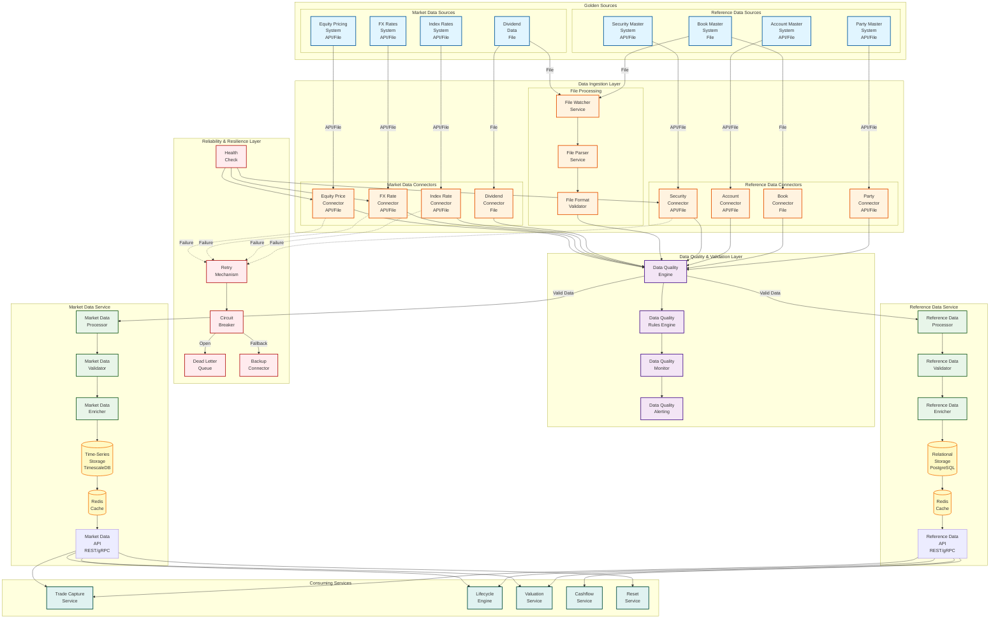
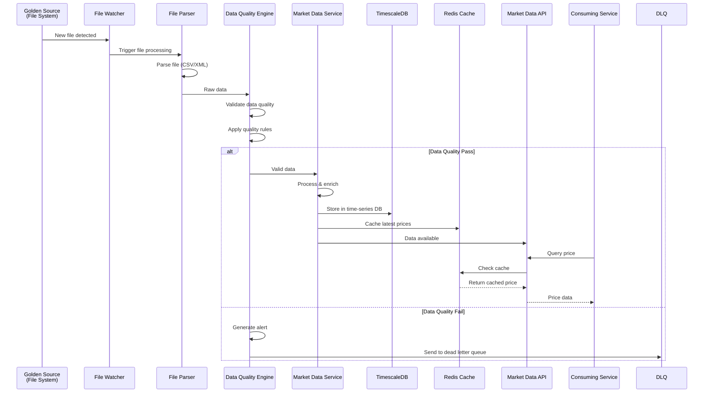
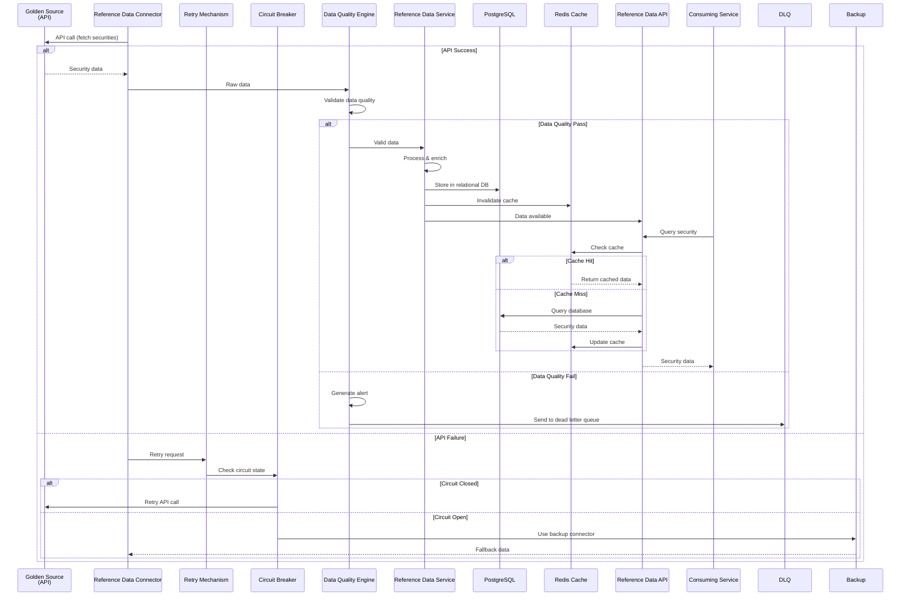
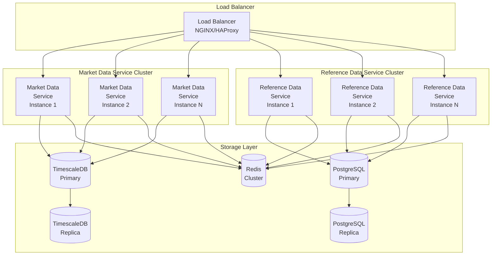

# Market Data & Reference Data Services - High-Level Architecture

## Architecture Overview

This document provides a high-level design for Market Data and Reference Data services, including file-based connectors, data quality checks, and reliability/resilience mechanisms.

---

## High-Level Architecture Diagram



---

## Component Details

### 1. Data Ingestion Layer

#### File-Based Connectors

**File Watcher Service**
- Monitors file drop locations (SFTP, S3, NFS)
- Detects new files, file modifications
- Triggers file processing pipeline
- Handles file naming conventions and patterns

**File Parser Service**
- Parses various file formats (CSV, XML, JSON, Fixed-width)
- Handles encoding (UTF-8, ASCII, EBCDIC)
- Extracts data based on file schemas
- Validates file structure and format

**File Format Validator**
- Validates file headers/footers
- Checks record counts
- Validates file integrity (checksums)
- Detects file format version changes

#### API-Based Connectors

**Real-time Connectors**
- REST API connectors
- WebSocket connectors
- Message queue connectors (JMS, Kafka)
- Polling connectors (scheduled)

**Batch Connectors**
- Scheduled API calls
- Bulk data retrieval
- Incremental data sync

---

### 2. Data Quality & Validation Layer

#### Data Quality Engine

**Validation Rules**
- **Completeness**: Required fields present
- **Accuracy**: Values within expected ranges
- **Consistency**: Cross-field validation
- **Timeliness**: Data freshness checks
- **Uniqueness**: Duplicate detection
- **Format**: Data type and format validation

**Market Data Quality Rules**
```java
// Example: Equity Price Quality Rules
- Price > 0
- Price within reasonable range (e.g., $0.01 to $10,000)
- Currency code valid (ISO 4217)
- Date not in future
- Security ID exists in reference data
- Price change from previous day within threshold (e.g., ±50%)
```

**Reference Data Quality Rules**
```java
// Example: Security Quality Rules
- ISIN format valid (12 characters, alphanumeric)
- CUSIP format valid (9 characters)
- Security name not empty
- Currency code valid
- Security type valid
- No duplicate identifiers
```

#### Data Quality Monitor

**Real-time Monitoring**
- Tracks data quality metrics
- Generates quality scores
- Identifies quality trends
- Tracks quality degradation

**Quality Metrics**
- **Completeness Rate**: % of records with all required fields
- **Accuracy Rate**: % of records passing validation rules
- **Timeliness**: Average delay from source to service
- **Error Rate**: % of records with quality issues

#### Data Quality Alerting

**Alert Types**
- **Critical**: Data quality below threshold (e.g., < 95%)
- **Warning**: Quality degradation detected
- **Info**: Quality issues resolved

**Alert Channels**
- Email notifications
- Slack/Teams integration
- PagerDuty integration
- Dashboard alerts

---

### 3. Reliability & Resilience Layer

#### Retry Mechanism

**Retry Strategy**
- **Exponential Backoff**: Increasing delay between retries
- **Max Retries**: Configurable per connector
- **Retryable Errors**: Network errors, timeouts, temporary failures
- **Non-Retryable Errors**: Authentication failures, invalid data

**Implementation**
```java
@Retryable(
    maxAttempts = 3,
    backoff = @Backoff(delay = 1000, multiplier = 2)
)
public List<Price> fetchEquityPrices(LocalDate date) {
    // Fetch from golden source
}
```

#### Circuit Breaker

**Circuit States**
- **Closed**: Normal operation, requests pass through
- **Open**: Failures detected, requests fail fast
- **Half-Open**: Testing if service recovered

**Circuit Breaker Configuration**
- **Failure Threshold**: % of requests that must fail to open circuit
- **Timeout**: Duration before attempting half-open
- **Success Threshold**: % of requests that must succeed to close circuit

**Implementation**
```java
@CircuitBreaker(
    name = "equityPriceConnector",
    fallbackMethod = "fallbackFetchEquityPrices"
)
public List<Price> fetchEquityPrices(LocalDate date) {
    // Fetch from golden source
}

public List<Price> fallbackFetchEquityPrices(LocalDate date) {
    // Fallback to backup source or cached data
}
```

#### Dead Letter Queue

**Purpose**
- Stores failed messages that cannot be processed
- Enables manual investigation and reprocessing
- Prevents data loss

**DLQ Storage**
- Database table for failed records
- Message queue (Kafka DLQ topic)
- File system (failed files archive)

#### Backup Connector

**Backup Sources**
- Secondary data providers
- Historical data cache
- Last known good values
- Default values (with alerting)

**Fallback Strategy**
```java
public List<Price> fetchEquityPricesWithFallback(LocalDate date) {
    try {
        return primaryConnector.fetch(date);
    } catch (Exception e) {
        log.warn("Primary connector failed, using backup", e);
        return backupConnector.fetch(date);
    }
}
```

#### Health Check

**Health Endpoints**
- **Liveness**: Service is running
- **Readiness**: Service can accept requests
- **Health**: Detailed health status

**Health Checks**
- Connector connectivity
- Database connectivity
- Cache connectivity
- Data freshness
- Quality metrics

---

### 4. Market Data Service

#### Market Data Processor

**Responsibilities**
- Receives validated data from connectors
- Transforms data to internal format
- Handles data normalization
- Manages data versioning

**Processing Flow**
1. Receive raw data from connector
2. Transform to internal format
3. Apply business rules
4. Enrich with metadata
5. Store in time-series database

#### Market Data Validator

**Validation Checks**
- Price ranges
- Currency codes
- Date validity
- Security ID existence
- Data type validation

#### Market Data Enricher

**Enrichment**
- Add metadata (source, timestamp, quality flags)
- Calculate derived fields (returns, changes)
- Link to reference data (security details)
- Add audit information

#### Storage Layer

**Time-Series Database (TimescaleDB)**
- Optimized for time-series data
- Automatic partitioning by time
- Efficient range queries
- Compression for historical data

**Schema**
```sql
CREATE TABLE equity_prices (
    time TIMESTAMPTZ NOT NULL,
    security_id VARCHAR(255) NOT NULL,
    price DECIMAL(20, 8) NOT NULL,
    currency VARCHAR(3) NOT NULL,
    source VARCHAR(100),
    quality_flag VARCHAR(50),
    created_at TIMESTAMPTZ DEFAULT NOW(),
    PRIMARY KEY (time, security_id)
);

SELECT create_hypertable('equity_prices', 'time');
```

#### Cache Layer

**Redis Cache**
- Latest prices (TTL: 1 hour)
- Frequently accessed securities
- Bulk query results
- Rate limit counters

**Cache Strategy**
- **Write-through**: Write to DB and cache simultaneously
- **Write-behind**: Write to cache, async write to DB
- **Cache-aside**: Application manages cache

#### API Layer

**REST API**
- Standard HTTP/REST endpoints
- JSON responses
- Pagination support
- Filtering and sorting

**gRPC API**
- High-performance binary protocol
- Streaming support
- Strong typing
- Low latency

---

### 5. Reference Data Service

#### Reference Data Processor

**Responsibilities**
- Receives validated data from connectors
- Handles full sync and incremental sync
- Manages data relationships
- Tracks data changes

**Processing Flow**
1. Receive raw data from connector
2. Detect changes (new, updated, deleted)
3. Validate relationships
4. Enrich with metadata
5. Store in relational database

#### Reference Data Validator

**Validation Checks**
- Identifier format (ISIN, CUSIP, etc.)
- Required fields present
- Relationship integrity
- Business rule validation
- Duplicate detection

#### Reference Data Enricher

**Enrichment**
- Add metadata (source, timestamp, version)
- Link relationships (account → books)
- Calculate derived fields
- Add audit information

#### Storage Layer

**Relational Database (PostgreSQL)**
- Normalized schema
- Foreign key relationships
- ACID transactions
- Full-text search support

**Schema**
```sql
CREATE TABLE securities (
    security_id VARCHAR(255) PRIMARY KEY,
    isin VARCHAR(12),
    cusip VARCHAR(9),
    ticker VARCHAR(20),
    security_name VARCHAR(500),
    currency VARCHAR(3),
    created_at TIMESTAMP DEFAULT NOW(),
    updated_at TIMESTAMP DEFAULT NOW()
);

CREATE INDEX idx_securities_isin ON securities(isin);
CREATE INDEX idx_securities_ticker ON securities(ticker);
```

#### Cache Layer

**Redis Cache**
- Frequently accessed securities (TTL: 24 hours)
- Account hierarchies
- Book mappings
- Bulk query results

**Cache Strategy**
- **Cache-aside**: Application manages cache
- **Write-through**: Write to DB and cache
- **Invalidation**: On data updates

#### API Layer

**REST API**
- CRUD operations
- Search and filtering
- Relationship queries
- Bulk operations

**gRPC API**
- High-performance lookups
- Streaming support
- Strong typing
- Low latency

---

## Data Flow Examples

### Example 1: File-Based Market Data Ingestion



### Example 2: API-Based Reference Data Sync



---

## Key Design Principles

### 1. Separation of Concerns
- **Market Data Service**: Time-series data, frequent updates
- **Reference Data Service**: Relational data, infrequent updates

### 2. Reliability
- **Retry Mechanism**: Handle transient failures
- **Circuit Breaker**: Prevent cascading failures
- **Dead Letter Queue**: Capture failed messages
- **Backup Connectors**: Fallback data sources

### 3. Data Quality
- **Validation Rules**: Comprehensive quality checks
- **Quality Monitoring**: Real-time quality metrics
- **Alerting**: Proactive quality issue detection

### 4. Resilience
- **Health Checks**: Monitor service health
- **Graceful Degradation**: Fallback mechanisms
- **Error Handling**: Comprehensive error management

### 5. Performance
- **Caching**: Reduce database load
- **Bulk Operations**: Efficient batch processing
- **Optimized Storage**: Specialized databases

### 6. Scalability
- **Horizontal Scaling**: Multiple service instances
- **Partitioning**: Data partitioning strategies
- **Load Balancing**: Distribute requests

---

## Deployment Architecture



---

## Monitoring & Observability

### Metrics
- **Ingestion Metrics**: Records processed, errors, latency
- **Quality Metrics**: Quality scores, validation failures
- **Performance Metrics**: API latency, throughput, cache hit rate
- **Reliability Metrics**: Circuit breaker state, retry counts, DLQ size

### Logging
- **Structured Logging**: JSON format, correlation IDs
- **Log Levels**: DEBUG, INFO, WARN, ERROR
- **Log Aggregation**: Centralized log management (ELK, Splunk)

### Tracing
- **Distributed Tracing**: Request tracing across services
- **Performance Tracing**: Identify bottlenecks
- **Error Tracing**: Track error propagation

---

## Summary

This architecture provides:

1. **Separation**: Market Data and Reference Data as separate services
2. **File Support**: File-based connectors with file processing pipeline
3. **Data Quality**: Comprehensive quality checks and monitoring
4. **Reliability**: Retry, circuit breaker, dead letter queue, backup connectors
5. **Resilience**: Health checks, graceful degradation, error handling
6. **Performance**: Caching, optimized storage, bulk operations
7. **Scalability**: Horizontal scaling, load balancing, partitioning

The architecture is designed to handle both file-based and API-based data sources, with robust data quality checks and reliability/resilience mechanisms in place.

