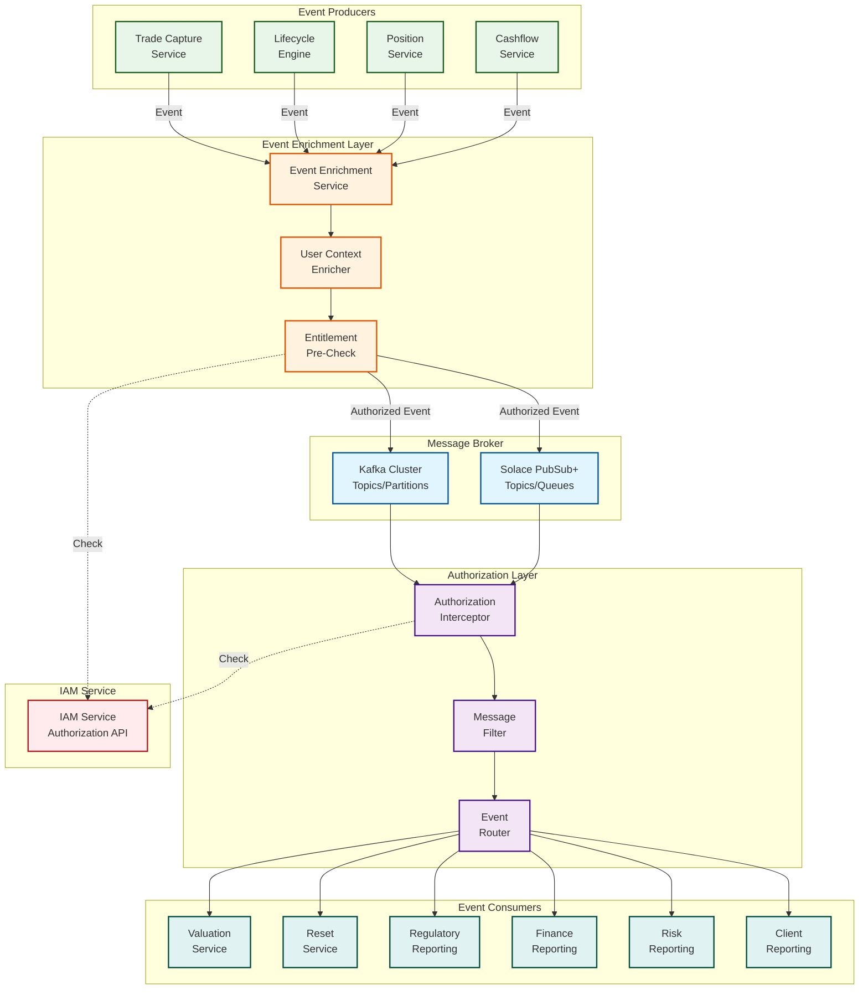

# Messaging Layer Entitlements Integration

## Overview

This document defines how entitlements and authorization are integrated at the messaging layer (Kafka, Solace, etc.) for the Equity Swap Lifecycle Management System. It covers event-level authorization, message filtering, consumer-side checks, and secure event routing.

---

## High-Level Architecture



---

## Event Enrichment with User Context

### Event Structure with User Context

```java
public class BusinessEvent {
    private String eventId;
    private String eventType;
    private LocalDateTime eventTimestamp;
    
    // User Context
    private UserContext userContext;
    
    // Event Data
    private PrimitiveInstruction instruction;
    private TradeState beforeState;
    private TradeState afterState;
    
    // Entitlement Metadata
    private EntitlementMetadata entitlementMetadata;
}

public class UserContext {
    private String userId;
    private String username;
    private List<String> roles;
    private List<String> permissions;
    private List<String> accountIds;  // Accounts user can access
    private List<String> bookIds;     // Books user can access
    private String sessionId;
    private String clientIp;
}

public class EntitlementMetadata {
    private String requiredFunction;      // e.g., "trade:create"
    private String requiredPermission;    // e.g., "trade:create"
    private List<String> requiredRoles;   // e.g., ["TRADE_CAPTURE_USER"]
    private String authorizationStatus;    // AUTHORIZED, UNAUTHORIZED, PENDING
    private LocalDateTime authorizedAt;
    private String authorizedBy;          // System or user ID
}
```

### Event Enrichment Service

```java
@Service
public class EventEnrichmentService {
    
    @Autowired
    private IAMService iamService;
    
    @Autowired
    private UserContextExtractor userContextExtractor;
    
    /**
     * Enrich event with user context and entitlement metadata
     */
    public BusinessEvent enrichEvent(BusinessEvent event, HttpServletRequest request) {
        // Extract user context from request
        UserContext userContext = userContextExtractor.extract(request);
        
        // Determine required function based on event type
        String requiredFunction = determineRequiredFunction(event);
        
        // Pre-check entitlement (optional, for early validation)
        boolean authorized = iamService.hasEntitlement(
            userContext.getUserId(),
            requiredFunction
        );
        
        // Enrich event
        event.setUserContext(userContext);
        event.setEntitlementMetadata(EntitlementMetadata.builder()
            .requiredFunction(requiredFunction)
            .authorizationStatus(authorized ? "AUTHORIZED" : "PENDING")
            .authorizedAt(LocalDateTime.now())
            .build());
        
        return event;
    }
    
    private String determineRequiredFunction(BusinessEvent event) {
        // Map event type to required function
        switch (event.getEventType()) {
            case "TRADE_CREATED":
                return "trade:create";
            case "TRADE_INCREASED":
                return "trade:increase";
            case "TRADE_DECREASED":
                return "trade:decrease";
            case "POSITION_UPDATED":
                return "position:update";
            case "CASHFLOW_CALCULATED":
                return "cashflow:calculate";
            default:
                return "unknown";
        }
    }
}
```

---

## Producer-Side Authorization

### Authorization Before Publishing

```java
@Service
public class EventProducerService {
    
    @Autowired
    private IAMService iamService;
    
    @Autowired
    private KafkaTemplate<String, BusinessEvent> kafkaTemplate;
    
    /**
     * Publish event with authorization check
     */
    public void publishEvent(BusinessEvent event, String userId) {
        // Check entitlement before publishing
        String requiredFunction = event.getEntitlementMetadata().getRequiredFunction();
        
        if (!iamService.hasEntitlement(userId, requiredFunction)) {
            throw new UnauthorizedException(
                "User " + userId + " does not have permission: " + requiredFunction
            );
        }
        
        // Check data access (account, book)
        if (!hasDataAccess(event, userId)) {
            throw new UnauthorizedException(
                "User " + userId + " does not have access to data in event"
            );
        }
        
        // Publish to appropriate topic based on entitlement
        String topic = determineTopic(event, userId);
        
        kafkaTemplate.send(topic, event.getEventId(), event);
    }
    
    private boolean hasDataAccess(BusinessEvent event, String userId) {
        // Check account access
        if (event.getAfterState().getTrade().getAccountId() != null) {
            if (!iamService.hasAccountAccess(
                userId,
                event.getAfterState().getTrade().getAccountId()
            )) {
                return false;
            }
        }
        
        // Check book access
        if (event.getAfterState().getTrade().getBookId() != null) {
            if (!iamService.hasBookAccess(
                userId,
                event.getAfterState().getTrade().getBookId()
            )) {
                return false;
            }
        }
        
        return true;
    }
    
    private String determineTopic(BusinessEvent event, String userId) {
        // Route to topic based on user entitlements
        // e.g., high-priority users go to priority topic
        if (iamService.hasRole(userId, "SYSTEM_ADMIN")) {
            return "equity-swaps-events-priority";
        }
        return "equity-swaps-events";
    }
}
```

---

## Consumer-Side Authorization

### Authorization Interceptor for Consumers

```java
@Component
public class EventConsumerAuthorizationInterceptor {
    
    @Autowired
    private IAMService iamService;
    
    /**
     * Intercept event consumption and check authorization
     */
    @KafkaListener(topics = "equity-swaps-events")
    public void consumeEvent(
            @Payload BusinessEvent event,
            @Header("user-id") String userId) {
        
        // Check if user has permission to consume this event
        if (!canConsumeEvent(event, userId)) {
            log.warn("User {} attempted to consume unauthorized event {}", userId, event.getEventId());
            // Option 1: Skip event (silent failure)
            return;
            
            // Option 2: Send to dead letter queue
            // deadLetterQueue.send(event);
            
            // Option 3: Throw exception (will retry)
            // throw new UnauthorizedException("User cannot consume this event");
        }
        
        // Check data access
        if (!hasDataAccess(event, userId)) {
            log.warn("User {} does not have data access for event {}", userId, event.getEventId());
            return;
        }
        
        // Process event
        processEvent(event);
    }
    
    private boolean canConsumeEvent(BusinessEvent event, String userId) {
        // Check if user has permission to consume events of this type
        String eventType = event.getEventType();
        String requiredPermission = "event:consume:" + eventType.toLowerCase();
        
        return iamService.hasEntitlement(userId, requiredPermission);
    }
    
    private boolean hasDataAccess(BusinessEvent event, String userId) {
        // Check account access
        String accountId = extractAccountId(event);
        if (accountId != null && !iamService.hasAccountAccess(userId, accountId)) {
            return false;
        }
        
        // Check book access
        String bookId = extractBookId(event);
        if (bookId != null && !iamService.hasBookAccess(userId, bookId)) {
            return false;
        }
        
        return true;
    }
}
```

---

## Message Filtering Based on Entitlements

### Kafka Consumer with Filtering

```java
@Component
public class FilteredEventConsumer {
    
    @Autowired
    private IAMService iamService;
    
    @Autowired
    private KafkaConsumer<String, BusinessEvent> kafkaConsumer;
    
    /**
     * Consume and filter events based on user entitlements
     */
    public void consumeFilteredEvents(String userId) {
        // Subscribe to topic
        kafkaConsumer.subscribe(Collections.singletonList("equity-swaps-events"));
        
        // Get user entitlements once (cache for performance)
        UserEntitlements entitlements = iamService.getUserEntitlements(userId);
        
        while (true) {
            ConsumerRecords<String, BusinessEvent> records = kafkaConsumer.poll(Duration.ofMillis(100));
            
            for (ConsumerRecord<String, BusinessEvent> record : records) {
                BusinessEvent event = record.value();
                
                // Filter based on entitlements
                if (shouldProcessEvent(event, entitlements)) {
                    processEvent(event);
                } else {
                    log.debug("Filtered out event {} for user {}", event.getEventId(), userId);
                }
            }
        }
    }
    
    private boolean shouldProcessEvent(BusinessEvent event, UserEntitlements entitlements) {
        // Check function permission
        String requiredFunction = event.getEntitlementMetadata().getRequiredFunction();
        if (!entitlements.getPermissions().contains(requiredFunction)) {
            return false;
        }
        
        // Check account access
        String accountId = extractAccountId(event);
        if (accountId != null && !entitlements.getAccountIds().contains(accountId)) {
            return false;
        }
        
        // Check book access
        String bookId = extractBookId(event);
        if (bookId != null && !entitlements.getBookIds().contains(bookId)) {
            return false;
        }
        
        return true;
    }
}
```

---

## Topic-Based Authorization

### Topic Naming Convention

```
equity-swaps-events-{account-id}        # Account-specific topics
equity-swaps-events-{book-id}           # Book-specific topics
equity-swaps-events-{role}             # Role-specific topics
equity-swaps-events-priority           # Priority topic for admins
equity-swaps-events-public             # Public events (all users)
```

### Dynamic Topic Subscription

```java
@Service
public class DynamicTopicSubscriptionService {
    
    @Autowired
    private IAMService iamService;
    
    @Autowired
    private KafkaConsumer<String, BusinessEvent> kafkaConsumer;
    
    /**
     * Subscribe to topics based on user entitlements
     */
    public void subscribeToAuthorizedTopics(String userId) {
        UserEntitlements entitlements = iamService.getUserEntitlements(userId);
        
        List<String> topics = new ArrayList<>();
        
        // Base topic (all users)
        topics.add("equity-swaps-events-public");
        
        // Account-specific topics
        for (String accountId : entitlements.getAccountIds()) {
            topics.add("equity-swaps-events-account-" + accountId);
        }
        
        // Book-specific topics
        for (String bookId : entitlements.getBookIds()) {
            topics.add("equity-swaps-events-book-" + bookId);
        }
        
        // Role-specific topics
        for (String role : entitlements.getRoles()) {
            if (role.equals("SYSTEM_ADMIN") || role.equals("TRADE_ADMIN")) {
                topics.add("equity-swaps-events-priority");
            }
        }
        
        // Subscribe to authorized topics only
        kafkaConsumer.subscribe(topics);
        
        log.info("User {} subscribed to topics: {}", userId, topics);
    }
}
```

---

## Kafka Integration Patterns

### Kafka Producer with Authorization

```java
@Configuration
public class KafkaProducerConfig {
    
    @Bean
    public ProducerFactory<String, BusinessEvent> producerFactory() {
        Map<String, Object> configProps = new HashMap<>();
        configProps.put(ProducerConfig.BOOTSTRAP_SERVERS_CONFIG, "localhost:9092");
        configProps.put(ProducerConfig.KEY_SERIALIZER_CLASS_CONFIG, StringSerializer.class);
        configProps.put(ProducerConfig.VALUE_SERIALIZER_CLASS_CONFIG, JsonSerializer.class);
        
        // Add authorization headers
        configProps.put(ProducerConfig.INTERCEPTOR_CLASSES_CONFIG, 
            AuthorizationProducerInterceptor.class.getName());
        
        return new DefaultKafkaProducerFactory<>(configProps);
    }
    
    @Bean
    public KafkaTemplate<String, BusinessEvent> kafkaTemplate() {
        return new KafkaTemplate<>(producerFactory());
    }
}

@Component
public class AuthorizationProducerInterceptor implements ProducerInterceptor<String, BusinessEvent> {
    
    @Override
    public ProducerRecord<String, BusinessEvent> onSend(ProducerRecord<String, BusinessEvent> record) {
        // Add user context to headers
        BusinessEvent event = record.value();
        if (event.getUserContext() != null) {
            record.headers().add("user-id", 
                event.getUserContext().getUserId().getBytes());
            record.headers().add("user-roles", 
                String.join(",", event.getUserContext().getRoles()).getBytes());
        }
        
        return record;
    }
    
    @Override
    public void onAcknowledgement(RecordMetadata metadata, Exception exception) {
        // Handle acknowledgment
    }
    
    @Override
    public void close() {
        // Cleanup
    }
    
    @Override
    public void configure(Map<String, ?> configs) {
        // Configuration
    }
}
```

### Kafka Consumer with Authorization

```java
@Configuration
public class KafkaConsumerConfig {
    
    @Bean
    public ConsumerFactory<String, BusinessEvent> consumerFactory() {
        Map<String, Object> configProps = new HashMap<>();
        configProps.put(ConsumerConfig.BOOTSTRAP_SERVERS_CONFIG, "localhost:9092");
        configProps.put(ConsumerConfig.GROUP_ID_CONFIG, "equity-swaps-consumer");
        configProps.put(ConsumerConfig.KEY_DESERIALIZER_CLASS_CONFIG, StringDeserializer.class);
        configProps.put(ConsumerConfig.VALUE_DESERIALIZER_CLASS_CONFIG, JsonDeserializer.class);
        
        // Add authorization interceptor
        configProps.put(ConsumerConfig.INTERCEPTOR_CLASSES_CONFIG, 
            AuthorizationConsumerInterceptor.class.getName());
        
        return new DefaultKafkaConsumerFactory<>(configProps);
    }
    
    @Bean
    public ConcurrentKafkaListenerContainerFactory<String, BusinessEvent> kafkaListenerContainerFactory() {
        ConcurrentKafkaListenerContainerFactory<String, BusinessEvent> factory = 
            new ConcurrentKafkaListenerContainerFactory<>();
        factory.setConsumerFactory(consumerFactory());
        return factory;
    }
}

@Component
public class AuthorizationConsumerInterceptor implements ConsumerInterceptor<String, BusinessEvent> {
    
    @Autowired
    private IAMService iamService;
    
    @Override
    public ConsumerRecords<String, BusinessEvent> onConsume(ConsumerRecords<String, BusinessEvent> records) {
        // Filter records based on authorization
        Map<TopicPartition, List<ConsumerRecord<String, BusinessEvent>>> filteredRecords = new HashMap<>();
        
        for (ConsumerRecord<String, BusinessEvent> record : records) {
            // Extract user ID from headers
            String userId = extractUserId(record.headers());
            
            if (userId != null && canConsumeRecord(record, userId)) {
                TopicPartition tp = new TopicPartition(record.topic(), record.partition());
                filteredRecords.computeIfAbsent(tp, k -> new ArrayList<>()).add(record);
            }
        }
        
        return new ConsumerRecords<>(filteredRecords);
    }
    
    private boolean canConsumeRecord(ConsumerRecord<String, BusinessEvent> record, String userId) {
        BusinessEvent event = record.value();
        
        // Check entitlement
        String requiredFunction = event.getEntitlementMetadata().getRequiredFunction();
        if (!iamService.hasEntitlement(userId, requiredFunction)) {
            return false;
        }
        
        // Check data access
        return hasDataAccess(event, userId);
    }
    
    @Override
    public void onCommit(Map<TopicPartition, OffsetAndMetadata> offsets) {
        // Handle commit
    }
    
    @Override
    public void close() {
        // Cleanup
    }
    
    @Override
    public void configure(Map<String, ?> configs) {
        // Configuration
    }
}
```

---

## Solace Integration Patterns

### Solace Producer with Authorization

```java
@Service
public class SolaceEventProducer {
    
    @Autowired
    private JCSMPSession solaceSession;
    
    @Autowired
    private IAMService iamService;
    
    /**
     * Publish event to Solace with authorization
     */
    public void publishEvent(BusinessEvent event, String userId) {
        // Check authorization
        if (!iamService.hasEntitlement(userId, 
            event.getEntitlementMetadata().getRequiredFunction())) {
            throw new UnauthorizedException("User not authorized to publish event");
        }
        
        // Determine topic based on entitlements
        String topic = determineTopic(event, userId);
        
        // Create message
        XMLMessage message = JCSMPFactory.onlyInstance().createMessage(XMLMessage.class);
        message.setApplicationMessageId(event.getEventId());
        
        // Add user context to message properties
        message.setProperty("user-id", userId);
        message.setProperty("user-roles", String.join(",", 
            event.getUserContext().getRoles()));
        
        // Set payload
        message.setData(serializeEvent(event));
        
        // Publish
        XMLMessageProducer producer = solaceSession.getMessageProducer(
            new JCSMPStreamingPublishEventHandler() {
                @Override
                public void responseReceived(String messageID) {
                    log.info("Message published: {}", messageID);
                }
                
                @Override
                public void handleError(String messageID, JCSMPException e, long timestamp) {
                    log.error("Error publishing message: {}", messageID, e);
                }
            }
        );
        
        producer.send(message, JCSMPFactory.onlyInstance().createTopic(topic));
    }
}
```

### Solace Consumer with Authorization

```java
@Service
public class SolaceEventConsumer {
    
    @Autowired
    private JCSMPSession solaceSession;
    
    @Autowired
    private IAMService iamService;
    
    /**
     * Subscribe to Solace topics with authorization filtering
     */
    public void subscribeToAuthorizedTopics(String userId) {
        UserEntitlements entitlements = iamService.getUserEntitlements(userId);
        
        // Build topic subscription list
        List<String> topics = buildAuthorizedTopics(entitlements);
        
        // Create flow receiver with message handler
        FlowReceiver flowReceiver = solaceSession.createFlow(
            new XMLMessageListener() {
                @Override
                public void onReceive(BytesXMLMessage message) {
                    try {
                        BusinessEvent event = deserializeEvent(message.getBytes());
                        
                        // Check authorization
                        if (canConsumeEvent(event, userId)) {
                            processEvent(event);
                        } else {
                            log.warn("Filtered out unauthorized event: {}", event.getEventId());
                        }
                    } catch (Exception e) {
                        log.error("Error processing message", e);
                    }
                }
                
                @Override
                public void onException(JCSMPException e) {
                    log.error("Error in message flow", e);
                }
            },
            new ConsumerFlowProperties()
                .setEndpoint(JCSMPFactory.onlyInstance().createQueue("equity-swaps-queue"))
                .setStartState(true)
        );
        
        flowReceiver.start();
    }
    
    private boolean canConsumeEvent(BusinessEvent event, String userId) {
        // Check entitlement
        String requiredFunction = event.getEntitlementMetadata().getRequiredFunction();
        if (!iamService.hasEntitlement(userId, requiredFunction)) {
            return false;
        }
        
        // Check data access
        return hasDataAccess(event, userId);
    }
}
```

---

## Event Router with Entitlements

### Smart Event Router

```java
@Service
public class EntitlementBasedEventRouter {
    
    @Autowired
    private IAMService iamService;
    
    @Autowired
    private KafkaTemplate<String, BusinessEvent> kafkaTemplate;
    
    /**
     * Route event to appropriate topics/queues based on entitlements
     */
    public void routeEvent(BusinessEvent event) {
        // Get all users who should receive this event
        List<String> authorizedUserIds = findAuthorizedUsers(event);
        
        // Route to user-specific topics
        for (String userId : authorizedUserIds) {
            String topic = "equity-swaps-events-user-" + userId;
            kafkaTemplate.send(topic, event.getEventId(), event);
        }
        
        // Route to role-based topics
        Set<String> roles = findAuthorizedRoles(event);
        for (String role : roles) {
            String topic = "equity-swaps-events-role-" + role.toLowerCase();
            kafkaTemplate.send(topic, event.getEventId(), event);
        }
        
        // Route to account-based topics
        String accountId = extractAccountId(event);
        if (accountId != null) {
            String topic = "equity-swaps-events-account-" + accountId;
            kafkaTemplate.send(topic, event.getEventId(), event);
        }
    }
    
    private List<String> findAuthorizedUsers(BusinessEvent event) {
        // Query IAM service for users with required entitlements
        String requiredFunction = event.getEntitlementMetadata().getRequiredFunction();
        
        // Get users with permission
        List<String> userIds = iamService.getUsersWithPermission(requiredFunction);
        
        // Filter by data access (account, book)
        return userIds.stream()
            .filter(userId -> hasDataAccess(event, userId))
            .collect(Collectors.toList());
    }
    
    private Set<String> findAuthorizedRoles(BusinessEvent event) {
        String requiredFunction = event.getEntitlementMetadata().getRequiredFunction();
        
        // Get roles that have this permission
        return iamService.getRolesWithPermission(requiredFunction);
    }
}
```

---

## Message-Level Security

### Encrypted Events

```java
@Service
public class SecureEventProducer {
    
    @Autowired
    private EncryptionService encryptionService;
    
    /**
     * Publish encrypted event
     */
    public void publishEncryptedEvent(BusinessEvent event, String userId) {
        // Encrypt sensitive data
        BusinessEvent encryptedEvent = encryptEvent(event, userId);
        
        // Publish
        kafkaTemplate.send("equity-swaps-events", event.getEventId(), encryptedEvent);
    }
    
    private BusinessEvent encryptEvent(BusinessEvent event, String userId) {
        // Get user's encryption key
        String encryptionKey = iamService.getUserEncryptionKey(userId);
        
        // Encrypt sensitive fields
        BusinessEvent encrypted = event.clone();
        
        // Encrypt account IDs, book IDs, etc.
        if (encrypted.getAfterState().getTrade().getAccountId() != null) {
            String encryptedAccountId = encryptionService.encrypt(
                encrypted.getAfterState().getTrade().getAccountId(),
                encryptionKey
            );
            encrypted.getAfterState().getTrade().setAccountId(encryptedAccountId);
        }
        
        return encrypted;
    }
}
```

### Event Signing

```java
@Service
public class SignedEventProducer {
    
    @Autowired
    private SigningService signingService;
    
    /**
     * Publish signed event
     */
    public void publishSignedEvent(BusinessEvent event) {
        // Sign event
        String signature = signingService.sign(event);
        
        // Add signature to event
        event.getEntitlementMetadata().setSignature(signature);
        
        // Publish
        kafkaTemplate.send("equity-swaps-events", event.getEventId(), event);
    }
}

@Service
public class SignedEventConsumer {
    
    @Autowired
    private SigningService signingService;
    
    /**
     * Verify event signature before processing
     */
    public void consumeSignedEvent(BusinessEvent event) {
        // Verify signature
        if (!signingService.verify(event, event.getEntitlementMetadata().getSignature())) {
            throw new SecurityException("Event signature verification failed");
        }
        
        // Process event
        processEvent(event);
    }
}
```

---

## Dead Letter Queue for Unauthorized Events

### Unauthorized Event Handling

```java
@Service
public class UnauthorizedEventHandler {
    
    @Autowired
    private KafkaTemplate<String, BusinessEvent> kafkaTemplate;
    
    /**
     * Send unauthorized event to DLQ
     */
    public void handleUnauthorizedEvent(BusinessEvent event, String reason) {
        // Create DLQ message
        DeadLetterMessage dlqMessage = DeadLetterMessage.builder()
            .originalEvent(event)
            .reason(reason)
            .timestamp(LocalDateTime.now())
            .build();
        
        // Send to DLQ topic
        kafkaTemplate.send("equity-swaps-events-dlq", event.getEventId(), dlqMessage);
        
        // Alert security team
        alertSecurityTeam(event, reason);
    }
    
    private void alertSecurityTeam(BusinessEvent event, String reason) {
        // Send alert to security team
        log.error("Unauthorized event detected: {} - Reason: {}", event.getEventId(), reason);
        // Integration with alerting system (PagerDuty, etc.)
    }
}
```

---

## Performance Optimization

### Caching Authorization Decisions

```java
@Service
public class CachedAuthorizationService {
    
    @Autowired
    private IAMService iamService;
    
    @Autowired
    private RedisTemplate<String, Boolean> redisTemplate;
    
    /**
     * Check entitlement with caching
     */
    public boolean hasEntitlementCached(String userId, String functionName) {
        String cacheKey = "auth:entitlement:" + userId + ":" + functionName;
        
        // Check cache
        Boolean cached = redisTemplate.opsForValue().get(cacheKey);
        if (cached != null) {
            return cached;
        }
        
        // Check IAM service
        boolean hasEntitlement = iamService.hasEntitlement(userId, functionName);
        
        // Cache result (TTL: 5 minutes)
        redisTemplate.opsForValue().set(
            cacheKey,
            hasEntitlement,
            Duration.ofMinutes(5)
        );
        
        return hasEntitlement;
    }
    
    /**
     * Invalidate cache on permission changes
     */
    public void invalidateUserCache(String userId) {
        redisTemplate.delete("auth:entitlement:" + userId + ":*");
    }
}
```

### Batch Authorization Checks

```java
@Service
public class BatchAuthorizationService {
    
    @Autowired
    private IAMService iamService;
    
    /**
     * Batch check entitlements for multiple events
     */
    public Map<String, Boolean> batchCheckEntitlements(
            String userId,
            List<BusinessEvent> events) {
        
        // Extract required functions
        Set<String> requiredFunctions = events.stream()
            .map(e -> e.getEntitlementMetadata().getRequiredFunction())
            .collect(Collectors.toSet());
        
        // Batch check with IAM service
        return iamService.batchCheckEntitlements(userId, requiredFunctions);
    }
}
```

---

## Monitoring & Auditing

### Authorization Audit Log

```java
@Service
public class AuthorizationAuditService {
    
    @Autowired
    private AuditLogRepository auditLogRepository;
    
    /**
     * Log authorization decision
     */
    public void logAuthorizationDecision(
            String userId,
            String functionName,
            boolean authorized,
            BusinessEvent event) {
        
        AuthorizationAuditLog log = AuthorizationAuditLog.builder()
            .userId(userId)
            .functionName(functionName)
            .authorized(authorized)
            .eventId(event.getEventId())
            .eventType(event.getEventType())
            .timestamp(LocalDateTime.now())
            .accountId(extractAccountId(event))
            .bookId(extractBookId(event))
            .build();
        
        auditLogRepository.save(log);
    }
}
```

---

## Summary

This architecture provides:

1. **Event Enrichment**: User context and entitlement metadata added to events
2. **Producer-Side Authorization**: Authorization checks before publishing
3. **Consumer-Side Authorization**: Authorization checks when consuming events
4. **Message Filtering**: Filter events based on user entitlements
5. **Topic-Based Authorization**: Route events to topics based on entitlements
6. **Dynamic Subscription**: Subscribe to topics based on user entitlements
7. **Event Routing**: Smart routing based on entitlements
8. **Security**: Encryption, signing, and secure event handling
9. **Performance**: Caching and batch authorization checks
10. **Auditing**: Comprehensive audit logging

The messaging layer is fully integrated with the IAM service, ensuring that only authorized users can produce and consume events, and that events are routed appropriately based on entitlements.

