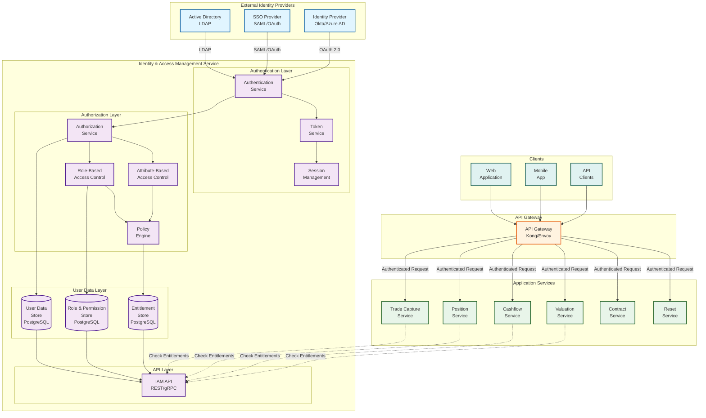
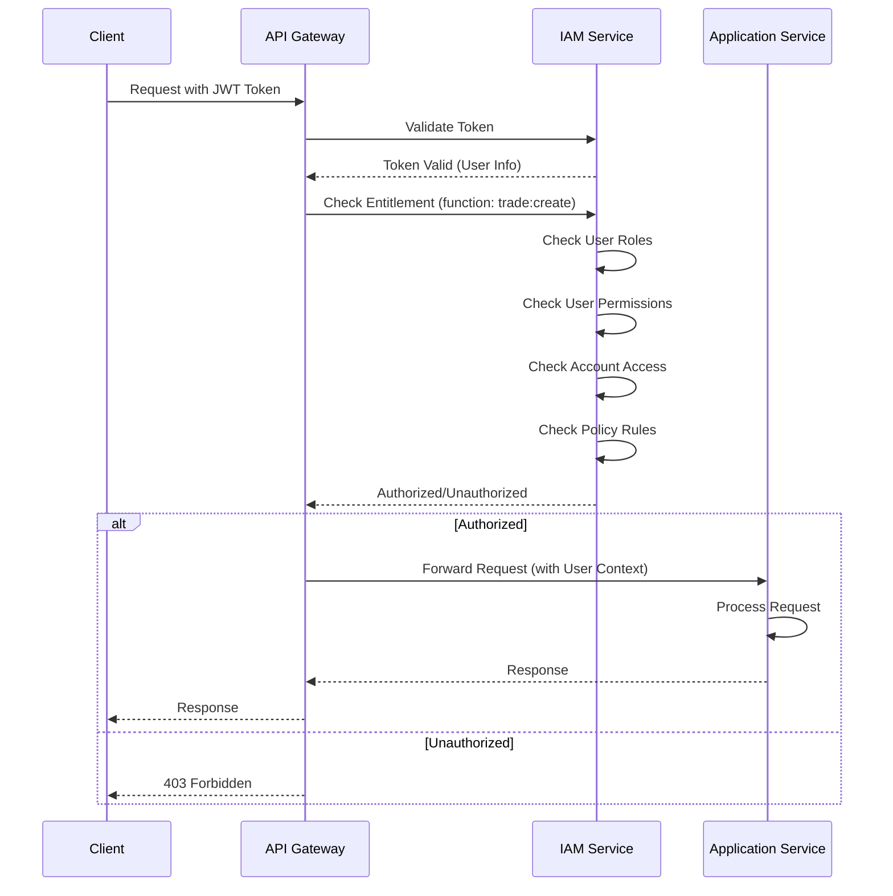
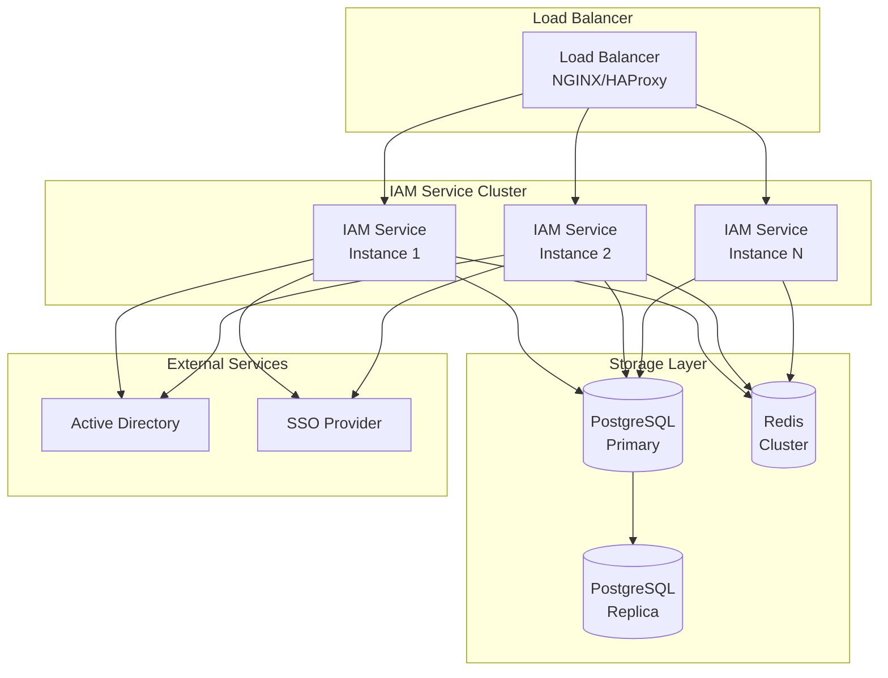

# User Data & Entitlements Architecture

## Overview

This document defines the architecture for user data management and entitlements/authorization for the Equity Swap Lifecycle Management System. It covers user authentication, authorization, role-based access control (RBAC), and function-level entitlements.

---

## High-Level Architecture



---

## Identity & Access Management (IAM) Service

### Purpose

Centralized service for:
- User authentication
- User authorization
- Role and permission management
- Entitlement checks
- Session management

### Components

#### 1. Authentication Service

**Responsibilities:**
- Authenticate users against identity providers
- Support multiple authentication methods (LDAP, SAML, OAuth 2.0)
- Generate and validate authentication tokens
- Handle password policies and MFA

**Authentication Methods:**
- **LDAP/Active Directory**: Corporate directory integration
- **SAML 2.0**: Single Sign-On (SSO)
- **OAuth 2.0**: Third-party identity providers
- **API Keys**: Service-to-service authentication

#### 2. Token Service

**Responsibilities:**
- Issue JWT tokens (access tokens, refresh tokens)
- Validate token signatures and expiration
- Token refresh mechanism
- Token revocation

**Token Structure:**
```json
{
  "sub": "user123",
  "email": "user@example.com",
  "roles": ["TRADE_CAPTURE_USER", "POSITION_VIEWER"],
  "permissions": [
    "trade:create",
    "position:read",
    "cashflow:read"
  ],
  "account_ids": ["ACC001", "ACC002"],
  "book_ids": ["BOOK001"],
  "exp": 1234567890,
  "iat": 1234567890
}
```

#### 3. Authorization Service

**Responsibilities:**
- Check user permissions for specific actions
- Enforce role-based access control (RBAC)
- Enforce attribute-based access control (ABAC)
- Cache authorization decisions

**Authorization Patterns:**
- **RBAC**: Role-based (e.g., TRADE_CAPTURE_USER, POSITION_ADMIN)
- **ABAC**: Attribute-based (e.g., account ownership, book access)
- **Function-based**: Permission to specific functions (e.g., trade:create, position:read)

#### 4. Role-Based Access Control (RBAC)

**Role Hierarchy:**
```
System Admin
  ├── Trade Admin
  │   ├── Trade Capture User
  │   ├── Trade Lifecycle User
  │   └── Trade Viewer
  ├── Position Admin
  │   ├── Position Manager
  │   └── Position Viewer
  ├── Cashflow Admin
  │   ├── Cashflow Manager
  │   └── Cashflow Viewer
  ├── Valuation Admin
  │   ├── Valuation Manager
  │   └── Valuation Viewer
  └── Reporting User
      ├── Regulatory Reporter
      ├── Finance Reporter
      └── Risk Reporter
```

**Predefined Roles:**
- **TRADE_CAPTURE_USER**: Can create new trades
- **TRADE_LIFECYCLE_USER**: Can modify trades (increase, decrease, terminate)
- **TRADE_VIEWER**: Can view trades (read-only)
- **POSITION_ADMIN**: Full access to positions
- **POSITION_MANAGER**: Can view and update positions
- **POSITION_VIEWER**: Can view positions (read-only)
- **CASHFLOW_ADMIN**: Full access to cashflows
- **CASHFLOW_VIEWER**: Can view cashflows (read-only)
- **VALUATION_ADMIN**: Full access to valuations
- **VALUATION_VIEWER**: Can view valuations (read-only)
- **REPORTING_USER**: Can generate reports
- **SYSTEM_ADMIN**: Full system access

#### 5. Attribute-Based Access Control (ABAC)

**Attributes:**
- **Account Access**: User can only access specific accounts
- **Book Access**: User can only access specific books
- **Security Access**: User can only access specific securities
- **Region Access**: User can only access specific regions
- **Business Unit Access**: User can only access specific business units

**Example:**
```java
// User can only access trades for accounts they own
if (user.getAccountIds().contains(trade.getAccountId())) {
    return true;
}
```

#### 6. Policy Engine

**Policy Rules:**
- **Function Permissions**: Which functions user can access
- **Data Access**: Which data user can access (accounts, books, securities)
- **Action Permissions**: What actions user can perform (create, read, update, delete)
- **Time-based Access**: Access restrictions by time (business hours, time zones)

**Policy Examples:**
```java
// Policy: User can create trades only for their assigned accounts
Policy tradeCreatePolicy = Policy.builder()
    .function("trade:create")
    .condition(user -> user.getAccountIds().contains(trade.getAccountId()))
    .build();

// Policy: User can view positions only during business hours
Policy positionViewPolicy = Policy.builder()
    .function("position:read")
    .condition(user -> isBusinessHours() && user.hasRole("POSITION_VIEWER"))
    .build();
```

---

## Data Model

### User Data Store

```sql
-- Users
CREATE TABLE users (
    user_id VARCHAR(255) PRIMARY KEY,
    username VARCHAR(100) UNIQUE NOT NULL,
    email VARCHAR(255) UNIQUE NOT NULL,
    first_name VARCHAR(100),
    last_name VARCHAR(100),
    status VARCHAR(50) DEFAULT 'ACTIVE', -- ACTIVE, INACTIVE, LOCKED, SUSPENDED
    password_hash VARCHAR(255), -- For local auth
    mfa_enabled BOOLEAN DEFAULT FALSE,
    mfa_secret VARCHAR(255),
    last_login_at TIMESTAMP,
    failed_login_attempts INT DEFAULT 0,
    locked_until TIMESTAMP,
    created_at TIMESTAMP DEFAULT NOW(),
    updated_at TIMESTAMP DEFAULT NOW()
);

-- User Accounts (Many-to-Many)
CREATE TABLE user_accounts (
    user_id VARCHAR(255),
    account_id VARCHAR(255),
    access_type VARCHAR(50), -- FULL, READ_ONLY, RESTRICTED
    granted_at TIMESTAMP DEFAULT NOW(),
    granted_by VARCHAR(255),
    PRIMARY KEY (user_id, account_id),
    FOREIGN KEY (user_id) REFERENCES users(user_id)
);

-- User Books (Many-to-Many)
CREATE TABLE user_books (
    user_id VARCHAR(255),
    book_id VARCHAR(255),
    access_type VARCHAR(50), -- FULL, READ_ONLY, RESTRICTED
    granted_at TIMESTAMP DEFAULT NOW(),
    granted_by VARCHAR(255),
    PRIMARY KEY (user_id, book_id),
    FOREIGN KEY (user_id) REFERENCES users(user_id)
);

-- User Groups (for organizational hierarchy)
CREATE TABLE user_groups (
    group_id VARCHAR(255) PRIMARY KEY,
    group_name VARCHAR(255) NOT NULL,
    parent_group_id VARCHAR(255),
    description TEXT,
    created_at TIMESTAMP DEFAULT NOW(),
    FOREIGN KEY (parent_group_id) REFERENCES user_groups(group_id)
);

CREATE TABLE user_group_memberships (
    user_id VARCHAR(255),
    group_id VARCHAR(255),
    joined_at TIMESTAMP DEFAULT NOW(),
    PRIMARY KEY (user_id, group_id),
    FOREIGN KEY (user_id) REFERENCES users(user_id),
    FOREIGN KEY (group_id) REFERENCES user_groups(group_id)
);
```

### Role & Permission Store

```sql
-- Roles
CREATE TABLE roles (
    role_id VARCHAR(255) PRIMARY KEY,
    role_name VARCHAR(100) UNIQUE NOT NULL,
    role_description TEXT,
    parent_role_id VARCHAR(255),
    created_at TIMESTAMP DEFAULT NOW(),
    FOREIGN KEY (parent_role_id) REFERENCES roles(role_id)
);

-- Permissions
CREATE TABLE permissions (
    permission_id VARCHAR(255) PRIMARY KEY,
    permission_name VARCHAR(100) UNIQUE NOT NULL,
    permission_description TEXT,
    resource_type VARCHAR(50), -- trade, position, cashflow, valuation
    action VARCHAR(50), -- create, read, update, delete, execute
    created_at TIMESTAMP DEFAULT NOW()
);

-- Role-Permission Mapping (Many-to-Many)
CREATE TABLE role_permissions (
    role_id VARCHAR(255),
    permission_id VARCHAR(255),
    granted_at TIMESTAMP DEFAULT NOW(),
    PRIMARY KEY (role_id, permission_id),
    FOREIGN KEY (role_id) REFERENCES roles(role_id),
    FOREIGN KEY (permission_id) REFERENCES permissions(permission_id)
);

-- User-Role Mapping (Many-to-Many)
CREATE TABLE user_roles (
    user_id VARCHAR(255),
    role_id VARCHAR(255),
    granted_at TIMESTAMP DEFAULT NOW(),
    granted_by VARCHAR(255),
    expires_at TIMESTAMP, -- Optional expiration
    PRIMARY KEY (user_id, role_id),
    FOREIGN KEY (user_id) REFERENCES users(user_id),
    FOREIGN KEY (role_id) REFERENCES roles(role_id)
);
```

### Entitlement Store

```sql
-- Function Entitlements
CREATE TABLE function_entitlements (
    entitlement_id VARCHAR(255) PRIMARY KEY,
    function_name VARCHAR(100) NOT NULL, -- trade:create, position:read, etc.
    function_description TEXT,
    required_permission VARCHAR(255),
    required_role VARCHAR(255),
    resource_type VARCHAR(50),
    created_at TIMESTAMP DEFAULT NOW(),
    FOREIGN KEY (required_permission) REFERENCES permissions(permission_id),
    FOREIGN KEY (required_role) REFERENCES roles(role_id)
);

-- User Function Entitlements (Direct entitlements, bypassing roles)
CREATE TABLE user_function_entitlements (
    user_id VARCHAR(255),
    function_name VARCHAR(100),
    granted_at TIMESTAMP DEFAULT NOW(),
    granted_by VARCHAR(255),
    expires_at TIMESTAMP,
    PRIMARY KEY (user_id, function_name),
    FOREIGN KEY (user_id) REFERENCES users(user_id)
);

-- Account-Level Entitlements
CREATE TABLE account_entitlements (
    user_id VARCHAR(255),
    account_id VARCHAR(255),
    function_name VARCHAR(100),
    granted_at TIMESTAMP DEFAULT NOW(),
    PRIMARY KEY (user_id, account_id, function_name),
    FOREIGN KEY (user_id) REFERENCES users(user_id)
);

-- Book-Level Entitlements
CREATE TABLE book_entitlements (
    user_id VARCHAR(255),
    book_id VARCHAR(255),
    function_name VARCHAR(100),
    granted_at TIMESTAMP DEFAULT NOW(),
    PRIMARY KEY (user_id, book_id, function_name),
    FOREIGN KEY (user_id) REFERENCES users(user_id)
);
```

---

## Function-Level Entitlements

### Trade Capture Service Entitlements

```java
public enum TradeCaptureFunction {
    // Trade Creation
    TRADE_CREATE("trade:create", "Create new trades"),
    TRADE_VALIDATE("trade:validate", "Validate trade data"),
    TRADE_ENRICH("trade:enrich", "Enrich trade data"),
    
    // Trade Viewing
    TRADE_VIEW("trade:view", "View trades"),
    TRADE_SEARCH("trade:search", "Search trades"),
    TRADE_EXPORT("trade:export", "Export trade data"),
    
    // Trade Modification
    TRADE_INCREASE("trade:increase", "Increase trade quantity"),
    TRADE_DECREASE("trade:decrease", "Decrease trade quantity"),
    TRADE_TERMINATE("trade:terminate", "Terminate trades"),
    
    // Trade Administration
    TRADE_ADMIN("trade:admin", "Trade administration"),
    TRADE_DELETE("trade:delete", "Delete trades");
    
    private final String functionName;
    private final String description;
}
```

### Position Service Entitlements

```java
public enum PositionFunction {
    // Position Viewing
    POSITION_VIEW("position:view", "View positions"),
    POSITION_SEARCH("position:search", "Search positions"),
    POSITION_EXPORT("position:export", "Export position data"),
    
    // Position Management
    POSITION_UPDATE("position:update", "Update positions"),
    POSITION_ADJUST("position:adjust", "Adjust positions"),
    
    // Position Administration
    POSITION_ADMIN("position:admin", "Position administration");
}
```

### Cashflow Service Entitlements

```java
public enum CashflowFunction {
    // Cashflow Viewing
    CASHFLOW_VIEW("cashflow:view", "View cashflows"),
    CASHFLOW_SEARCH("cashflow:search", "Search cashflows"),
    CASHFLOW_EXPORT("cashflow:export", "Export cashflow data"),
    
    // Cashflow Management
    CASHFLOW_CALCULATE("cashflow:calculate", "Calculate cashflows"),
    CASHFLOW_ADJUST("cashflow:adjust", "Adjust cashflows"),
    
    // Cashflow Administration
    CASHFLOW_ADMIN("cashflow:admin", "Cashflow administration");
}
```

### Valuation Service Entitlements

```java
public enum ValuationFunction {
    // Valuation Viewing
    VALUATION_VIEW("valuation:view", "View valuations"),
    VALUATION_SEARCH("valuation:search", "Search valuations"),
    VALUATION_EXPORT("valuation:export", "Export valuation data"),
    
    // Valuation Management
    VALUATION_CALCULATE("valuation:calculate", "Calculate valuations"),
    VALUATION_ADJUST("valuation:adjust", "Adjust valuations"),
    
    // Valuation Administration
    VALUATION_ADMIN("valuation:admin", "Valuation administration");
}
```

---

## Authorization Flow

### Request Flow with Authorization



### Service-Level Authorization Check

```java
@Service
public class TradeCaptureService {
    
    @Autowired
    private IAMService iamService;
    
    public Trade createTrade(CreateTradeRequest request, String userId) {
        // Check entitlement
        if (!iamService.hasEntitlement(userId, TradeCaptureFunction.TRADE_CREATE)) {
            throw new UnauthorizedException("User does not have permission to create trades");
        }
        
        // Check account access
        if (!iamService.hasAccountAccess(userId, request.getAccountId())) {
            throw new UnauthorizedException("User does not have access to account: " + request.getAccountId());
        }
        
        // Check book access
        if (!iamService.hasBookAccess(userId, request.getBookId())) {
            throw new UnauthorizedException("User does not have access to book: " + request.getBookId());
        }
        
        // Proceed with trade creation
        return processTradeCreation(request);
    }
}
```

---

## IAM Service API

### Authentication API

```java
public interface AuthenticationService {
    // Login
    AuthenticationResponse login(LoginRequest request);
    
    // Logout
    void logout(String token);
    
    // Refresh Token
    AuthenticationResponse refreshToken(String refreshToken);
    
    // Validate Token
    UserInfo validateToken(String token);
}
```

### Authorization API

```java
public interface AuthorizationService {
    // Check Entitlement
    boolean hasEntitlement(String userId, String functionName);
    
    // Check Account Access
    boolean hasAccountAccess(String userId, String accountId);
    
    // Check Book Access
    boolean hasBookAccess(String userId, String bookId);
    
    // Check Security Access
    boolean hasSecurityAccess(String userId, String securityId);
    
    // Get User Permissions
    List<String> getUserPermissions(String userId);
    
    // Get User Roles
    List<String> getUserRoles(String userId);
    
    // Get User Accounts
    List<String> getUserAccountIds(String userId);
    
    // Get User Books
    List<String> getUserBookIds(String userId);
}
```

### User Management API

```java
public interface UserManagementService {
    // User CRUD
    User createUser(CreateUserRequest request);
    User updateUser(String userId, UpdateUserRequest request);
    User getUser(String userId);
    void deleteUser(String userId);
    
    // Role Management
    void assignRole(String userId, String roleId);
    void revokeRole(String userId, String roleId);
    List<Role> getUserRoles(String userId);
    
    // Permission Management
    void grantPermission(String userId, String permissionId);
    void revokePermission(String userId, String permissionId);
    
    // Account Access
    void grantAccountAccess(String userId, String accountId, String accessType);
    void revokeAccountAccess(String userId, String accountId);
    
    // Book Access
    void grantBookAccess(String userId, String bookId, String accessType);
    void revokeBookAccess(String userId, String bookId);
}
```

---

## Integration with Application Services

### API Gateway Integration

**Kong/Envoy Plugin:**
```lua
-- Kong Authorization Plugin
local function check_entitlement(conf)
    local token = kong.request.get_header("Authorization")
    local function_name = kong.request.get_path():match("/([^/]+)")
    
    -- Call IAM Service
    local res = kong.http_client.get(
        "http://iam-service/api/v1/authorize",
        {
            headers = {
                ["Authorization"] = token,
                ["X-Function"] = function_name
            }
        }
    )
    
    if res.status ~= 200 then
        return kong.response.exit(403, { message = "Unauthorized" })
    end
    
    -- Add user context to request
    kong.service.request.set_header("X-User-Id", res.body.user_id)
    kong.service.request.set_header("X-User-Roles", table.concat(res.body.roles, ","))
end
```

### Service-Level Integration

**Authorization Interceptor:**
```java
@Component
public class AuthorizationInterceptor implements HandlerInterceptor {
    
    @Autowired
    private IAMService iamService;
    
    @Override
    public boolean preHandle(HttpServletRequest request, 
                           HttpServletResponse response, 
                           Object handler) {
        String userId = extractUserId(request);
        String functionName = extractFunctionName(request);
        
        if (!iamService.hasEntitlement(userId, functionName)) {
            response.setStatus(HttpStatus.FORBIDDEN.value());
            return false;
        }
        
        return true;
    }
}
```

---

## Caching Strategy

### Authorization Cache

```java
@Service
public class AuthorizationCache {
    
    @Autowired
    private RedisTemplate<String, Boolean> redisTemplate;
    
    // Cache entitlement checks (TTL: 5 minutes)
    public boolean hasEntitlementCached(String userId, String functionName) {
        String key = "auth:entitlement:" + userId + ":" + functionName;
        Boolean cached = redisTemplate.opsForValue().get(key);
        
        if (cached != null) {
            return cached;
        }
        
        // Check with IAM Service
        boolean hasEntitlement = iamService.hasEntitlement(userId, functionName);
        
        // Cache result
        redisTemplate.opsForValue().set(
            key,
            hasEntitlement,
            Duration.ofMinutes(5)
        );
        
        return hasEntitlement;
    }
    
    // Invalidate cache on role/permission changes
    public void invalidateUserCache(String userId) {
        redisTemplate.delete("auth:entitlement:" + userId + ":*");
    }
}
```

---

## Security Considerations

### 1. Token Security
- **JWT Signing**: Use strong signing algorithms (RS256)
- **Token Expiration**: Short-lived access tokens (15 minutes), longer refresh tokens (7 days)
- **Token Storage**: HttpOnly cookies for web, secure storage for mobile

### 2. Password Security
- **Hashing**: Use bcrypt or Argon2
- **Password Policy**: Minimum length, complexity requirements
- **MFA**: Multi-factor authentication for sensitive operations

### 3. Authorization Security
- **Principle of Least Privilege**: Grant minimum required permissions
- **Regular Audits**: Review user permissions regularly
- **Separation of Duties**: Critical operations require multiple approvals

### 4. Audit Logging
- **Authentication Events**: Login, logout, failed login attempts
- **Authorization Events**: Permission checks, access denials
- **User Management Events**: Role assignments, permission changes

---

## Deployment Architecture



---

## Summary

This architecture provides:

1. **Centralized IAM Service**: Single source of truth for authentication and authorization
2. **Multiple Authentication Methods**: LDAP, SAML, OAuth 2.0 support
3. **Role-Based Access Control (RBAC)**: Predefined roles with permissions
4. **Attribute-Based Access Control (ABAC)**: Account, book, security-level access control
5. **Function-Level Entitlements**: Granular permissions for each service function
6. **Caching**: Performance optimization for authorization checks
7. **Security**: Token security, password policies, MFA, audit logging
8. **Integration**: API Gateway and service-level integration patterns

The IAM Service integrates seamlessly with all application services, providing consistent authentication and authorization across the entire Equity Swap Lifecycle Management System.

